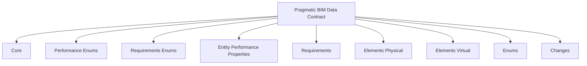
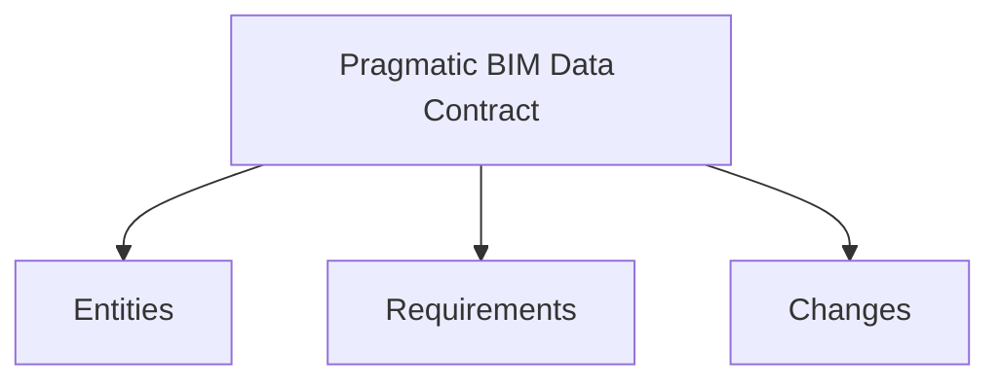
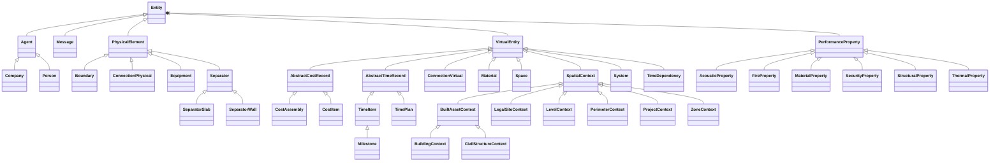
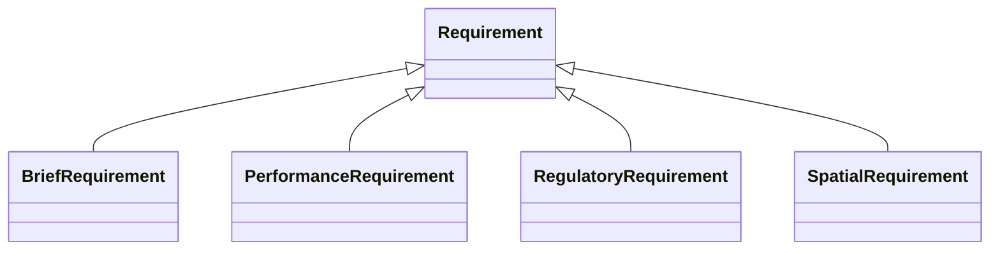
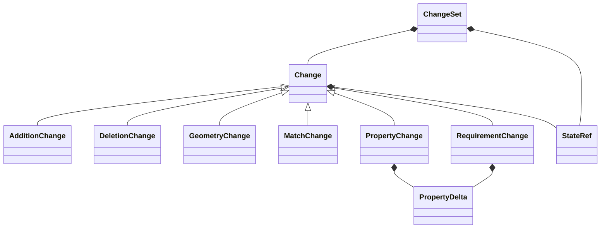

# Pragmatic BIM Data Contract 

## Why this exists

BIM data is hard to use.

Not because the data is missing, but because it is buried in complexity:

- IFC (Industry Foundation Classes) is powerful but:
  - too complex (hundreds of entities and deep relationships)
  - inconsistent across tools and projects
  - difficult to query for real workflows
  - mixes **performance** (what a product or assembly actually delivers) with
    **requirements** (what a project or regulation demands) in the same property
    sets and attributes, so compliance checks and product data stay entangled
  - treats **change** as an afterthought: revisions are file swaps, not structured
    diff records you can query, aggregate, or feed into workflows
- IDS (Information Delivery Specification) focuses on data validation, but not on
  complex conditional validation logic (for example: if a building is below 25 m,
  staircase walls must be EI90).
- bSDD (buildingSMART Data Dictionary) focuses on classification, not workflows.

Result: teams cannot reliably build automation, dashboards, or simulations on top
of BIM data without heavy preprocessing.

## What this is

This project defines a pragmatic BIM data contract: a minimal, opinionated
structure for BIM data designed for workflows, not modeling.

It acts as a layer between:

- complex source data (for example IFC)
- and real applications (QTO, simulations, dashboards, quality checks)

## Core idea

Instead of trying to standardize everything, this contract:

- reduces complexity
- enforces consistency
- focuses on what is actually needed
- separates performance properties from requirement drivers so each can be queried,
  validated, and updated independently
- models change as first-class data (`Change`, `ChangeSet`, `PropertyDelta`) rather
  than relying on opaque file diffs

It is intentionally limited.

## Principles

### 1) Not a replacement for IFC

This contract does not compete with IFC.

IFC remains:

- the exchange format
- the source of truth

This contract exists to make IFC usable in day-to-day workflows.

### 2) Designed for workflows, not modeling

This contract is built for:

- querying data
- running calculations
- feeding simulations
- building applications

Not for:

- authoring models
- preserving full semantic richness

### 3) Opinionated by design

Flexibility is often the enemy of automation. This contract intentionally:

- limits structure
- enforces naming
- reduces ambiguity

If your use case requires full flexibility, use IFC directly.

### 4) Abstraction over completeness

This project intentionally ignores large parts of IFC.

Only data required for real workflows is included.

### 5) Consistency over universality

This is not a universal standard.

It is a consistent contract that enables:

- repeatable queries
- predictable pipelines
- reliable automation

## What this enables

Using this contract, you can build:

- quantity takeoff pipelines
- room and space analysis
- simulation input models
- project dashboards
- validation workflows

Without having to:

- traverse complex IFC relationships
- handle inconsistent structures
- rebuild logic for every project

## Project structure

- `schema/00_pragmatic_bim_data_contract.yaml`: root schema entrypoint importing all modules.
- `schema/core_schema.yaml`: core entities and reusable base slots.
- `schema/performance_enums_schema.yaml`: enums for normalized performance properties.
- `schema/requirements_enums_schema.yaml`: enums for requirement drivers and assessment status.
- `schema/performance_schema.yaml`: normalized performance properties stored on `Entity` (extracted IFC values).
- `schema/requirements_schema.yaml`: prescriptive requirement records and element-level requirement-driver slots.
- `schema/elements_physical_schema.yaml`: physical element hierarchy and element-related slots.
- `schema/elements_virtual_schema.yaml`: virtual entities (`SpatialContext`, `Space`, `System`, `ConnectionVirtual`, `TimeItem`, `Milestone`, `TimePlan`, `TimeDependency`, `CostItem`, `CostAssembly`, `Material`) and their slots.
- `schema/changes_schema.yaml`: typed change records (`PropertyChange`, `GeometryChange`, `MatchChange`, …) and `ChangeSet` batches.
- `schema/enums_schema.yaml`: controlled vocabularies.
- `schema/enum_localizations.yaml`: enum label/localization metadata.
- `mappings/`: declarative IFC → schema mapping for external ingestion adapters (see `mappings/README.md`; run `python scripts/merge_ifc_mapping.py` after edits).
- `converter/`: converter module for transforming data to and from the schema (see `converter/README.md`).

<!-- diagram:module-map begin -->

<!-- diagram:module-map end -->

## Schema overview

The contract groups data into three top-level concerns (see [`ContentKind`](schema/enums_schema.yaml) for adapter projection):

1. **Entities** — BIM and project graph (`Entity` subclasses: physical, virtual, context). Normalized IFC performance values stay on `Entity.performance_properties` (not requirements).
2. **Requirements** — prescriptive records (`Requirement` subclasses) with `requirement_domain`: `performance`, `spatial`, `regulatory`, `brief`.
3. **Changes** — revision diff records (`Change` subclasses) with `change_type`: `geometry_change`, `property_change`, `requirement_change`, `match_change`, `addition`, `deletion`; optional `change_severity` for magnitude.

Supporting modules: **core**, **performance** (entity property facets), **enums**, **enum localizations**, **elements physical/virtual**, **changes** helpers (`StateRef`, `PropertyDelta`).

<!-- diagram:pillars-overview begin -->

<!-- diagram:pillars-overview end -->

Interactive full class hierarchy: [schema documentation](https://schema.pragmaticbim.ch/schema/pragmatic-bim.docs.html).

<!-- diagram:entity-detail begin -->

<!-- diagram:entity-detail end -->

<!-- diagram:requirements-overview begin -->

<!-- diagram:requirements-overview end -->

<!-- diagram:changes-overview begin -->

<!-- diagram:changes-overview end -->

Browse the generated schema documentation at [https://schema.pragmaticbim.ch/schema/pragmatic-bim.docs.html](https://schema.pragmaticbim.ch/schema/pragmatic-bim.docs.html).

## Modeling conventions

- Entity-to-entity relationships are modeled as ID references (`inlined: false`).
- Value objects that belong inside a record are embedded (`inlined: true`).
- `cost_category` and `material_category` are intentionally open text for now and can later be aligned with stronger classification systems.
- Units can be carried as plain strings for operational compatibility and optionally accompanied by unit URIs (for example QUDT) for stronger semantic alignment.

## How it fits in a workflow

1. Ingest BIM/IFC data with project-specific extraction logic.
2. Map extracted entities to this schema.
3. Store/query as graph or relational projections.
4. Enrich with requirements, performance metrics, schedules, and cost/material metadata.
5. Export, analyze, or feed application APIs.

## Getting started

1. Clone this repository.
2. Start with `schema/00_pragmatic_bim_data_contract.yaml` to understand module composition.
3. Browse the [schema documentation](https://schema.pragmaticbim.ch/schema/pragmatic-bim.docs.html).
4. Inspect module definitions in `schema/`.
5. Use or extend the converter in `converter/`.
6. Follow `converter/README.md` for converter setup and commands.

## Hosted schema URIs (GitHub Pages / custom domain)

Generated schema artifacts are published via GitHub Pages from stable release tags (`v*`).

- Stable landing page: `https://schema.pragmaticbim.ch/`
- Stable docs (HTML): `https://schema.pragmaticbim.ch/schema/pragmatic-bim.docs.html`
- Stable JSON Schema: `https://schema.pragmaticbim.ch/schema/pragmatic-bim.schema.json`
- Stable SHACL: `https://schema.pragmaticbim.ch/schema/pragmatic-bim.shacl.ttl`
- Stable CSV: `https://schema.pragmaticbim.ch/schema/pragmatic-bim.csv`
- Stable Pydantic: `https://schema.pragmaticbim.ch/schema/pragmatic-bim.pydantic.py`
- Stable docs (Markdown, raw): `https://schema.pragmaticbim.ch/schema/pragmatic-bim.docs.md`
- Latest stable alias: `https://schema.pragmaticbim.ch/latest/`
- Version-pinned snapshot: `https://schema.pragmaticbim.ch/vX.Y.Z/`

### URI resolution

LinkML module `id` values are published as landing pages on the stable site:

| Purpose | URL pattern | Example |
|---|---|---|
| Root schema | `https://schema.pragmaticbim.ch/` | — |
| Module namespace URI | `https://schema.pragmaticbim.ch/{slug}` | [`/elements-virtual`](https://schema.pragmaticbim.ch/elements-virtual) |
| Module metadata (JSON) | `https://schema.pragmaticbim.ch/{slug}/descriptor.json` | [`/elements-virtual/descriptor.json`](https://schema.pragmaticbim.ch/elements-virtual/descriptor.json) |
| Class documentation | `https://schema.pragmaticbim.ch/schema/{ClassName}.html` | [`/schema/VirtualEntity.html`](https://schema.pragmaticbim.ch/schema/VirtualEntity.html) |
| Validation / codegen | `https://schema.pragmaticbim.ch/schema/pragmatic-bim.schema.json` | merged schema (all modules) |

Module slug → primary doc entry:

| Module slug | Primary class docs |
|---|---|
| `core` | `Entity.html` |
| `elements-virtual` | `VirtualEntity.html` |
| `elements-physical` | `PhysicalElement.html` |
| `changes` | `PropertyChange.html`, `ChangeSet.html` |
| `performance` | `FireProperty.html` |
| `requirements` | schema index (slots-only module) |
| `enums` | `GeometryRepresentationType.html` |
| `performance-enums` | `PerformancePropertyValueType.html` |
| `requirements-enums` | `ConnectionRequirementDriver.html` |

Resolver pages are generated by [`scripts/generate_module_pages.py`](scripts/generate_module_pages.py) during the stable Pages release workflow.

Development and pull request validation remain in CI (`schema-generation.yml`) and are not deployed to the stable Pages root.

Enable Pages once in repository settings:

1. Go to `Settings` -> `Pages`.
2. Under Build and deployment, set Source to `GitHub Actions`.

## Private extensions (SKOS/SPARQL)

Classification assets and private SKOS/SPARQL rules are currently maintained in
the sibling repository `../pragmatic-bim-private-rules`.

Recommended local checkout layout:

- `../pragmatic-bim-data-contract` (this repository)
- `../pragmatic-bim-private-rules`

## Contributing

Contributions are welcome.

- Open an issue for bugs or feature proposals.
- Keep pull requests focused and small where possible.
- Add or update documentation when behavior changes.

## License

This project is licensed under the MIT License. See `LICENSE` for details.
t