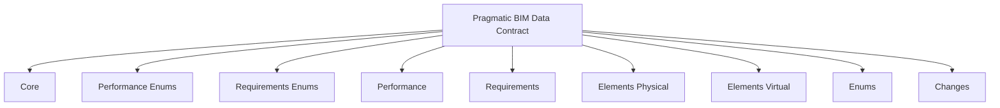
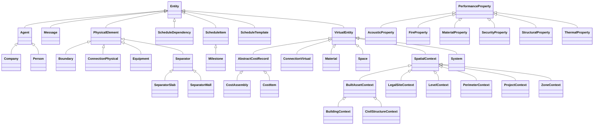

<!-- schema-diagrams-preamble -->

## Schema diagrams

Generated from `schema/*.yaml`. See the [schema documentation](https://schema.pragmaticbim.ch/schema/pragmatic-bim.docs.html) for interactive class pages.

### Module map

### Entity hierarchy

# Pragmatic BIM Data Contract

To provide a simple, implementation-ready BIM data model for integration, querying, costing, and analysis workflows, this schema defines a pragmatic, graph-first LinkML structure that is IFC-aware and extensible across classification schemes.

URI: https://schema.pragmaticbim.ch

Name: pragmatic_bim_data_contract

## Classes

| Class | Description |
| --- | --- |
| [Change](Change.md) | Detected difference for one subject between two revisions |
| [ChangeSet](ChangeSet.md) | Batch of Change records produced by comparing two model or document revisions |
| [Classification](Classification.md) | Generic classification entry from any scheme (for example IFC, Uniclass, Omni... |
| [ContactPoint](ContactPoint.md) | Structured communication endpoint or profile for an agent |
| [Decision](Decision.md) | Decision record linked to an entity for workflow traceability and governance |
| [Document](Document.md) | Reference to an external document stored in a file system, DMS, object storag... |
| [Entity](Entity.md) | Common base class for all schema entities |
| &nbsp;&nbsp;&nbsp;&nbsp;&nbsp;&nbsp;&nbsp;&nbsp;[Agent](Agent.md) | Abstract base class for people or organizations acting in workflow and commun... |
| &nbsp;&nbsp;&nbsp;&nbsp;&nbsp;&nbsp;&nbsp;&nbsp;&nbsp;&nbsp;&nbsp;&nbsp;&nbsp;&nbsp;&nbsp;&nbsp;[Company](Company.md) | Organization, company, or legal entity participating in the project or asset ... |
| &nbsp;&nbsp;&nbsp;&nbsp;&nbsp;&nbsp;&nbsp;&nbsp;&nbsp;&nbsp;&nbsp;&nbsp;&nbsp;&nbsp;&nbsp;&nbsp;[Person](Person.md) | Individual stakeholder, contributor, assignee, or responsible party represent... |
| &nbsp;&nbsp;&nbsp;&nbsp;&nbsp;&nbsp;&nbsp;&nbsp;[Message](Message.md) | Message or communication record linked to an entity for coordination and trac... |
| &nbsp;&nbsp;&nbsp;&nbsp;&nbsp;&nbsp;&nbsp;&nbsp;[PhysicalElement](PhysicalElement.md) | Base class for physical elements that can be placed in built asset/level cont... |
| &nbsp;&nbsp;&nbsp;&nbsp;&nbsp;&nbsp;&nbsp;&nbsp;&nbsp;&nbsp;&nbsp;&nbsp;&nbsp;&nbsp;&nbsp;&nbsp;[Boundary](Boundary.md) | Physical element acting as a boundary treatment (for example covering) |
| &nbsp;&nbsp;&nbsp;&nbsp;&nbsp;&nbsp;&nbsp;&nbsp;&nbsp;&nbsp;&nbsp;&nbsp;&nbsp;&nbsp;&nbsp;&nbsp;[ConnectionPhysical](ConnectionPhysical.md) | Physical connector providing functional connection between spaces (for exampl... |
| &nbsp;&nbsp;&nbsp;&nbsp;&nbsp;&nbsp;&nbsp;&nbsp;&nbsp;&nbsp;&nbsp;&nbsp;&nbsp;&nbsp;&nbsp;&nbsp;[Equipment](Equipment.md) | Endpoint or device element (for example terminal, unit, control device, senso... |
| &nbsp;&nbsp;&nbsp;&nbsp;&nbsp;&nbsp;&nbsp;&nbsp;&nbsp;&nbsp;&nbsp;&nbsp;&nbsp;&nbsp;&nbsp;&nbsp;[Separator](Separator.md) | Abstract base class for elements that separate spaces or zones |
| &nbsp;&nbsp;&nbsp;&nbsp;&nbsp;&nbsp;&nbsp;&nbsp;&nbsp;&nbsp;&nbsp;&nbsp;&nbsp;&nbsp;&nbsp;&nbsp;&nbsp;&nbsp;&nbsp;&nbsp;&nbsp;&nbsp;&nbsp;&nbsp;[SeparatorSlab](SeparatorSlab.md) | Slab-based separating element (for example floor/roof/base slab separators) |
| &nbsp;&nbsp;&nbsp;&nbsp;&nbsp;&nbsp;&nbsp;&nbsp;&nbsp;&nbsp;&nbsp;&nbsp;&nbsp;&nbsp;&nbsp;&nbsp;&nbsp;&nbsp;&nbsp;&nbsp;&nbsp;&nbsp;&nbsp;&nbsp;[SeparatorWall](SeparatorWall.md) | Wall-based separating element |
| &nbsp;&nbsp;&nbsp;&nbsp;&nbsp;&nbsp;&nbsp;&nbsp;[ScheduleDependency](ScheduleDependency.md) | Precedence relationship between two schedule items, optionally with lag |
| &nbsp;&nbsp;&nbsp;&nbsp;&nbsp;&nbsp;&nbsp;&nbsp;[ScheduleItem](ScheduleItem.md) | Planned work item with baseline and actual dates, linked to a schedule templa... |
| &nbsp;&nbsp;&nbsp;&nbsp;&nbsp;&nbsp;&nbsp;&nbsp;&nbsp;&nbsp;&nbsp;&nbsp;&nbsp;&nbsp;&nbsp;&nbsp;[Milestone](Milestone.md) | Zero-duration checkpoint or delivery target within a schedule |
| &nbsp;&nbsp;&nbsp;&nbsp;&nbsp;&nbsp;&nbsp;&nbsp;[ScheduleTemplate](ScheduleTemplate.md) | Reusable schedule container defining items, milestones, and dependencies for ... |
| &nbsp;&nbsp;&nbsp;&nbsp;&nbsp;&nbsp;&nbsp;&nbsp;[VirtualEntity](VirtualEntity.md) | Abstract base class for non-physical, conceptual, or informational entities |
| &nbsp;&nbsp;&nbsp;&nbsp;&nbsp;&nbsp;&nbsp;&nbsp;&nbsp;&nbsp;&nbsp;&nbsp;&nbsp;&nbsp;&nbsp;&nbsp;[AbstractCostRecord](AbstractCostRecord.md) | Abstract base for reusable cost record fields shared by atomic and aggregated... |
| &nbsp;&nbsp;&nbsp;&nbsp;&nbsp;&nbsp;&nbsp;&nbsp;&nbsp;&nbsp;&nbsp;&nbsp;&nbsp;&nbsp;&nbsp;&nbsp;&nbsp;&nbsp;&nbsp;&nbsp;&nbsp;&nbsp;&nbsp;&nbsp;[CostAssembly](CostAssembly.md) | Aggregated unit price assembled from multiple cost items |
| &nbsp;&nbsp;&nbsp;&nbsp;&nbsp;&nbsp;&nbsp;&nbsp;&nbsp;&nbsp;&nbsp;&nbsp;&nbsp;&nbsp;&nbsp;&nbsp;&nbsp;&nbsp;&nbsp;&nbsp;&nbsp;&nbsp;&nbsp;&nbsp;[CostItem](CostItem.md) | Cost record used for estimation and calculation, optionally linked to quantit... |
| &nbsp;&nbsp;&nbsp;&nbsp;&nbsp;&nbsp;&nbsp;&nbsp;&nbsp;&nbsp;&nbsp;&nbsp;&nbsp;&nbsp;&nbsp;&nbsp;[ConnectionVirtual](ConnectionVirtual.md) | Logical or topological connection between spaces and/or physical elements |
| &nbsp;&nbsp;&nbsp;&nbsp;&nbsp;&nbsp;&nbsp;&nbsp;&nbsp;&nbsp;&nbsp;&nbsp;&nbsp;&nbsp;&nbsp;&nbsp;[Material](Material.md) | Material definition that can be associated with one or more entities |
| &nbsp;&nbsp;&nbsp;&nbsp;&nbsp;&nbsp;&nbsp;&nbsp;&nbsp;&nbsp;&nbsp;&nbsp;&nbsp;&nbsp;&nbsp;&nbsp;[Space](Space.md) | Spatial container used for occupancy, circulation, service, or analysis |
| &nbsp;&nbsp;&nbsp;&nbsp;&nbsp;&nbsp;&nbsp;&nbsp;&nbsp;&nbsp;&nbsp;&nbsp;&nbsp;&nbsp;&nbsp;&nbsp;[SpatialContext](SpatialContext.md) | Context node used to represent project, perimeter, legal site, built asset, l... |
| &nbsp;&nbsp;&nbsp;&nbsp;&nbsp;&nbsp;&nbsp;&nbsp;&nbsp;&nbsp;&nbsp;&nbsp;&nbsp;&nbsp;&nbsp;&nbsp;&nbsp;&nbsp;&nbsp;&nbsp;&nbsp;&nbsp;&nbsp;&nbsp;[BuiltAssetContext](BuiltAssetContext.md) | Abstract spatial context for built assets such as buildings and civil structu... |
| &nbsp;&nbsp;&nbsp;&nbsp;&nbsp;&nbsp;&nbsp;&nbsp;&nbsp;&nbsp;&nbsp;&nbsp;&nbsp;&nbsp;&nbsp;&nbsp;&nbsp;&nbsp;&nbsp;&nbsp;&nbsp;&nbsp;&nbsp;&nbsp;&nbsp;&nbsp;&nbsp;&nbsp;&nbsp;&nbsp;&nbsp;&nbsp;[BuildingContext](BuildingContext.md) | Spatial context node constrained to building semantics |
| &nbsp;&nbsp;&nbsp;&nbsp;&nbsp;&nbsp;&nbsp;&nbsp;&nbsp;&nbsp;&nbsp;&nbsp;&nbsp;&nbsp;&nbsp;&nbsp;&nbsp;&nbsp;&nbsp;&nbsp;&nbsp;&nbsp;&nbsp;&nbsp;&nbsp;&nbsp;&nbsp;&nbsp;&nbsp;&nbsp;&nbsp;&nbsp;[CivilStructureContext](CivilStructureContext.md) | Spatial context node constrained to civil structure semantics |
| &nbsp;&nbsp;&nbsp;&nbsp;&nbsp;&nbsp;&nbsp;&nbsp;&nbsp;&nbsp;&nbsp;&nbsp;&nbsp;&nbsp;&nbsp;&nbsp;&nbsp;&nbsp;&nbsp;&nbsp;&nbsp;&nbsp;&nbsp;&nbsp;[LegalSiteContext](LegalSiteContext.md) | Spatial context node constrained to legal site semantics |
| &nbsp;&nbsp;&nbsp;&nbsp;&nbsp;&nbsp;&nbsp;&nbsp;&nbsp;&nbsp;&nbsp;&nbsp;&nbsp;&nbsp;&nbsp;&nbsp;&nbsp;&nbsp;&nbsp;&nbsp;&nbsp;&nbsp;&nbsp;&nbsp;[LevelContext](LevelContext.md) | Spatial context node constrained to level/storey semantics |
| &nbsp;&nbsp;&nbsp;&nbsp;&nbsp;&nbsp;&nbsp;&nbsp;&nbsp;&nbsp;&nbsp;&nbsp;&nbsp;&nbsp;&nbsp;&nbsp;&nbsp;&nbsp;&nbsp;&nbsp;&nbsp;&nbsp;&nbsp;&nbsp;[PerimeterContext](PerimeterContext.md) | Spatial context node constrained to perimeter semantics |
| &nbsp;&nbsp;&nbsp;&nbsp;&nbsp;&nbsp;&nbsp;&nbsp;&nbsp;&nbsp;&nbsp;&nbsp;&nbsp;&nbsp;&nbsp;&nbsp;&nbsp;&nbsp;&nbsp;&nbsp;&nbsp;&nbsp;&nbsp;&nbsp;[ProjectContext](ProjectContext.md) | Spatial context node constrained to project semantics |
| &nbsp;&nbsp;&nbsp;&nbsp;&nbsp;&nbsp;&nbsp;&nbsp;&nbsp;&nbsp;&nbsp;&nbsp;&nbsp;&nbsp;&nbsp;&nbsp;&nbsp;&nbsp;&nbsp;&nbsp;&nbsp;&nbsp;&nbsp;&nbsp;[ZoneContext](ZoneContext.md) | Spatial context node constrained to zone semantics |
| &nbsp;&nbsp;&nbsp;&nbsp;&nbsp;&nbsp;&nbsp;&nbsp;&nbsp;&nbsp;&nbsp;&nbsp;&nbsp;&nbsp;&nbsp;&nbsp;[System](System.md) | Building service system grouping that serves spaces or zones |
| [GeometryRepresentation](GeometryRepresentation.md) | Minimal geometry reference for an entity, separating representation from enco... |
| [LocalizedText](LocalizedText.md) | Localized text value for a specific language tag |
| [MetadataEntry](MetadataEntry.md) | Generic metadata entry for storing IFC attributes, PropertySet fields, or pro... |
| [PerformanceProperty](PerformanceProperty.md) | Normalized performance/property record derived from raw IFC PropertySet value... |
| &nbsp;&nbsp;&nbsp;&nbsp;&nbsp;&nbsp;&nbsp;&nbsp;[AcousticProperty](AcousticProperty.md) | Normalized acoustic-related property |
| &nbsp;&nbsp;&nbsp;&nbsp;&nbsp;&nbsp;&nbsp;&nbsp;[FireProperty](FireProperty.md) | Normalized fire-related property |
| &nbsp;&nbsp;&nbsp;&nbsp;&nbsp;&nbsp;&nbsp;&nbsp;[MaterialProperty](MaterialProperty.md) | Normalized material-related property |
| &nbsp;&nbsp;&nbsp;&nbsp;&nbsp;&nbsp;&nbsp;&nbsp;[SecurityProperty](SecurityProperty.md) | Normalized security-related property |
| &nbsp;&nbsp;&nbsp;&nbsp;&nbsp;&nbsp;&nbsp;&nbsp;[StructuralProperty](StructuralProperty.md) | Normalized structural-related property |
| &nbsp;&nbsp;&nbsp;&nbsp;&nbsp;&nbsp;&nbsp;&nbsp;[ThermalProperty](ThermalProperty.md) | Normalized thermal-related property |
| [PostalAddress](PostalAddress.md) | Structured postal or physical address for an agent |
| [PropertyDelta](PropertyDelta.md) | Field-level difference between two revision states |
| [QuantityValue](QuantityValue.md) | Minimal quantity record for costing and analysis |
| [StateRef](StateRef.md) | Pointer to a content state at a specific revision |
| [Task](Task.md) | Action/task record linked to an entity for implementation and follow-up workf... |

## Slots

| Slot | Description |
| --- | --- |
| [actual_finish_at](actual_finish_at.md) | Actual finish timestamp for the schedule item where known |
| [actual_start_at](actual_start_at.md) | Actual start timestamp for the schedule item where known |
| [address_country](address_country.md) | Country name |
| [address_country_code](address_country_code.md) | Optional ISO 3166-1 alpha-2 or alpha-3 country code |
| [address_locality](address_locality.md) | Locality, city, or town |
| [address_region](address_region.md) | Region, state, canton, or province |
| [affected_subject_id](affected_subject_id.md) | Identifier of the changed subject (entity id, document id, or external key) |
| [affected_subject_path](affected_subject_path.md) | Optional JSON-pointer-style path for nested targets (for example documents[2]... |
| [affected_subject_type](affected_subject_type.md) | LinkML class name of the changed subject (for example Space, SeparatorWall, D... |
| [applies_to_entities](applies_to_entities.md) | Entities this cost item applies to |
| [assignee](assignee.md) | Responsible agent |
| [availability_notes](availability_notes.md) | Optional notes about availability, office hours, or response expectations |
| [belongs_to_company](belongs_to_company.md) | Optional company that the person belongs to |
| [boundary_type](boundary_type.md) | Classification of boundary element (e |
| [bounded_by](bounded_by.md) | Physical elements that bound a space |
| [bounded_space](bounded_space.md) | Space bounded by this boundary element |
| [change_kind](change_kind.md) | Severity or category of change detected between two revisions |
| [change_source](change_source.md) | URI identifying the tool or pipeline that produced this change record |
| [changes](changes.md) | Change records included in this batch |
| [classification_code](classification_code.md) | Classification code inside the scheme |
| [classification_label](classification_label.md) | Optional human-readable classification label |
| [classification_scheme](classification_scheme.md) | Name of the classification scheme (for example ifc, uniclass, omniclass, cust... |
| [classification_source](classification_source.md) | Source authority or dataset for this classification |
| [classification_uri](classification_uri.md) | Optional URI/CURIE that identifies the classification concept in an external ... |
| [classification_version](classification_version.md) | Optional scheme/version identifier |
| [classifications](classifications.md) | Classification entries from IFC and other schemes |
| [component_cost_items](component_cost_items.md) | Atomic cost items that are aggregated into this cost assembly |
| [connection_physical_requirement_drivers](connection_physical_requirement_drivers.md) | Performance requirement drivers for this physical connection element |
| [connection_physical_type](connection_physical_type.md) | Classification of physical connector type (for example door, window, duct, pi... |
| [connection_virtual_requirement_drivers](connection_virtual_requirement_drivers.md) | Main requirement drivers for this virtual connection |
| [connection_virtual_type](connection_virtual_type.md) | Classification of virtual connection semantics (for example structural_joint,... |
| [connects_physical_elements](connects_physical_elements.md) | Physical elements connected by this virtual connection (for example wall-wall... |
| [connects_spaces](connects_spaces.md) | Spaces connected by this virtual connection |
| [contact_channel_type](contact_channel_type.md) | Communication channel type such as email, phone, website, linkedin, whatsapp,... |
| [contact_points](contact_points.md) | Structured communication channels and profiles associated with this agent |
| [contact_uri](contact_uri.md) | URI for the contact endpoint or profile where applicable |
| [contact_value](contact_value.md) | Human-readable contact value such as an email address, phone number, handle, ... |
| [contained_entities](contained_entities.md) | Generic containment for associated entities |
| [context_type](context_type.md) | Classification of context entity (project, perimeter, legal_site, building, c... |
| [cost_assemblies](cost_assemblies.md) | Aggregated unit prices associated with this entity |
| [cost_category](cost_category.md) | Cost category label kept intentionally open pending classification-backed mod... |
| [cost_items](cost_items.md) | Cost items associated with this entity |
| [cost_quantity_type](cost_quantity_type.md) | Quantity type used as basis for this cost calculation |
| [cost_quantity_unit](cost_quantity_unit.md) | Unit of the cost quantity value |
| [cost_quantity_value](cost_quantity_value.md) | Quantity magnitude used as basis for this cost calculation |
| [created_at](created_at.md) | Creation timestamp for this entity record |
| [currency](currency.md) | ISO 4217 currency code (for example EUR, USD) |
| [decided_at](decided_at.md) | Timestamp when the decision was made |
| [decided_by](decided_by.md) | Agent responsible for the decision |
| [decision_status](decision_status.md) | Decision status expressed as a URI/CURIE (for example proposed, accepted, rej... |
| [decision_type](decision_type.md) | Decision type expressed as a URI/CURIE from a controlled vocabulary |
| [decisions](decisions.md) | Decision records associated with this entity |
| [dependency_type](dependency_type.md) | Precedence logic used between the predecessor and successor items |
| [description](description.md) | Default description text |
| [detected_at](detected_at.md) | Timestamp when this change was detected |
| [document_state_refs](document_state_refs.md) | Optional baseline document states for the comparison that produced this chang... |
| [document_storage_link](document_storage_link.md) | Document location when the subject is or embeds a Document |
| [documents](documents.md) | Linked documents associated with this entity |
| [due_at](due_at.md) | Due timestamp for task completion |
| [equipment_type](equipment_type.md) | Classification of equipment (for example HVAC, electrical, plumbing) |
| [from_revision](from_revision.md) | Source revision number for this change |
| [from_state_ref](from_state_ref.md) | Content state pointer at the source revision |
| [from_value](from_value.md) | Prior value serialized as text |
| [geometry_format](geometry_format.md) | Optional serialization/encoding format (for example ifc, gltf, wkt, geojson),... |
| [geometry_reference](geometry_reference.md) | URI/path/hash/pointer to geometry payload |
| [geometry_representation](geometry_representation.md) | Representation kind/dimension (for example body_3d, footprint_2d, point), ind... |
| [geometry_representations](geometry_representations.md) | Geometry references associated with the entity |
| [group_members](group_members.md) | Zone members; may include spaces, separations, systems, etc |
| [id](id.md) | Unique local identifier |
| [ifc_attribute_name](ifc_attribute_name.md) | IFC attribute name when property_path_kind is ifc_attribute (for example Name... |
| [ifc_global_id](ifc_global_id.md) | IFC GlobalId of the mapped entity |
| [ifc_state_ref](ifc_state_ref.md) | Optional baseline IFC model state for the comparison that produced this chang... |
| [intent_verdict](intent_verdict.md) | Intent stability verdict from an automated judge (for example iterthink STABL... |
| [is_preferred](is_preferred.md) | Indicates whether this is the preferred contact point |
| [lag_days](lag_days.md) | Optional lag or lead offset in days applied to the dependency relation |
| [language_tag](language_tag.md) | IETF BCP 47 language tag (for example en, de, pt-BR) |
| [localized_descriptions](localized_descriptions.md) | Localized variants of description |
| [localized_names](localized_names.md) | Localized variants of name |
| [mapping_version](mapping_version.md) | Mapping specification version used to derive the normalized property |
| [material_category](material_category.md) | Material category label kept intentionally open pending classification-backed... |
| [material_specification](material_specification.md) | Material grade, specification, or product description |
| [materials](materials.md) | Material definitions associated with this entity |
| [meaning_uri](meaning_uri.md) | Optional semantic URI for linking the entity instance to an external ontology... |
| [message_body](message_body.md) | Human-readable message content |
| [message_subject](message_subject.md) | Optional subject or headline for the message |
| [message_type](message_type.md) | Message type expressed as a URI/CURIE from a controlled vocabulary |
| [messages](messages.md) | Messages associated with this entity |
| [metadata](metadata.md) | Generic metadata container for IFC attributes/properties and project-specific... |
| [metadata_key](metadata_key.md) | Metadata key, for example IfcWall |
| [metadata_value](metadata_value.md) | Metadata value serialized as text |
| [milestone_at](milestone_at.md) | Target timestamp for the milestone checkpoint |
| [modified_at](modified_at.md) | Last modification timestamp for this entity record |
| [name](name.md) | Default display name |
| [parent_building](parent_building.md) | Parent building context reference |
| [parent_legal_site](parent_legal_site.md) | Parent legal site context reference |
| [parent_level](parent_level.md) | Parent level/storey context reference |
| [parent_perimeter](parent_perimeter.md) | Parent perimeter context reference |
| [parent_project](parent_project.md) | Parent project context reference |
| [parent_space](parent_space.md) | Parent space where the equipment is located |
| [parent_system](parent_system.md) | Parent systems that the equipment belongs to |
| [parent_zone](parent_zone.md) | Parent zone context reference |
| [performance_properties](performance_properties.md) | Normalized, strongly typed domain properties (fire/acoustic/thermal/structura... |
| [planned_finish_at](planned_finish_at.md) | Planned finish timestamp for the schedule item |
| [planned_start_at](planned_start_at.md) | Planned start timestamp for the schedule item |
| [post_office_box_number](post_office_box_number.md) | Post office box number where applicable |
| [postal_addresses](postal_addresses.md) | Structured postal or physical addresses associated with this agent |
| [postal_code](postal_code.md) | Postal or ZIP code |
| [predecessor_item](predecessor_item.md) | Schedule item that must occur before the successor item |
| [produced_at](produced_at.md) | Timestamp when this changeset was produced |
| [produced_by](produced_by.md) | Agent or system that produced this changeset |
| [property_delta](property_delta.md) | Field-level differences detected between the two revision states |
| [property_key](property_key.md) | Canonical key inside the domain; constrained via subclass slot_usage to a dom... |
| [property_path](property_path.md) | Canonical path to the changed field |
| [property_path_kind](property_path_kind.md) | Classification of the property path for downstream diff interpretation |
| [property_unit](property_unit.md) | Normalized unit where applicable (for example min, dB, W/m2K) |
| [property_unit_uri](property_unit_uri.md) | Optional URI that identifies the normalized property unit in an external voca... |
| [property_value_boolean](property_value_boolean.md) | Boolean value when property_value_type is boolean |
| [property_value_number](property_value_number.md) | Numeric value when property_value_type is number |
| [property_value_string](property_value_string.md) | String value when property_value_type is string |
| [property_value_type](property_value_type.md) | Value type discriminator for normalized storage (for example string, number, ... |
| [quantity_type](quantity_type.md) | Controlled quantity type |
| [quantity_unit](quantity_unit.md) | Unit of the quantity value |
| [quantity_unit_uri](quantity_unit_uri.md) | Optional URI that identifies the quantity unit in an external vocabulary such... |
| [quantity_value](quantity_value.md) | Numeric quantity value |
| [quantity_values](quantity_values.md) | Quantities associated with the entity |
| [rationale](rationale.md) | Human-readable rationale that explains why the decision was made |
| [recipients](recipients.md) | Agents that received the message |
| [related_decision](related_decision.md) | Optional reference to a decision that informs or drives this task |
| [revision](revision.md) | Integer revision counter for change tracking |
| [schedule_dependencies](schedule_dependencies.md) | Dependency relationships used within this schedule template |
| [schedule_items](schedule_items.md) | Schedule items contained in this template; milestone instances may also appea... |
| [schedule_template](schedule_template.md) | Parent schedule template this item or dependency belongs to |
| [scheduled_entities](scheduled_entities.md) | Model entities that this schedule template or schedule item applies to |
| [sender](sender.md) | Agent that sent the message |
| [sent_at](sent_at.md) | Timestamp when the message was sent |
| [separates_levels](separates_levels.md) | Level context nodes separated by this slab separator |
| [separates_spaces](separates_spaces.md) | Spaces separated by this separator element |
| [separator_requirement_drivers](separator_requirement_drivers.md) | Performance requirement drivers for this separator |
| [separator_slab_type](separator_slab_type.md) | Classification of slab-based separator element (for example floor/roof/base s... |
| [separator_wall_type](separator_wall_type.md) | Classification of wall-based separator element |
| [serves_spaces](serves_spaces.md) | Spaces served by this system |
| [serves_zones](serves_zones.md) | Zone context nodes served by this system |
| [source_property](source_property.md) | Original property name inside the source PropertySet (for example FireRating) |
| [source_pset](source_pset.md) | Original IFC PropertySet name (for example Pset_WallCommon) |
| [source_value_raw](source_value_raw.md) | Raw source value before normalization |
| [space_type](space_type.md) | Classification of space (void, circulation, usable, service) |
| [state_ref](state_ref.md) | URI, path, or content hash identifying the stored content state |
| [state_ref_format](state_ref_format.md) | Optional serialization format (for example ifc, gltf, pdf, docx, markdown, pl... |
| [state_ref_kind](state_ref_kind.md) | Kind of content referenced (for example ifc_model, document, text_extract) |
| [state_ref_label](state_ref_label.md) | Optional human-readable label (for example LOD300 export, Spec v3 draft) |
| [status](status.md) | Lifecycle or QA status |
| [storage_link](storage_link.md) | URI/URL/path to the stored document location |
| [street_address](street_address.md) | Street name and house number or equivalent address line |
| [successor_item](successor_item.md) | Schedule item whose timing is constrained by the predecessor item |
| [system_discipline](system_discipline.md) | Classification of system discipline (electrical, sanitary, ventilation, heati... |
| [system_type](system_type.md) | Classification of system role (unit, network, terminal) |
| [tags](tags.md) | Optional free-form labels for filtering/grouping |
| [task_notes](task_notes.md) | Additional notes or implementation details for the task |
| [task_status](task_status.md) | Task status URI/CURIE aligned with action status vocabularies |
| [task_type](task_type.md) | Task type expressed as a URI/CURIE from a controlled vocabulary |
| [tasks](tasks.md) | Tasks associated with this entity |
| [text_value](text_value.md) | Localized text value |
| [to_revision](to_revision.md) | Target revision number for this change |
| [to_state_ref](to_state_ref.md) | Content state pointer at the target revision |
| [to_value](to_value.md) | New value serialized as text |
| [transport_medium](transport_medium.md) | Primary transport medium carried or enabled by the connector (for example hum... |
| [triggered_process](triggered_process.md) | External workflow process URI (for example yourcompanyos process instance) |
| [triggered_task](triggered_task.md) | Id of a Task record that this change triggered or should trigger |
| [unit_cost](unit_cost.md) | Unit cost for this cost item |
| [usage_context](usage_context.md) | Optional usage context such as work, personal, support, billing, or emergency |
| [zone_type](zone_type.md) | Optional zone classification; intended for SpatialContext nodes where context... |

## Enumerations

| Enumeration | Description |
| --- | --- |
| [AcousticPropertyKey](AcousticPropertyKey.md) | Canonical acoustic-related keys derived from IFC PropertySets |
| [BoundaryType](BoundaryType.md) |  |
| [ChangeIntentVerdict](ChangeIntentVerdict.md) | Intent stability verdict from an automated judge (for example iterthink STABL... |
| [ChangeKind](ChangeKind.md) | Severity or category of change detected between two revisions |
| [ConnectionPhysicalType](ConnectionPhysicalType.md) | Classification of physical connector elements that connect spaces |
| [ConnectionRequirementDriver](ConnectionRequirementDriver.md) | Main requirement drivers for connection element performance |
| [ConnectionVirtualType](ConnectionVirtualType.md) | Classification of virtual connection semantics using schema-internal meanings... |
| [ContextType](ContextType.md) |  |
| [EquipmentType](EquipmentType.md) |  |
| [FirePropertyKey](FirePropertyKey.md) | Canonical fire-related keys derived from IFC PropertySets |
| [GeometryRepresentationType](GeometryRepresentationType.md) | Classification of geometric representation dimension/style |
| [MaterialPropertyKey](MaterialPropertyKey.md) | Canonical material-related keys derived from IFC PropertySets and material me... |
| [PerformancePropertyValueType](PerformancePropertyValueType.md) | Type discriminator for normalized performance property values |
| [PropertyPathKind](PropertyPathKind.md) | Classification of a property path for diff interpretation across IFC and text... |
| [QuantityType](QuantityType.md) |  |
| [ScheduleDependencyType](ScheduleDependencyType.md) | Precedence logic between two schedule items |
| [SecurityPropertyKey](SecurityPropertyKey.md) | Canonical security-related keys derived from IFC PropertySets |
| [SeparatorRequirementDriver](SeparatorRequirementDriver.md) | Main requirement drivers for separator performance |
| [SeparatorSlabType](SeparatorSlabType.md) | Classification of slab-based separator elements |
| [SeparatorWallType](SeparatorWallType.md) | Classification of wall-based separator elements |
| [SpaceType](SpaceType.md) | Classification of space semantics used by modeling and downstream conversion |
| [StateRefKind](StateRefKind.md) | Kind of content referenced by a StateRef pointer |
| [StatusType](StatusType.md) | Lifecycle or QA gate status used for model progression and approvals |
| [StructuralPropertyKey](StructuralPropertyKey.md) | Canonical structural-related keys derived from IFC PropertySets |
| [SystemDiscipline](SystemDiscipline.md) | Discipline of a building service system |
| [SystemType](SystemType.md) | Role of an MEP-related element or grouping in the service chain |
| [ThermalPropertyKey](ThermalPropertyKey.md) | Canonical thermal-related keys derived from IFC PropertySets |
| [TransportMedium](TransportMedium.md) | Primary medium transported through or enabled by a physical connector |
| [ZoneType](ZoneType.md) | Classification of zone purpose and organizational intent |

## Types

| Type | Description |
| --- | --- |
| [Boolean](Boolean.md) | A binary (true or false) value |
| [Curie](Curie.md) | a compact URI |
| [Date](Date.md) | a date (year, month and day) in an idealized calendar |
| [DateOrDatetime](DateOrDatetime.md) | Either a date or a datetime |
| [Datetime](Datetime.md) | The combination of a date and time |
| [Decimal](Decimal.md) | A real number with arbitrary precision that conforms to the xsd:decimal speci... |
| [Double](Double.md) | A real number that conforms to the xsd:double specification |
| [Float](Float.md) | A real number that conforms to the xsd:float specification |
| [Integer](Integer.md) | An integer |
| [Jsonpath](Jsonpath.md) | A string encoding a JSON Path |
| [Jsonpointer](Jsonpointer.md) | A string encoding a JSON Pointer |
| [Ncname](Ncname.md) | Prefix part of CURIE |
| [Nodeidentifier](Nodeidentifier.md) | A URI, CURIE or BNODE that represents a node in a model |
| [Objectidentifier](Objectidentifier.md) | A URI or CURIE that represents an object in the model |
| [Sparqlpath](Sparqlpath.md) | A string encoding a SPARQL Property Path |
| [String](String.md) | A character string |
| [Time](Time.md) | A time object represents a (local) time of day, independent of any particular... |
| [Uri](Uri.md) | a complete URI |
| [Uriorcurie](Uriorcurie.md) | a URI or a CURIE |

## Subsets

| Subset | Description |
| --- | --- |
