---
search:
  boost: 10.0
---

# Class: AbstractCostRecord 


_Abstract base for reusable cost record fields shared by atomic and aggregated cost records._


<div data-search-exclude markdown="1">


* __NOTE__: this is an abstract class and should not be instantiated directly


URI: [pbs:AbstractCostRecord](https://schema.pragmaticbim.ch/AbstractCostRecord)

```mermaid
 classDiagram
    class AbstractCostRecord
    click AbstractCostRecord href "./AbstractCostRecord.html"
      VirtualEntity <|-- AbstractCostRecord
        click VirtualEntity href "./VirtualEntity.html"
      AbstractCostRecord <|-- CostItem
        click CostItem href "./CostItem.html"
      AbstractCostRecord <|-- CostAssembly
        click CostAssembly href "./CostAssembly.html"
      AbstractCostRecord : applies_to_entities
        AbstractCostRecord --> "*" Entity : applies_to_entities
        click Entity href "./Entity.html"
      AbstractCostRecord : classifications
        AbstractCostRecord --> "*" Classification : classifications
        click Classification href "./Classification.html"
      AbstractCostRecord : cost_assemblies
        AbstractCostRecord --> "*" CostAssembly : cost_assemblies
        click CostAssembly href "./CostAssembly.html"
      AbstractCostRecord : cost_category
      AbstractCostRecord : cost_items
        AbstractCostRecord --> "*" CostItem : cost_items
        click CostItem href "./CostItem.html"
      AbstractCostRecord : cost_quantity_type
        AbstractCostRecord --> "0..1" QuantityType : cost_quantity_type
        click QuantityType href "./QuantityType.html"
      AbstractCostRecord : cost_quantity_unit
      AbstractCostRecord : cost_quantity_value
      AbstractCostRecord : created_at
      AbstractCostRecord : currency
      AbstractCostRecord : decisions
        AbstractCostRecord --> "*" Decision : decisions
        click Decision href "./Decision.html"
      AbstractCostRecord : description
      AbstractCostRecord : documents
        AbstractCostRecord --> "*" Document : documents
        click Document href "./Document.html"
      AbstractCostRecord : geometry_representations
        AbstractCostRecord --> "*" GeometryRepresentation : geometry_representations
        click GeometryRepresentation href "./GeometryRepresentation.html"
      AbstractCostRecord : id
      AbstractCostRecord : ifc_global_id
      AbstractCostRecord : localized_descriptions
        AbstractCostRecord --> "*" LocalizedText : localized_descriptions
        click LocalizedText href "./LocalizedText.html"
      AbstractCostRecord : localized_names
        AbstractCostRecord --> "*" LocalizedText : localized_names
        click LocalizedText href "./LocalizedText.html"
      AbstractCostRecord : materials
        AbstractCostRecord --> "*" Material : materials
        click Material href "./Material.html"
      AbstractCostRecord : meaning_uri
      AbstractCostRecord : messages
        AbstractCostRecord --> "*" Message : messages
        click Message href "./Message.html"
      AbstractCostRecord : metadata
        AbstractCostRecord --> "*" MetadataEntry : metadata
        click MetadataEntry href "./MetadataEntry.html"
      AbstractCostRecord : modified_at
      AbstractCostRecord : name
      AbstractCostRecord : performance_properties
        AbstractCostRecord --> "*" PerformanceProperty : performance_properties
        click PerformanceProperty href "./PerformanceProperty.html"
      AbstractCostRecord : quantity_values
        AbstractCostRecord --> "*" QuantityValue : quantity_values
        click QuantityValue href "./QuantityValue.html"
      AbstractCostRecord : revision
      AbstractCostRecord : status
        AbstractCostRecord --> "0..1" StatusType : status
        click StatusType href "./StatusType.html"
      AbstractCostRecord : tasks
        AbstractCostRecord --> "*" Task : tasks
        click Task href "./Task.html"
      AbstractCostRecord : time_items
        AbstractCostRecord --> "*" TimeItem : time_items
        click TimeItem href "./TimeItem.html"
      AbstractCostRecord : time_plans
        AbstractCostRecord --> "*" TimePlan : time_plans
        click TimePlan href "./TimePlan.html"
      AbstractCostRecord : unit_cost
```





## Inheritance
* [Entity](Entity.md)
    * [VirtualEntity](VirtualEntity.md)
        * **AbstractCostRecord**
            * [CostItem](CostItem.md)
            * [CostAssembly](CostAssembly.md)


## Class Properties

| Property | Value |
| --- | --- |
| Class URI | [pbs:AbstractCostRecord](https://schema.pragmaticbim.ch/AbstractCostRecord) |


## Slots

| Name | Cardinality and Range | Description | Inheritance |
| ---  | --- | --- | --- |
| [cost_category](cost_category.md) | 0..1 <br/> [String](String.md) | Cost category label kept intentionally open pending classification-backed modeling. | direct |
| [unit_cost](unit_cost.md) | 1 <br/> [Double](Double.md) | Unit cost for this cost item. | direct |
| [currency](currency.md) | 1 <br/> [String](String.md) | ISO 4217 currency code (for example EUR, USD). | direct |
| [cost_quantity_type](cost_quantity_type.md) | 0..1 <br/> [QuantityType](QuantityType.md) | Quantity type used as basis for this cost calculation. | direct |
| [cost_quantity_value](cost_quantity_value.md) | 0..1 <br/> [Double](Double.md) | Quantity magnitude used as basis for this cost calculation. | direct |
| [cost_quantity_unit](cost_quantity_unit.md) | 0..1 <br/> [String](String.md) | Unit of the cost quantity value. | direct |
| [applies_to_entities](applies_to_entities.md) | * <br/> [Entity](Entity.md) | Model entities this record applies to (requirements, cost items, schedule items, etc.). | direct |
| [cost_items](cost_items.md) | * <br/> [CostItem](CostItem.md) | Cost items associated with this entity. | [VirtualEntity](VirtualEntity.md) |
| [cost_assemblies](cost_assemblies.md) | * <br/> [CostAssembly](CostAssembly.md) | Aggregated unit prices associated with this entity. | [VirtualEntity](VirtualEntity.md) |
| [time_items](time_items.md) | * <br/> [TimeItem](TimeItem.md) | Time items associated with this entity. | [VirtualEntity](VirtualEntity.md) |
| [time_plans](time_plans.md) | * <br/> [TimePlan](TimePlan.md) | Grouped time plans associated with this entity. | [VirtualEntity](VirtualEntity.md) |
| [materials](materials.md) | * <br/> [Material](Material.md) | Material definitions associated with this entity. | [VirtualEntity](VirtualEntity.md) |
| [id](id.md) | 1 <br/> [String](String.md) | Unique local identifier. | [Entity](Entity.md) |
| [name](name.md) | 1 <br/> [String](String.md) | Default display name. | [Entity](Entity.md) |
| [localized_names](localized_names.md) | * <br/> [LocalizedText](LocalizedText.md) | Localized variants of name. | [Entity](Entity.md) |
| [description](description.md) | 0..1 <br/> [String](String.md) | Default description text. | [Entity](Entity.md) |
| [meaning_uri](meaning_uri.md) | 0..1 <br/> [Uriorcurie](Uriorcurie.md) | Optional semantic URI for linking the entity instance to an external ontology concept. | [Entity](Entity.md) |
| [localized_descriptions](localized_descriptions.md) | * <br/> [LocalizedText](LocalizedText.md) | Localized variants of description. | [Entity](Entity.md) |
| [ifc_global_id](ifc_global_id.md) | 0..1 <br/> [String](String.md) | IFC GlobalId of the mapped entity. | [Entity](Entity.md) |
| [classifications](classifications.md) | * <br/> [Classification](Classification.md) | Classification entries from IFC and other schemes. | [Entity](Entity.md) |
| [geometry_representations](geometry_representations.md) | * <br/> [GeometryRepresentation](GeometryRepresentation.md) | Geometry references associated with the entity. A single element may link to multiple geometry representations to serve different intents (authoring, coordination, analysis, visualization) without duplicating the element itself. | [Entity](Entity.md) |
| [quantity_values](quantity_values.md) | * <br/> [QuantityValue](QuantityValue.md) | Quantities associated with the entity. | [Entity](Entity.md) |
| [documents](documents.md) | * <br/> [Document](Document.md) | Linked documents associated with this entity. | [Entity](Entity.md) |
| [metadata](metadata.md) | * <br/> [MetadataEntry](MetadataEntry.md) | Generic metadata container for IFC attributes/properties and project-specific extensions. | [Entity](Entity.md) |
| [performance_properties](performance_properties.md) | * <br/> [PerformanceProperty](PerformanceProperty.md) | Normalized, strongly typed domain properties (fire/acoustic/thermal/structural/ security/material) extracted from raw IFC PropertySet values. | [Entity](Entity.md) |
| [decisions](decisions.md) | * <br/> [Decision](Decision.md) | Decision records associated with this entity. | [Entity](Entity.md) |
| [tasks](tasks.md) | * <br/> [Task](Task.md) | Tasks associated with this entity. | [Entity](Entity.md) |
| [messages](messages.md) | * <br/> [Message](Message.md) | Messages associated with this entity. | [Entity](Entity.md) |
| [created_at](created_at.md) | 0..1 <br/> [Datetime](Datetime.md) | Creation timestamp for this entity record. | [Entity](Entity.md) |
| [modified_at](modified_at.md) | 0..1 <br/> [Datetime](Datetime.md) | Last modification timestamp for this entity record. | [Entity](Entity.md) |
| [revision](revision.md) | 0..1 <br/> [Integer](Integer.md) | Integer revision counter for change tracking. | [Entity](Entity.md) |
| [status](status.md) | 0..1 <br/> [StatusType](StatusType.md) | Lifecycle or QA status. | [Entity](Entity.md) |


## Identifier and Mapping Information


### Schema Source


* from schema: https://schema.pragmaticbim.ch


## Mappings

| Mapping Type | Mapped Value |
| ---  | ---  |
| self | pbs:AbstractCostRecord |
| native | pbs:AbstractCostRecord |


## LinkML Source

<!-- TODO: investigate https://stackoverflow.com/questions/37606292/how-to-create-tabbed-code-blocks-in-mkdocs-or-sphinx -->

### Direct

<details>
```yaml
name: AbstractCostRecord
description: Abstract base for reusable cost record fields shared by atomic and aggregated
  cost records.
from_schema: https://schema.pragmaticbim.ch
is_a: VirtualEntity
abstract: true
slots:
- cost_category
- unit_cost
- currency
- cost_quantity_type
- cost_quantity_value
- cost_quantity_unit
- applies_to_entities
class_uri: pbs:AbstractCostRecord

```
</details>

### Induced

<details>
```yaml
name: AbstractCostRecord
description: Abstract base for reusable cost record fields shared by atomic and aggregated
  cost records.
from_schema: https://schema.pragmaticbim.ch
is_a: VirtualEntity
abstract: true
attributes:
  cost_category:
    name: cost_category
    description: Cost category label kept intentionally open pending classification-backed
      modeling.
    from_schema: https://schema.pragmaticbim.ch
    rank: 1000
    owner: AbstractCostRecord
    domain_of:
    - AbstractCostRecord
    range: string
  unit_cost:
    name: unit_cost
    description: Unit cost for this cost item.
    from_schema: https://schema.pragmaticbim.ch
    rank: 1000
    owner: AbstractCostRecord
    domain_of:
    - AbstractCostRecord
    range: double
    required: true
    minimum_value: 0
  currency:
    name: currency
    description: ISO 4217 currency code (for example EUR, USD).
    from_schema: https://schema.pragmaticbim.ch
    rank: 1000
    owner: AbstractCostRecord
    domain_of:
    - AbstractCostRecord
    range: string
    required: true
    pattern: ^[A-Z]{3}$
  cost_quantity_type:
    name: cost_quantity_type
    description: Quantity type used as basis for this cost calculation.
    from_schema: https://schema.pragmaticbim.ch
    rank: 1000
    owner: AbstractCostRecord
    domain_of:
    - AbstractCostRecord
    range: QuantityType
  cost_quantity_value:
    name: cost_quantity_value
    description: Quantity magnitude used as basis for this cost calculation.
    from_schema: https://schema.pragmaticbim.ch
    rank: 1000
    owner: AbstractCostRecord
    domain_of:
    - AbstractCostRecord
    range: double
    minimum_value: 0
  cost_quantity_unit:
    name: cost_quantity_unit
    description: Unit of the cost quantity value.
    from_schema: https://schema.pragmaticbim.ch
    rank: 1000
    owner: AbstractCostRecord
    domain_of:
    - AbstractCostRecord
    range: string
  applies_to_entities:
    name: applies_to_entities
    description: Model entities this record applies to (requirements, cost items,
      schedule items, etc.).
    from_schema: https://schema.pragmaticbim.ch
    rank: 1000
    owner: AbstractCostRecord
    domain_of:
    - Requirement
    - AbstractTimeRecord
    - AbstractCostRecord
    range: Entity
    multivalued: true
    inlined: false
  cost_items:
    name: cost_items
    description: Cost items associated with this entity.
    from_schema: https://schema.pragmaticbim.ch
    rank: 1000
    owner: AbstractCostRecord
    domain_of:
    - VirtualEntity
    range: CostItem
    multivalued: true
    inlined: false
  cost_assemblies:
    name: cost_assemblies
    description: Aggregated unit prices associated with this entity.
    from_schema: https://schema.pragmaticbim.ch
    rank: 1000
    owner: AbstractCostRecord
    domain_of:
    - VirtualEntity
    range: CostAssembly
    multivalued: true
    inlined: false
  time_items:
    name: time_items
    description: Time items associated with this entity.
    from_schema: https://schema.pragmaticbim.ch
    rank: 1000
    owner: AbstractCostRecord
    domain_of:
    - VirtualEntity
    range: TimeItem
    multivalued: true
    inlined: false
  time_plans:
    name: time_plans
    description: Grouped time plans associated with this entity.
    from_schema: https://schema.pragmaticbim.ch
    rank: 1000
    owner: AbstractCostRecord
    domain_of:
    - VirtualEntity
    range: TimePlan
    multivalued: true
    inlined: false
  materials:
    name: materials
    description: Material definitions associated with this entity.
    from_schema: https://schema.pragmaticbim.ch
    rank: 1000
    owner: AbstractCostRecord
    domain_of:
    - VirtualEntity
    range: Material
    multivalued: true
    inlined: false
  id:
    name: id
    description: Unique local identifier.
    from_schema: https://schema.pragmaticbim.ch
    rank: 1000
    identifier: true
    owner: AbstractCostRecord
    domain_of:
    - Entity
    - Task
    - Document
    - Requirement
    - Change
    - ChangeSet
    range: string
    required: true
  name:
    name: name
    description: Default display name.
    from_schema: https://schema.pragmaticbim.ch
    rank: 1000
    owner: AbstractCostRecord
    domain_of:
    - Entity
    - Requirement
    range: string
    required: true
  localized_names:
    name: localized_names
    description: Localized variants of name.
    from_schema: https://schema.pragmaticbim.ch
    rank: 1000
    owner: AbstractCostRecord
    domain_of:
    - Entity
    range: LocalizedText
    multivalued: true
    inlined: true
  description:
    name: description
    description: Default description text.
    from_schema: https://schema.pragmaticbim.ch
    rank: 1000
    owner: AbstractCostRecord
    domain_of:
    - Entity
    - Requirement
    range: string
  meaning_uri:
    name: meaning_uri
    description: Optional semantic URI for linking the entity instance to an external
      ontology concept.
    from_schema: https://schema.pragmaticbim.ch
    rank: 1000
    owner: AbstractCostRecord
    domain_of:
    - Entity
    range: uriorcurie
  localized_descriptions:
    name: localized_descriptions
    description: Localized variants of description.
    from_schema: https://schema.pragmaticbim.ch
    rank: 1000
    owner: AbstractCostRecord
    domain_of:
    - Entity
    range: LocalizedText
    multivalued: true
    inlined: true
  ifc_global_id:
    name: ifc_global_id
    description: IFC GlobalId of the mapped entity.
    from_schema: https://schema.pragmaticbim.ch
    rank: 1000
    owner: AbstractCostRecord
    domain_of:
    - Entity
    - Change
    range: string
    pattern: ^[0-3][0-9A-Za-z_$]{21}$
  classifications:
    name: classifications
    description: Classification entries from IFC and other schemes.
    from_schema: https://schema.pragmaticbim.ch
    rank: 1000
    owner: AbstractCostRecord
    domain_of:
    - Entity
    - Document
    range: Classification
    multivalued: true
    inlined: true
  geometry_representations:
    name: geometry_representations
    description: 'Geometry references associated with the entity. A single element
      may link to multiple geometry representations to serve different intents (authoring,
      coordination, analysis, visualization) without duplicating the element itself.

      '
    from_schema: https://schema.pragmaticbim.ch
    rank: 1000
    owner: AbstractCostRecord
    domain_of:
    - Entity
    range: GeometryRepresentation
    multivalued: true
    inlined: true
  quantity_values:
    name: quantity_values
    description: Quantities associated with the entity.
    from_schema: https://schema.pragmaticbim.ch
    rank: 1000
    owner: AbstractCostRecord
    domain_of:
    - Entity
    range: QuantityValue
    multivalued: true
    inlined: true
  documents:
    name: documents
    description: Linked documents associated with this entity.
    from_schema: https://schema.pragmaticbim.ch
    rank: 1000
    owner: AbstractCostRecord
    domain_of:
    - Entity
    range: Document
    multivalued: true
    inlined: true
  metadata:
    name: metadata
    description: Generic metadata container for IFC attributes/properties and project-specific
      extensions.
    from_schema: https://schema.pragmaticbim.ch
    rank: 1000
    owner: AbstractCostRecord
    domain_of:
    - Entity
    range: MetadataEntry
    multivalued: true
    inlined: true
  performance_properties:
    name: performance_properties
    description: 'Normalized, strongly typed domain properties (fire/acoustic/thermal/structural/
      security/material) extracted from raw IFC PropertySet values.

      '
    from_schema: https://schema.pragmaticbim.ch
    rank: 1000
    owner: AbstractCostRecord
    domain_of:
    - Entity
    range: PerformanceProperty
    multivalued: true
    inlined: true
  decisions:
    name: decisions
    description: Decision records associated with this entity.
    from_schema: https://schema.pragmaticbim.ch
    rank: 1000
    owner: AbstractCostRecord
    domain_of:
    - Entity
    range: Decision
    multivalued: true
    inlined: true
  tasks:
    name: tasks
    description: Tasks associated with this entity.
    from_schema: https://schema.pragmaticbim.ch
    rank: 1000
    owner: AbstractCostRecord
    domain_of:
    - Entity
    range: Task
    multivalued: true
    inlined: true
  messages:
    name: messages
    description: Messages associated with this entity.
    from_schema: https://schema.pragmaticbim.ch
    rank: 1000
    owner: AbstractCostRecord
    domain_of:
    - Entity
    range: Message
    multivalued: true
    inlined: true
  created_at:
    name: created_at
    description: Creation timestamp for this entity record.
    from_schema: https://schema.pragmaticbim.ch
    rank: 1000
    owner: AbstractCostRecord
    domain_of:
    - Entity
    range: datetime
  modified_at:
    name: modified_at
    description: Last modification timestamp for this entity record.
    from_schema: https://schema.pragmaticbim.ch
    rank: 1000
    owner: AbstractCostRecord
    domain_of:
    - Entity
    range: datetime
  revision:
    name: revision
    description: Integer revision counter for change tracking.
    from_schema: https://schema.pragmaticbim.ch
    rank: 1000
    owner: AbstractCostRecord
    domain_of:
    - Entity
    range: integer
    minimum_value: 0
  status:
    name: status
    description: Lifecycle or QA status.
    from_schema: https://schema.pragmaticbim.ch
    rank: 1000
    owner: AbstractCostRecord
    domain_of:
    - Entity
    - Requirement
    range: StatusType
class_uri: pbs:AbstractCostRecord

```
</details></div>