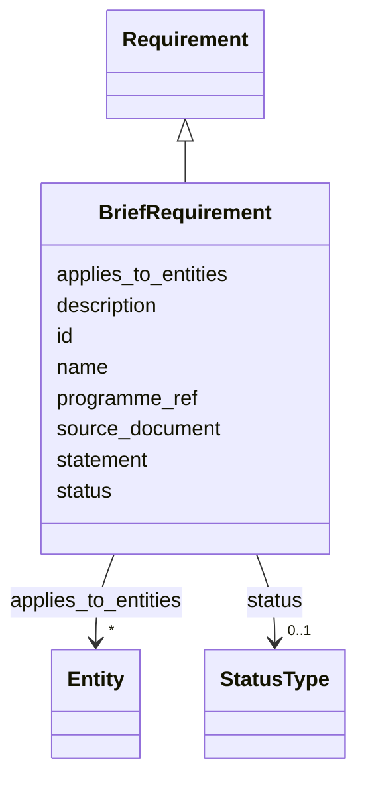

---
search:
  boost: 10.0
---

# Class: BriefRequirement 


_Client or programme requirement, including free-standing brief items._


<div data-search-exclude markdown="1">


URI: [pbs:BriefRequirement](https://schema.pragmaticbim.ch/BriefRequirement)





## Inheritance
* [Requirement](Requirement.md)
    * **BriefRequirement**


## Class Properties

| Property | Value |
| --- | --- |
| Class URI | [pbs:BriefRequirement](https://schema.pragmaticbim.ch/BriefRequirement) |


## Slots

| Name | Cardinality and Range | Description | Inheritance |
| ---  | --- | --- | --- |
| [programme_ref](programme_ref.md) | 0..1 <br/> [Uriorcurie](Uriorcurie.md) | URI or identifier for a programme or brief document. | direct |
| [statement](statement.md) | 0..1 <br/> [String](String.md) | Free-text requirement statement from client or programme. | direct |
| [id](id.md) | 1 <br/> [String](String.md) | Unique local identifier. | [Requirement](Requirement.md) |
| [name](name.md) | 1 <br/> [String](String.md) | Default display name. | [Requirement](Requirement.md) |
| [description](description.md) | 0..1 <br/> [String](String.md) | Default description text. | [Requirement](Requirement.md) |
| [applies_to_entities](applies_to_entities.md) | * <br/> [Entity](Entity.md) | Model entities this record applies to (requirements, cost items, schedule items, etc.). | [Requirement](Requirement.md) |
| [source_document](source_document.md) | 0..1 <br/> [Uriorcurie](Uriorcurie.md) | Optional URI to norm, brief, or source document backing this requirement. | [Requirement](Requirement.md) |
| [status](status.md) | 0..1 <br/> [StatusType](StatusType.md) | Lifecycle or QA status. | [Requirement](Requirement.md) |


## Identifier and Mapping Information


### Schema Source


* from schema: https://schema.pragmaticbim.ch


## Mappings

| Mapping Type | Mapped Value |
| ---  | ---  |
| self | pbs:BriefRequirement |
| native | pbs:BriefRequirement |


## LinkML Source

<!-- TODO: investigate https://stackoverflow.com/questions/37606292/how-to-create-tabbed-code-blocks-in-mkdocs-or-sphinx -->

### Direct

<details>
```yaml
name: BriefRequirement
description: Client or programme requirement, including free-standing brief items.
from_schema: https://schema.pragmaticbim.ch
is_a: Requirement
slots:
- programme_ref
- statement
class_uri: pbs:BriefRequirement

```
</details>

### Induced

<details>
```yaml
name: BriefRequirement
description: Client or programme requirement, including free-standing brief items.
from_schema: https://schema.pragmaticbim.ch
is_a: Requirement
attributes:
  programme_ref:
    name: programme_ref
    description: URI or identifier for a programme or brief document.
    from_schema: https://schema.pragmaticbim.ch
    rank: 1000
    owner: BriefRequirement
    domain_of:
    - BriefRequirement
    range: uriorcurie
  statement:
    name: statement
    description: Free-text requirement statement from client or programme.
    from_schema: https://schema.pragmaticbim.ch
    rank: 1000
    owner: BriefRequirement
    domain_of:
    - BriefRequirement
    range: string
  id:
    name: id
    description: Unique local identifier.
    from_schema: https://schema.pragmaticbim.ch
    rank: 1000
    identifier: true
    owner: BriefRequirement
    domain_of:
    - Entity
    - Task
    - Document
    - Requirement
    - Change
    - ChangeSet
    range: string
    required: true
  name:
    name: name
    description: Default display name.
    from_schema: https://schema.pragmaticbim.ch
    rank: 1000
    owner: BriefRequirement
    domain_of:
    - Entity
    - Requirement
    range: string
    required: true
  description:
    name: description
    description: Default description text.
    from_schema: https://schema.pragmaticbim.ch
    rank: 1000
    owner: BriefRequirement
    domain_of:
    - Entity
    - Requirement
    range: string
  applies_to_entities:
    name: applies_to_entities
    description: Model entities this record applies to (requirements, cost items,
      schedule items, etc.).
    from_schema: https://schema.pragmaticbim.ch
    rank: 1000
    owner: BriefRequirement
    domain_of:
    - Requirement
    - TimeRecord
    - CostRecord
    range: Entity
    multivalued: true
    inlined: false
  source_document:
    name: source_document
    description: Optional URI to norm, brief, or source document backing this requirement.
    from_schema: https://schema.pragmaticbim.ch
    rank: 1000
    owner: BriefRequirement
    domain_of:
    - Requirement
    range: uriorcurie
  status:
    name: status
    description: Lifecycle or QA status.
    from_schema: https://schema.pragmaticbim.ch
    rank: 1000
    owner: BriefRequirement
    domain_of:
    - Entity
    - Requirement
    range: StatusType
class_uri: pbs:BriefRequirement

```
</details></div>