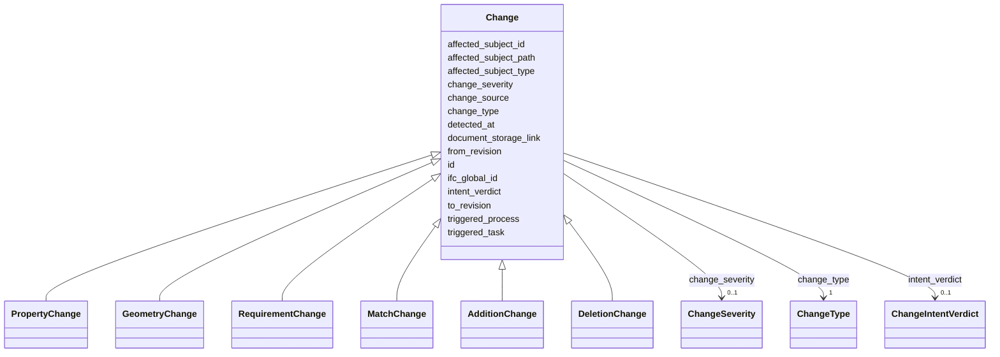

---
search:
  boost: 10.0
---

# Class: Change 


_Detected difference for one subject between two revisions (content_kind change). Supports IFC model diffs, document/text diffs, and schema-entity field changes. Use change_type together with the concrete subclass for interpretation._

__


<div data-search-exclude markdown="1">


* __NOTE__: this is an abstract class and should not be instantiated directly


URI: [pbs:Change](https://schema.pragmaticbim.ch/Change)





## Inheritance
* **Change**
    * [PropertyChange](PropertyChange.md)
    * [GeometryChange](GeometryChange.md)
    * [RequirementChange](RequirementChange.md)
    * [MatchChange](MatchChange.md)
    * [AdditionChange](AdditionChange.md)
    * [DeletionChange](DeletionChange.md)


## Class Properties

| Property | Value |
| --- | --- |
| Class URI | [pbs:Change](https://schema.pragmaticbim.ch/Change) |


## Slots

| Name | Cardinality and Range | Description | Inheritance |
| ---  | --- | --- | --- |
| [id](id.md) | 1 <br/> [String](String.md) | Unique local identifier. | direct |
| [change_type](change_type.md) | 1 <br/> [ChangeType](ChangeType.md) | Category of change detected between two revisions. | direct |
| [change_severity](change_severity.md) | 0..1 <br/> [ChangeSeverity](ChangeSeverity.md) | Optional severity independent of change type. | direct |
| [intent_verdict](intent_verdict.md) | 0..1 <br/> [ChangeIntentVerdict](ChangeIntentVerdict.md) | Intent stability verdict from an automated judge (for example iterthink STABLE/NEW). | direct |
| [affected_subject_id](affected_subject_id.md) | 1 <br/> [String](String.md) | Identifier of the changed subject (entity id, document id, or external key). | direct |
| [affected_subject_type](affected_subject_type.md) | 1 <br/> [String](String.md) | LinkML class name of the changed subject (for example Space, SeparatorWall, Document). | direct |
| [affected_subject_path](affected_subject_path.md) | 0..1 <br/> [String](String.md) | Optional JSON-pointer-style path for nested targets (for example documents[2], localized_descriptions[de], section.4.2.paragraph_1). | direct |
| [ifc_global_id](ifc_global_id.md) | 0..1 <br/> [String](String.md) | IFC GlobalId of the mapped entity. | direct |
| [document_storage_link](document_storage_link.md) | 0..1 <br/> [Uriorcurie](Uriorcurie.md) | Document location when the subject is or embeds a Document. | direct |
| [from_revision](from_revision.md) | 1 <br/> [Integer](Integer.md) | Source revision number for this change. | direct |
| [to_revision](to_revision.md) | 1 <br/> [Integer](Integer.md) | Target revision number for this change. | direct |
| [triggered_task](triggered_task.md) | 0..1 <br/> [String](String.md) | Id of a Task record that this change triggered or should trigger. | direct |
| [triggered_process](triggered_process.md) | 0..1 <br/> [Uriorcurie](Uriorcurie.md) | External workflow process URI (for example yourcompanyos process instance). | direct |
| [detected_at](detected_at.md) | 0..1 <br/> [Datetime](Datetime.md) | Timestamp when this change was detected. | direct |
| [change_source](change_source.md) | 0..1 <br/> [Uriorcurie](Uriorcurie.md) | URI identifying the tool or pipeline that produced this change record. | direct |


## Usages

| used by | used in | type | used |
| ---  | --- | --- | --- |
| [ChangeSet](ChangeSet.md) | [changes](changes.md) | range | [Change](Change.md) |


## Identifier and Mapping Information


### Schema Source


* from schema: https://schema.pragmaticbim.ch


## Mappings

| Mapping Type | Mapped Value |
| ---  | ---  |
| self | pbs:Change |
| native | pbs:Change |


## LinkML Source

<!-- TODO: investigate https://stackoverflow.com/questions/37606292/how-to-create-tabbed-code-blocks-in-mkdocs-or-sphinx -->

### Direct

<details>
```yaml
name: Change
description: 'Detected difference for one subject between two revisions (content_kind
  change). Supports IFC model diffs, document/text diffs, and schema-entity field
  changes. Use change_type together with the concrete subclass for interpretation.

  '
from_schema: https://schema.pragmaticbim.ch
abstract: true
slots:
- id
- change_type
- change_severity
- intent_verdict
- affected_subject_id
- affected_subject_type
- affected_subject_path
- ifc_global_id
- document_storage_link
- from_revision
- to_revision
- triggered_task
- triggered_process
- detected_at
- change_source
slot_usage:
  id:
    name: id
    identifier: true
    required: true
  change_type:
    name: change_type
    required: true
  affected_subject_id:
    name: affected_subject_id
    required: true
  affected_subject_type:
    name: affected_subject_type
    required: true
  from_revision:
    name: from_revision
    required: true
  to_revision:
    name: to_revision
    required: true
class_uri: pbs:Change

```
</details>

### Induced

<details>
```yaml
name: Change
description: 'Detected difference for one subject between two revisions (content_kind
  change). Supports IFC model diffs, document/text diffs, and schema-entity field
  changes. Use change_type together with the concrete subclass for interpretation.

  '
from_schema: https://schema.pragmaticbim.ch
abstract: true
slot_usage:
  id:
    name: id
    identifier: true
    required: true
  change_type:
    name: change_type
    required: true
  affected_subject_id:
    name: affected_subject_id
    required: true
  affected_subject_type:
    name: affected_subject_type
    required: true
  from_revision:
    name: from_revision
    required: true
  to_revision:
    name: to_revision
    required: true
attributes:
  id:
    name: id
    description: Unique local identifier.
    from_schema: https://schema.pragmaticbim.ch
    rank: 1000
    identifier: true
    owner: Change
    domain_of:
    - Entity
    - Task
    - Document
    - Requirement
    - Change
    - ChangeSet
    range: string
    required: true
  change_type:
    name: change_type
    description: Category of change detected between two revisions.
    from_schema: https://schema.pragmaticbim.ch
    rank: 1000
    owner: Change
    domain_of:
    - Change
    range: ChangeType
    required: true
  change_severity:
    name: change_severity
    description: Optional severity independent of change type.
    from_schema: https://schema.pragmaticbim.ch
    rank: 1000
    owner: Change
    domain_of:
    - Change
    range: ChangeSeverity
  intent_verdict:
    name: intent_verdict
    description: Intent stability verdict from an automated judge (for example iterthink
      STABLE/NEW).
    from_schema: https://schema.pragmaticbim.ch
    rank: 1000
    owner: Change
    domain_of:
    - Change
    range: ChangeIntentVerdict
  affected_subject_id:
    name: affected_subject_id
    description: Identifier of the changed subject (entity id, document id, or external
      key).
    from_schema: https://schema.pragmaticbim.ch
    rank: 1000
    owner: Change
    domain_of:
    - Change
    range: string
    required: true
  affected_subject_type:
    name: affected_subject_type
    description: 'LinkML class name of the changed subject (for example Space, SeparatorWall,
      Document).

      '
    from_schema: https://schema.pragmaticbim.ch
    rank: 1000
    owner: Change
    domain_of:
    - Change
    range: string
    required: true
  affected_subject_path:
    name: affected_subject_path
    description: 'Optional JSON-pointer-style path for nested targets (for example
      documents[2], localized_descriptions[de], section.4.2.paragraph_1).

      '
    from_schema: https://schema.pragmaticbim.ch
    rank: 1000
    owner: Change
    domain_of:
    - Change
    range: string
  ifc_global_id:
    name: ifc_global_id
    description: IFC GlobalId of the mapped entity.
    from_schema: https://schema.pragmaticbim.ch
    rank: 1000
    owner: Change
    domain_of:
    - Entity
    - Change
    range: string
    pattern: ^[0-3][0-9A-Za-z_$]{21}$
  document_storage_link:
    name: document_storage_link
    description: Document location when the subject is or embeds a Document.
    from_schema: https://schema.pragmaticbim.ch
    rank: 1000
    owner: Change
    domain_of:
    - Change
    range: uriorcurie
  from_revision:
    name: from_revision
    description: Source revision number for this change.
    from_schema: https://schema.pragmaticbim.ch
    rank: 1000
    owner: Change
    domain_of:
    - Change
    - ChangeSet
    range: integer
    required: true
    minimum_value: 0
  to_revision:
    name: to_revision
    description: Target revision number for this change.
    from_schema: https://schema.pragmaticbim.ch
    rank: 1000
    owner: Change
    domain_of:
    - Change
    - ChangeSet
    range: integer
    required: true
    minimum_value: 0
  triggered_task:
    name: triggered_task
    description: Id of a Task record that this change triggered or should trigger.
    from_schema: https://schema.pragmaticbim.ch
    rank: 1000
    owner: Change
    domain_of:
    - Change
    range: string
  triggered_process:
    name: triggered_process
    description: External workflow process URI (for example yourcompanyos process
      instance).
    from_schema: https://schema.pragmaticbim.ch
    rank: 1000
    owner: Change
    domain_of:
    - Change
    range: uriorcurie
  detected_at:
    name: detected_at
    description: Timestamp when this change was detected.
    from_schema: https://schema.pragmaticbim.ch
    rank: 1000
    slot_uri: dcterms:created
    owner: Change
    domain_of:
    - Change
    range: datetime
  change_source:
    name: change_source
    description: URI identifying the tool or pipeline that produced this change record.
    from_schema: https://schema.pragmaticbim.ch
    rank: 1000
    owner: Change
    domain_of:
    - Change
    range: uriorcurie
class_uri: pbs:Change

```
</details></div>