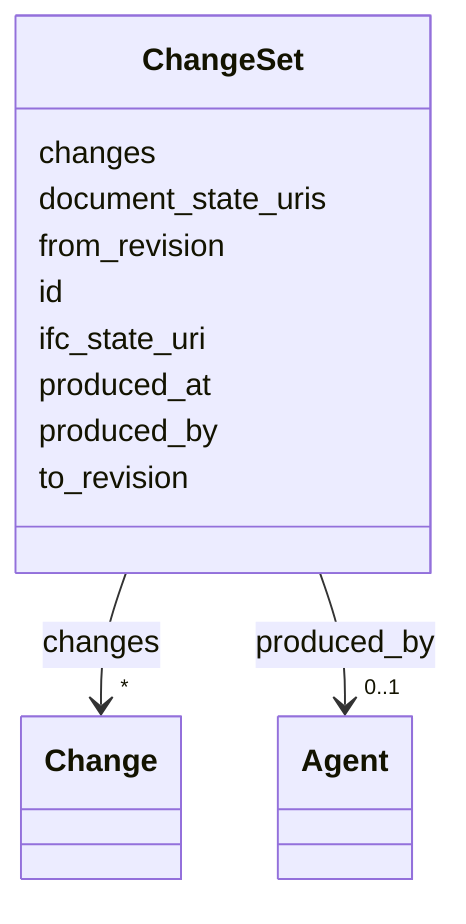

---
search:
  boost: 10.0
---

# Class: ChangeSet 


_Batch of Change records produced by comparing two model or document revisions._

__


<div data-search-exclude markdown="1">


URI: [pbs:ChangeSet](https://schema.pragmaticbim.ch/ChangeSet)





<!-- no inheritance hierarchy -->

## Class Properties

| Property | Value |
| --- | --- |
| Class URI | [pbs:ChangeSet](https://schema.pragmaticbim.ch/ChangeSet) |


## Slots

| Name | Cardinality and Range | Description | Inheritance |
| ---  | --- | --- | --- |
| [id](id.md) | 1 <br/> [String](String.md) | Unique local identifier. | direct |
| [from_revision](from_revision.md) | 1 <br/> [Integer](Integer.md) | Source revision number for this change. | direct |
| [to_revision](to_revision.md) | 1 <br/> [Integer](Integer.md) | Target revision number for this change. | direct |
| [changes](changes.md) | * <br/> [Change](Change.md) | Change records included in this batch. | direct |
| [ifc_state_uri](ifc_state_uri.md) | 0..1 <br/> [Uriorcurie](Uriorcurie.md) | Optional URI, path, or content hash for the baseline IFC model state used in this comparison. | direct |
| [document_state_uris](document_state_uris.md) | * <br/> [Uriorcurie](Uriorcurie.md) | Optional URIs or content hashes for baseline document states used in this comparison. | direct |
| [produced_at](produced_at.md) | 0..1 <br/> [Datetime](Datetime.md) | Timestamp when this changeset was produced. | direct |
| [produced_by](produced_by.md) | 0..1 <br/> [Agent](Agent.md) | Agent or system that produced this changeset. | direct |


## Identifier and Mapping Information


### Schema Source


* from schema: https://schema.pragmaticbim.ch


## Mappings

| Mapping Type | Mapped Value |
| ---  | ---  |
| self | pbs:ChangeSet |
| native | pbs:ChangeSet |
| exact | prov:Entity |


## LinkML Source

<!-- TODO: investigate https://stackoverflow.com/questions/37606292/how-to-create-tabbed-code-blocks-in-mkdocs-or-sphinx -->

### Direct

<details>
```yaml
name: ChangeSet
description: 'Batch of Change records produced by comparing two model or document
  revisions.

  '
from_schema: https://schema.pragmaticbim.ch
exact_mappings:
- prov:Entity
slots:
- id
- from_revision
- to_revision
- changes
- ifc_state_uri
- document_state_uris
- produced_at
- produced_by
slot_usage:
  id:
    name: id
    identifier: true
    required: true
class_uri: pbs:ChangeSet

```
</details>

### Induced

<details>
```yaml
name: ChangeSet
description: 'Batch of Change records produced by comparing two model or document
  revisions.

  '
from_schema: https://schema.pragmaticbim.ch
exact_mappings:
- prov:Entity
slot_usage:
  id:
    name: id
    identifier: true
    required: true
attributes:
  id:
    name: id
    description: Unique local identifier.
    from_schema: https://schema.pragmaticbim.ch
    rank: 1000
    identifier: true
    owner: ChangeSet
    domain_of:
    - Entity
    - Task
    - Document
    - Requirement
    - Change
    - ChangeSet
    range: string
    required: true
  from_revision:
    name: from_revision
    description: Source revision number for this change.
    from_schema: https://schema.pragmaticbim.ch
    rank: 1000
    owner: ChangeSet
    domain_of:
    - Change
    - ChangeSet
    range: integer
    required: true
    minimum_value: 0
  to_revision:
    name: to_revision
    description: Target revision number for this change.
    from_schema: https://schema.pragmaticbim.ch
    rank: 1000
    owner: ChangeSet
    domain_of:
    - Change
    - ChangeSet
    range: integer
    required: true
    minimum_value: 0
  changes:
    name: changes
    description: Change records included in this batch.
    from_schema: https://schema.pragmaticbim.ch
    rank: 1000
    owner: ChangeSet
    domain_of:
    - ChangeSet
    range: Change
    multivalued: true
    inlined: true
  ifc_state_uri:
    name: ifc_state_uri
    description: Optional URI, path, or content hash for the baseline IFC model state
      used in this comparison.
    from_schema: https://schema.pragmaticbim.ch
    rank: 1000
    owner: ChangeSet
    domain_of:
    - ChangeSet
    range: uriorcurie
  document_state_uris:
    name: document_state_uris
    description: Optional URIs or content hashes for baseline document states used
      in this comparison.
    from_schema: https://schema.pragmaticbim.ch
    rank: 1000
    owner: ChangeSet
    domain_of:
    - ChangeSet
    range: uriorcurie
    multivalued: true
  produced_at:
    name: produced_at
    description: Timestamp when this changeset was produced.
    from_schema: https://schema.pragmaticbim.ch
    rank: 1000
    slot_uri: dcterms:created
    owner: ChangeSet
    domain_of:
    - ChangeSet
    range: datetime
  produced_by:
    name: produced_by
    description: Agent or system that produced this changeset.
    from_schema: https://schema.pragmaticbim.ch
    rank: 1000
    slot_uri: prov:wasAttributedTo
    owner: ChangeSet
    domain_of:
    - ChangeSet
    range: Agent
    inlined: false
class_uri: pbs:ChangeSet

```
</details></div>