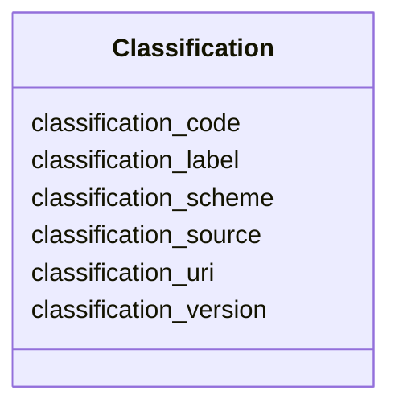

---
search:
  boost: 10.0
---

# Class: Classification 


_Generic classification entry from any scheme (for example IFC, Uniclass, OmniClass, custom)._


<div data-search-exclude markdown="1">


URI: [pbs:Classification](https://schema.pragmaticbim.ch/Classification)





<!-- no inheritance hierarchy -->

## Class Properties

| Property | Value |
| --- | --- |
| Class URI | [pbs:Classification](https://schema.pragmaticbim.ch/Classification) |


## Slots

| Name | Cardinality and Range | Description | Inheritance |
| ---  | --- | --- | --- |
| [classification_scheme](classification_scheme.md) | 1 <br/> [String](String.md) | Name of the classification scheme (for example ifc, uniclass, omniclass, custom). | direct |
| [classification_code](classification_code.md) | 1 <br/> [String](String.md) | Classification code inside the scheme. | direct |
| [classification_label](classification_label.md) | 0..1 <br/> [String](String.md) | Optional human-readable classification label. | direct |
| [classification_uri](classification_uri.md) | 0..1 <br/> [Uriorcurie](Uriorcurie.md) | Optional URI/CURIE that identifies the classification concept in an external registry. | direct |
| [classification_version](classification_version.md) | 0..1 <br/> [String](String.md) | Optional scheme/version identifier. | direct |
| [classification_source](classification_source.md) | 0..1 <br/> [String](String.md) | Source authority or dataset for this classification. | direct |


## Usages

| used by | used in | type | used |
| ---  | --- | --- | --- |
| [Entity](Entity.md) | [classifications](classifications.md) | range | [Classification](Classification.md) |
| [Agent](Agent.md) | [classifications](classifications.md) | range | [Classification](Classification.md) |
| [Person](Person.md) | [classifications](classifications.md) | range | [Classification](Classification.md) |
| [Company](Company.md) | [classifications](classifications.md) | range | [Classification](Classification.md) |
| [Message](Message.md) | [classifications](classifications.md) | range | [Classification](Classification.md) |
| [Document](Document.md) | [classifications](classifications.md) | range | [Classification](Classification.md) |
| [PhysicalElement](PhysicalElement.md) | [classifications](classifications.md) | range | [Classification](Classification.md) |
| [Separator](Separator.md) | [classifications](classifications.md) | range | [Classification](Classification.md) |
| [SeparatorWall](SeparatorWall.md) | [classifications](classifications.md) | range | [Classification](Classification.md) |
| [SeparatorSlab](SeparatorSlab.md) | [classifications](classifications.md) | range | [Classification](Classification.md) |
| [ConnectionPhysical](ConnectionPhysical.md) | [classifications](classifications.md) | range | [Classification](Classification.md) |
| [Boundary](Boundary.md) | [classifications](classifications.md) | range | [Classification](Classification.md) |
| [Equipment](Equipment.md) | [classifications](classifications.md) | range | [Classification](Classification.md) |
| [VirtualEntity](VirtualEntity.md) | [classifications](classifications.md) | range | [Classification](Classification.md) |
| [SpatialContext](SpatialContext.md) | [classifications](classifications.md) | range | [Classification](Classification.md) |
| [ProjectContext](ProjectContext.md) | [classifications](classifications.md) | range | [Classification](Classification.md) |
| [PerimeterContext](PerimeterContext.md) | [classifications](classifications.md) | range | [Classification](Classification.md) |
| [LegalSiteContext](LegalSiteContext.md) | [classifications](classifications.md) | range | [Classification](Classification.md) |
| [BuiltAssetContext](BuiltAssetContext.md) | [classifications](classifications.md) | range | [Classification](Classification.md) |
| [BuildingContext](BuildingContext.md) | [classifications](classifications.md) | range | [Classification](Classification.md) |
| [CivilStructureContext](CivilStructureContext.md) | [classifications](classifications.md) | range | [Classification](Classification.md) |
| [LevelContext](LevelContext.md) | [classifications](classifications.md) | range | [Classification](Classification.md) |
| [ZoneContext](ZoneContext.md) | [classifications](classifications.md) | range | [Classification](Classification.md) |
| [Space](Space.md) | [classifications](classifications.md) | range | [Classification](Classification.md) |
| [System](System.md) | [classifications](classifications.md) | range | [Classification](Classification.md) |
| [ConnectionVirtual](ConnectionVirtual.md) | [classifications](classifications.md) | range | [Classification](Classification.md) |
| [AbstractTimeRecord](AbstractTimeRecord.md) | [classifications](classifications.md) | range | [Classification](Classification.md) |
| [TimeItem](TimeItem.md) | [classifications](classifications.md) | range | [Classification](Classification.md) |
| [Milestone](Milestone.md) | [classifications](classifications.md) | range | [Classification](Classification.md) |
| [TimePlan](TimePlan.md) | [classifications](classifications.md) | range | [Classification](Classification.md) |
| [TimeDependency](TimeDependency.md) | [classifications](classifications.md) | range | [Classification](Classification.md) |
| [AbstractCostRecord](AbstractCostRecord.md) | [classifications](classifications.md) | range | [Classification](Classification.md) |
| [CostItem](CostItem.md) | [classifications](classifications.md) | range | [Classification](Classification.md) |
| [CostAssembly](CostAssembly.md) | [classifications](classifications.md) | range | [Classification](Classification.md) |
| [Material](Material.md) | [classifications](classifications.md) | range | [Classification](Classification.md) |


## Identifier and Mapping Information


### Schema Source


* from schema: https://schema.pragmaticbim.ch


## Mappings

| Mapping Type | Mapped Value |
| ---  | ---  |
| self | pbs:Classification |
| native | pbs:Classification |


## LinkML Source

<!-- TODO: investigate https://stackoverflow.com/questions/37606292/how-to-create-tabbed-code-blocks-in-mkdocs-or-sphinx -->

### Direct

<details>
```yaml
name: Classification
description: Generic classification entry from any scheme (for example IFC, Uniclass,
  OmniClass, custom).
from_schema: https://schema.pragmaticbim.ch
slots:
- classification_scheme
- classification_code
- classification_label
- classification_uri
- classification_version
- classification_source
class_uri: pbs:Classification

```
</details>

### Induced

<details>
```yaml
name: Classification
description: Generic classification entry from any scheme (for example IFC, Uniclass,
  OmniClass, custom).
from_schema: https://schema.pragmaticbim.ch
attributes:
  classification_scheme:
    name: classification_scheme
    description: Name of the classification scheme (for example ifc, uniclass, omniclass,
      custom).
    from_schema: https://schema.pragmaticbim.ch
    rank: 1000
    owner: Classification
    domain_of:
    - Classification
    range: string
    required: true
  classification_code:
    name: classification_code
    description: Classification code inside the scheme.
    from_schema: https://schema.pragmaticbim.ch
    rank: 1000
    owner: Classification
    domain_of:
    - Classification
    range: string
    required: true
  classification_label:
    name: classification_label
    description: Optional human-readable classification label.
    from_schema: https://schema.pragmaticbim.ch
    rank: 1000
    owner: Classification
    domain_of:
    - Classification
    range: string
  classification_uri:
    name: classification_uri
    description: Optional URI/CURIE that identifies the classification concept in
      an external registry.
    from_schema: https://schema.pragmaticbim.ch
    rank: 1000
    owner: Classification
    domain_of:
    - Classification
    range: uriorcurie
  classification_version:
    name: classification_version
    description: Optional scheme/version identifier.
    from_schema: https://schema.pragmaticbim.ch
    rank: 1000
    owner: Classification
    domain_of:
    - Classification
    range: string
  classification_source:
    name: classification_source
    description: Source authority or dataset for this classification.
    from_schema: https://schema.pragmaticbim.ch
    rank: 1000
    owner: Classification
    domain_of:
    - Classification
    range: string
class_uri: pbs:Classification

```
</details></div>