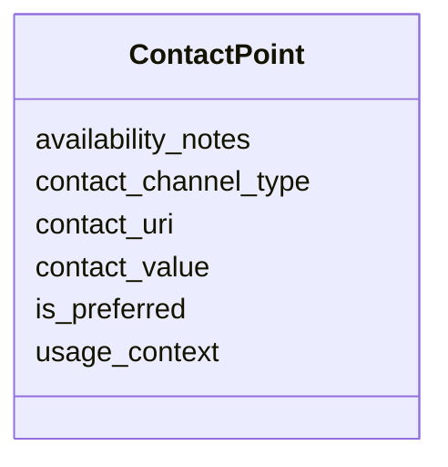

---
search:
  boost: 10.0
---

# Class: ContactPoint 


_Structured communication endpoint or profile for an agent._


<div data-search-exclude markdown="1">


URI: [pbs:ContactPoint](https://schema.pragmaticbim.ch/ContactPoint)





<!-- no inheritance hierarchy -->

## Class Properties

| Property | Value |
| --- | --- |
| Class URI | [pbs:ContactPoint](https://schema.pragmaticbim.ch/ContactPoint) |


## Slots

| Name | Cardinality and Range | Description | Inheritance |
| ---  | --- | --- | --- |
| [contact_channel_type](contact_channel_type.md) | 0..1 <br/> [String](String.md) | Communication channel type such as email, phone, website, linkedin, whatsapp, signal, slack, teams, or telegram. | direct |
| [contact_value](contact_value.md) | 0..1 <br/> [String](String.md) | Human-readable contact value such as an email address, phone number, handle, or username. | direct |
| [contact_uri](contact_uri.md) | 0..1 <br/> [Uriorcurie](Uriorcurie.md) | URI for the contact endpoint or profile where applicable. | direct |
| [usage_context](usage_context.md) | 0..1 <br/> [String](String.md) | Optional usage context such as work, personal, support, billing, or emergency. | direct |
| [is_preferred](is_preferred.md) | 0..1 <br/> [Boolean](Boolean.md) | Indicates whether this is the preferred contact point. | direct |
| [availability_notes](availability_notes.md) | 0..1 <br/> [String](String.md) | Optional notes about availability, office hours, or response expectations. | direct |


## Usages

| used by | used in | type | used |
| ---  | --- | --- | --- |
| [Agent](Agent.md) | [contact_points](contact_points.md) | range | [ContactPoint](ContactPoint.md) |
| [Person](Person.md) | [contact_points](contact_points.md) | range | [ContactPoint](ContactPoint.md) |
| [Company](Company.md) | [contact_points](contact_points.md) | range | [ContactPoint](ContactPoint.md) |


## Identifier and Mapping Information


### Schema Source


* from schema: https://schema.pragmaticbim.ch


## Mappings

| Mapping Type | Mapped Value |
| ---  | ---  |
| self | pbs:ContactPoint |
| native | pbs:ContactPoint |
| exact | schema:ContactPoint |


## LinkML Source

<!-- TODO: investigate https://stackoverflow.com/questions/37606292/how-to-create-tabbed-code-blocks-in-mkdocs-or-sphinx -->

### Direct

<details>
```yaml
name: ContactPoint
description: Structured communication endpoint or profile for an agent.
from_schema: https://schema.pragmaticbim.ch
exact_mappings:
- schema:ContactPoint
slots:
- contact_channel_type
- contact_value
- contact_uri
- usage_context
- is_preferred
- availability_notes
class_uri: pbs:ContactPoint

```
</details>

### Induced

<details>
```yaml
name: ContactPoint
description: Structured communication endpoint or profile for an agent.
from_schema: https://schema.pragmaticbim.ch
exact_mappings:
- schema:ContactPoint
attributes:
  contact_channel_type:
    name: contact_channel_type
    description: Communication channel type such as email, phone, website, linkedin,
      whatsapp, signal, slack, teams, or telegram.
    from_schema: https://schema.pragmaticbim.ch
    rank: 1000
    owner: ContactPoint
    domain_of:
    - ContactPoint
    range: string
  contact_value:
    name: contact_value
    description: Human-readable contact value such as an email address, phone number,
      handle, or username.
    from_schema: https://schema.pragmaticbim.ch
    rank: 1000
    owner: ContactPoint
    domain_of:
    - ContactPoint
    range: string
  contact_uri:
    name: contact_uri
    description: URI for the contact endpoint or profile where applicable.
    from_schema: https://schema.pragmaticbim.ch
    rank: 1000
    owner: ContactPoint
    domain_of:
    - ContactPoint
    range: uriorcurie
  usage_context:
    name: usage_context
    description: Optional usage context such as work, personal, support, billing,
      or emergency.
    from_schema: https://schema.pragmaticbim.ch
    rank: 1000
    owner: ContactPoint
    domain_of:
    - ContactPoint
    range: string
  is_preferred:
    name: is_preferred
    description: Indicates whether this is the preferred contact point.
    from_schema: https://schema.pragmaticbim.ch
    rank: 1000
    owner: ContactPoint
    domain_of:
    - ContactPoint
    range: boolean
  availability_notes:
    name: availability_notes
    description: Optional notes about availability, office hours, or response expectations.
    from_schema: https://schema.pragmaticbim.ch
    rank: 1000
    owner: ContactPoint
    domain_of:
    - ContactPoint
    range: string
class_uri: pbs:ContactPoint

```
</details></div>