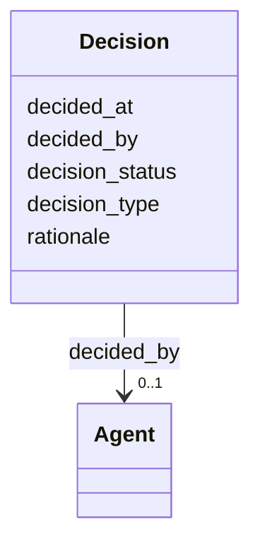

---
search:
  boost: 10.0
---

# Class: Decision 


_Decision record linked to an entity for workflow traceability and governance._


<div data-search-exclude markdown="1">


URI: [pbs:Decision](https://schema.pragmaticbim.ch/Decision)





<!-- no inheritance hierarchy -->

## Class Properties

| Property | Value |
| --- | --- |
| Class URI | [pbs:Decision](https://schema.pragmaticbim.ch/Decision) |


## Slots

| Name | Cardinality and Range | Description | Inheritance |
| ---  | --- | --- | --- |
| [decision_type](decision_type.md) | 0..1 <br/> [Uriorcurie](Uriorcurie.md) | Decision type expressed as a URI/CURIE from a controlled vocabulary. | direct |
| [decision_status](decision_status.md) | 0..1 <br/> [Uriorcurie](Uriorcurie.md) | Decision status expressed as a URI/CURIE (for example proposed, accepted, rejected, superseded). | direct |
| [decided_by](decided_by.md) | 0..1 <br/> [Agent](Agent.md) | Agent responsible for the decision. | direct |
| [decided_at](decided_at.md) | 0..1 <br/> [Datetime](Datetime.md) | Timestamp when the decision was made. | direct |
| [rationale](rationale.md) | 0..1 <br/> [String](String.md) | Human-readable rationale that explains why the decision was made. | direct |


## Usages

| used by | used in | type | used |
| ---  | --- | --- | --- |
| [Entity](Entity.md) | [decisions](decisions.md) | range | [Decision](Decision.md) |
| [Agent](Agent.md) | [decisions](decisions.md) | range | [Decision](Decision.md) |
| [Person](Person.md) | [decisions](decisions.md) | range | [Decision](Decision.md) |
| [Company](Company.md) | [decisions](decisions.md) | range | [Decision](Decision.md) |
| [Task](Task.md) | [related_decision](related_decision.md) | range | [Decision](Decision.md) |
| [Message](Message.md) | [decisions](decisions.md) | range | [Decision](Decision.md) |
| [PhysicalElement](PhysicalElement.md) | [decisions](decisions.md) | range | [Decision](Decision.md) |
| [Separator](Separator.md) | [decisions](decisions.md) | range | [Decision](Decision.md) |
| [SeparatorWall](SeparatorWall.md) | [decisions](decisions.md) | range | [Decision](Decision.md) |
| [SeparatorSlab](SeparatorSlab.md) | [decisions](decisions.md) | range | [Decision](Decision.md) |
| [ConnectionPhysical](ConnectionPhysical.md) | [decisions](decisions.md) | range | [Decision](Decision.md) |
| [Boundary](Boundary.md) | [decisions](decisions.md) | range | [Decision](Decision.md) |
| [Equipment](Equipment.md) | [decisions](decisions.md) | range | [Decision](Decision.md) |
| [VirtualEntity](VirtualEntity.md) | [decisions](decisions.md) | range | [Decision](Decision.md) |
| [SpatialContext](SpatialContext.md) | [decisions](decisions.md) | range | [Decision](Decision.md) |
| [ProjectContext](ProjectContext.md) | [decisions](decisions.md) | range | [Decision](Decision.md) |
| [PerimeterContext](PerimeterContext.md) | [decisions](decisions.md) | range | [Decision](Decision.md) |
| [LegalSiteContext](LegalSiteContext.md) | [decisions](decisions.md) | range | [Decision](Decision.md) |
| [BuiltAssetContext](BuiltAssetContext.md) | [decisions](decisions.md) | range | [Decision](Decision.md) |
| [BuildingContext](BuildingContext.md) | [decisions](decisions.md) | range | [Decision](Decision.md) |
| [CivilStructureContext](CivilStructureContext.md) | [decisions](decisions.md) | range | [Decision](Decision.md) |
| [LevelContext](LevelContext.md) | [decisions](decisions.md) | range | [Decision](Decision.md) |
| [ZoneContext](ZoneContext.md) | [decisions](decisions.md) | range | [Decision](Decision.md) |
| [Space](Space.md) | [decisions](decisions.md) | range | [Decision](Decision.md) |
| [System](System.md) | [decisions](decisions.md) | range | [Decision](Decision.md) |
| [ConnectionVirtual](ConnectionVirtual.md) | [decisions](decisions.md) | range | [Decision](Decision.md) |
| [TimeRecord](TimeRecord.md) | [decisions](decisions.md) | range | [Decision](Decision.md) |
| [CostRecord](CostRecord.md) | [decisions](decisions.md) | range | [Decision](Decision.md) |
| [Material](Material.md) | [decisions](decisions.md) | range | [Decision](Decision.md) |


## Identifier and Mapping Information


### Schema Source


* from schema: https://schema.pragmaticbim.ch


## Mappings

| Mapping Type | Mapped Value |
| ---  | ---  |
| self | pbs:Decision |
| native | pbs:Decision |
| exact | prov:Entity |


## LinkML Source

<!-- TODO: investigate https://stackoverflow.com/questions/37606292/how-to-create-tabbed-code-blocks-in-mkdocs-or-sphinx -->

### Direct

<details>
```yaml
name: Decision
description: Decision record linked to an entity for workflow traceability and governance.
from_schema: https://schema.pragmaticbim.ch
exact_mappings:
- prov:Entity
slots:
- decision_type
- decision_status
- decided_by
- decided_at
- rationale
class_uri: pbs:Decision

```
</details>

### Induced

<details>
```yaml
name: Decision
description: Decision record linked to an entity for workflow traceability and governance.
from_schema: https://schema.pragmaticbim.ch
exact_mappings:
- prov:Entity
attributes:
  decision_type:
    name: decision_type
    description: Decision type expressed as a URI/CURIE from a controlled vocabulary.
    from_schema: https://schema.pragmaticbim.ch
    rank: 1000
    slot_uri: dcterms:type
    owner: Decision
    domain_of:
    - Decision
    range: uriorcurie
  decision_status:
    name: decision_status
    description: Decision status expressed as a URI/CURIE (for example proposed, accepted,
      rejected, superseded).
    from_schema: https://schema.pragmaticbim.ch
    rank: 1000
    slot_uri: adms:status
    owner: Decision
    domain_of:
    - Decision
    range: uriorcurie
  decided_by:
    name: decided_by
    description: Agent responsible for the decision.
    from_schema: https://schema.pragmaticbim.ch
    rank: 1000
    slot_uri: prov:wasAttributedTo
    owner: Decision
    domain_of:
    - Decision
    range: Agent
    inlined: false
  decided_at:
    name: decided_at
    description: Timestamp when the decision was made.
    from_schema: https://schema.pragmaticbim.ch
    rank: 1000
    slot_uri: dcterms:created
    owner: Decision
    domain_of:
    - Decision
    range: datetime
  rationale:
    name: rationale
    description: Human-readable rationale that explains why the decision was made.
    from_schema: https://schema.pragmaticbim.ch
    rank: 1000
    slot_uri: dcterms:description
    owner: Decision
    domain_of:
    - Decision
    range: string
class_uri: pbs:Decision

```
</details></div>