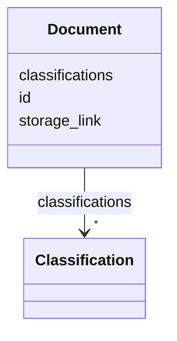

---
search:
  boost: 10.0
---

# Class: Document 


_Reference to an external document stored in a file system, DMS, object storage, or URL._


<div data-search-exclude markdown="1">


URI: [pbs:Document](https://schema.pragmaticbim.ch/Document)





<!-- no inheritance hierarchy -->

## Class Properties

| Property | Value |
| --- | --- |
| Class URI | [pbs:Document](https://schema.pragmaticbim.ch/Document) |


## Slots

| Name | Cardinality and Range | Description | Inheritance |
| ---  | --- | --- | --- |
| [id](id.md) | 0..1 <br/> [String](String.md) | Optional stable identifier when referenced externally (for example from Change records). | direct |
| [classifications](classifications.md) | * <br/> [Classification](Classification.md) | Classification entries from IFC and other schemes. | direct |
| [storage_link](storage_link.md) | 1 <br/> [Uriorcurie](Uriorcurie.md) | URI/URL/path to the stored document location. | direct |


## Usages

| used by | used in | type | used |
| ---  | --- | --- | --- |
| [Entity](Entity.md) | [documents](documents.md) | range | [Document](Document.md) |
| [Agent](Agent.md) | [documents](documents.md) | range | [Document](Document.md) |
| [Person](Person.md) | [documents](documents.md) | range | [Document](Document.md) |
| [Company](Company.md) | [documents](documents.md) | range | [Document](Document.md) |
| [Message](Message.md) | [documents](documents.md) | range | [Document](Document.md) |
| [PhysicalElement](PhysicalElement.md) | [documents](documents.md) | range | [Document](Document.md) |
| [Separator](Separator.md) | [documents](documents.md) | range | [Document](Document.md) |
| [SeparatorWall](SeparatorWall.md) | [documents](documents.md) | range | [Document](Document.md) |
| [SeparatorSlab](SeparatorSlab.md) | [documents](documents.md) | range | [Document](Document.md) |
| [ConnectionPhysical](ConnectionPhysical.md) | [documents](documents.md) | range | [Document](Document.md) |
| [Boundary](Boundary.md) | [documents](documents.md) | range | [Document](Document.md) |
| [Equipment](Equipment.md) | [documents](documents.md) | range | [Document](Document.md) |
| [VirtualEntity](VirtualEntity.md) | [documents](documents.md) | range | [Document](Document.md) |
| [SpatialContext](SpatialContext.md) | [documents](documents.md) | range | [Document](Document.md) |
| [ProjectContext](ProjectContext.md) | [documents](documents.md) | range | [Document](Document.md) |
| [PerimeterContext](PerimeterContext.md) | [documents](documents.md) | range | [Document](Document.md) |
| [LegalSiteContext](LegalSiteContext.md) | [documents](documents.md) | range | [Document](Document.md) |
| [BuiltAssetContext](BuiltAssetContext.md) | [documents](documents.md) | range | [Document](Document.md) |
| [BuildingContext](BuildingContext.md) | [documents](documents.md) | range | [Document](Document.md) |
| [CivilStructureContext](CivilStructureContext.md) | [documents](documents.md) | range | [Document](Document.md) |
| [LevelContext](LevelContext.md) | [documents](documents.md) | range | [Document](Document.md) |
| [ZoneContext](ZoneContext.md) | [documents](documents.md) | range | [Document](Document.md) |
| [Space](Space.md) | [documents](documents.md) | range | [Document](Document.md) |
| [System](System.md) | [documents](documents.md) | range | [Document](Document.md) |
| [ConnectionVirtual](ConnectionVirtual.md) | [documents](documents.md) | range | [Document](Document.md) |
| [AbstractTimeRecord](AbstractTimeRecord.md) | [documents](documents.md) | range | [Document](Document.md) |
| [TimeItem](TimeItem.md) | [documents](documents.md) | range | [Document](Document.md) |
| [Milestone](Milestone.md) | [documents](documents.md) | range | [Document](Document.md) |
| [TimePlan](TimePlan.md) | [documents](documents.md) | range | [Document](Document.md) |
| [TimeDependency](TimeDependency.md) | [documents](documents.md) | range | [Document](Document.md) |
| [AbstractCostRecord](AbstractCostRecord.md) | [documents](documents.md) | range | [Document](Document.md) |
| [CostItem](CostItem.md) | [documents](documents.md) | range | [Document](Document.md) |
| [CostAssembly](CostAssembly.md) | [documents](documents.md) | range | [Document](Document.md) |
| [Material](Material.md) | [documents](documents.md) | range | [Document](Document.md) |


## Identifier and Mapping Information


### Schema Source


* from schema: https://schema.pragmaticbim.ch


## Mappings

| Mapping Type | Mapped Value |
| ---  | ---  |
| self | pbs:Document |
| native | pbs:Document |


## LinkML Source

<!-- TODO: investigate https://stackoverflow.com/questions/37606292/how-to-create-tabbed-code-blocks-in-mkdocs-or-sphinx -->

### Direct

<details>
```yaml
name: Document
description: Reference to an external document stored in a file system, DMS, object
  storage, or URL.
from_schema: https://schema.pragmaticbim.ch
slots:
- id
- classifications
- storage_link
slot_usage:
  id:
    name: id
    description: Optional stable identifier when referenced externally (for example
      from Change records).
    identifier: false
    required: false
class_uri: pbs:Document

```
</details>

### Induced

<details>
```yaml
name: Document
description: Reference to an external document stored in a file system, DMS, object
  storage, or URL.
from_schema: https://schema.pragmaticbim.ch
slot_usage:
  id:
    name: id
    description: Optional stable identifier when referenced externally (for example
      from Change records).
    identifier: false
    required: false
attributes:
  id:
    name: id
    description: Optional stable identifier when referenced externally (for example
      from Change records).
    from_schema: https://schema.pragmaticbim.ch
    rank: 1000
    identifier: false
    owner: Document
    domain_of:
    - Entity
    - Task
    - Document
    - Requirement
    - Change
    - ChangeSet
    range: string
    required: false
  classifications:
    name: classifications
    description: Classification entries from IFC and other schemes.
    from_schema: https://schema.pragmaticbim.ch
    rank: 1000
    owner: Document
    domain_of:
    - Entity
    - Document
    range: Classification
    multivalued: true
    inlined: true
  storage_link:
    name: storage_link
    description: URI/URL/path to the stored document location.
    from_schema: https://schema.pragmaticbim.ch
    rank: 1000
    owner: Document
    domain_of:
    - Document
    range: uriorcurie
    required: true
class_uri: pbs:Document

```
</details></div>