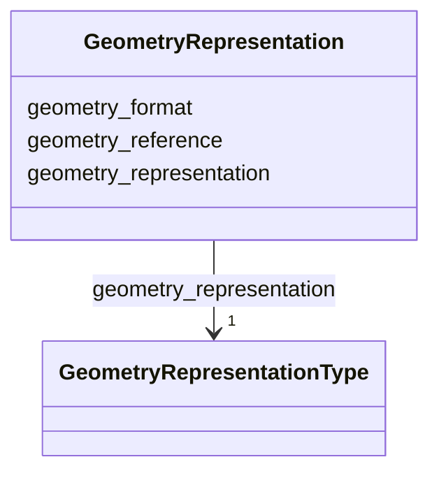

---
search:
  boost: 10.0
---

# Class: GeometryRepresentation 


_Minimal geometry reference for an entity, separating representation from encoding format._


<div data-search-exclude markdown="1">


URI: [pbs:GeometryRepresentation](https://schema.pragmaticbim.ch/GeometryRepresentation)





<!-- no inheritance hierarchy -->

## Class Properties

| Property | Value |
| --- | --- |
| Class URI | [pbs:GeometryRepresentation](https://schema.pragmaticbim.ch/GeometryRepresentation) |


## Slots

| Name | Cardinality and Range | Description | Inheritance |
| ---  | --- | --- | --- |
| [geometry_reference](geometry_reference.md) | 1 <br/> [String](String.md) | URI/path/hash/pointer to geometry payload. | direct |
| [geometry_representation](geometry_representation.md) | 1 <br/> [GeometryRepresentationType](GeometryRepresentationType.md) | Representation kind/dimension (for example body_3d, footprint_2d, point), independent of file format. | direct |
| [geometry_format](geometry_format.md) | 0..1 <br/> [String](String.md) | Optional serialization/encoding format (for example ifc, gltf, wkt, geojson), independent of representation kind. | direct |


## Usages

| used by | used in | type | used |
| ---  | --- | --- | --- |
| [Entity](Entity.md) | [geometry_representations](geometry_representations.md) | range | [GeometryRepresentation](GeometryRepresentation.md) |
| [Agent](Agent.md) | [geometry_representations](geometry_representations.md) | range | [GeometryRepresentation](GeometryRepresentation.md) |
| [Person](Person.md) | [geometry_representations](geometry_representations.md) | range | [GeometryRepresentation](GeometryRepresentation.md) |
| [Company](Company.md) | [geometry_representations](geometry_representations.md) | range | [GeometryRepresentation](GeometryRepresentation.md) |
| [Message](Message.md) | [geometry_representations](geometry_representations.md) | range | [GeometryRepresentation](GeometryRepresentation.md) |
| [PhysicalElement](PhysicalElement.md) | [geometry_representations](geometry_representations.md) | range | [GeometryRepresentation](GeometryRepresentation.md) |
| [Separator](Separator.md) | [geometry_representations](geometry_representations.md) | range | [GeometryRepresentation](GeometryRepresentation.md) |
| [SeparatorWall](SeparatorWall.md) | [geometry_representations](geometry_representations.md) | range | [GeometryRepresentation](GeometryRepresentation.md) |
| [SeparatorSlab](SeparatorSlab.md) | [geometry_representations](geometry_representations.md) | range | [GeometryRepresentation](GeometryRepresentation.md) |
| [ConnectionPhysical](ConnectionPhysical.md) | [geometry_representations](geometry_representations.md) | range | [GeometryRepresentation](GeometryRepresentation.md) |
| [Boundary](Boundary.md) | [geometry_representations](geometry_representations.md) | range | [GeometryRepresentation](GeometryRepresentation.md) |
| [Equipment](Equipment.md) | [geometry_representations](geometry_representations.md) | range | [GeometryRepresentation](GeometryRepresentation.md) |
| [VirtualEntity](VirtualEntity.md) | [geometry_representations](geometry_representations.md) | range | [GeometryRepresentation](GeometryRepresentation.md) |
| [SpatialContext](SpatialContext.md) | [geometry_representations](geometry_representations.md) | range | [GeometryRepresentation](GeometryRepresentation.md) |
| [ProjectContext](ProjectContext.md) | [geometry_representations](geometry_representations.md) | range | [GeometryRepresentation](GeometryRepresentation.md) |
| [PerimeterContext](PerimeterContext.md) | [geometry_representations](geometry_representations.md) | range | [GeometryRepresentation](GeometryRepresentation.md) |
| [LegalSiteContext](LegalSiteContext.md) | [geometry_representations](geometry_representations.md) | range | [GeometryRepresentation](GeometryRepresentation.md) |
| [BuiltAssetContext](BuiltAssetContext.md) | [geometry_representations](geometry_representations.md) | range | [GeometryRepresentation](GeometryRepresentation.md) |
| [BuildingContext](BuildingContext.md) | [geometry_representations](geometry_representations.md) | range | [GeometryRepresentation](GeometryRepresentation.md) |
| [CivilStructureContext](CivilStructureContext.md) | [geometry_representations](geometry_representations.md) | range | [GeometryRepresentation](GeometryRepresentation.md) |
| [LevelContext](LevelContext.md) | [geometry_representations](geometry_representations.md) | range | [GeometryRepresentation](GeometryRepresentation.md) |
| [ZoneContext](ZoneContext.md) | [geometry_representations](geometry_representations.md) | range | [GeometryRepresentation](GeometryRepresentation.md) |
| [Space](Space.md) | [geometry_representations](geometry_representations.md) | range | [GeometryRepresentation](GeometryRepresentation.md) |
| [System](System.md) | [geometry_representations](geometry_representations.md) | range | [GeometryRepresentation](GeometryRepresentation.md) |
| [ConnectionVirtual](ConnectionVirtual.md) | [geometry_representations](geometry_representations.md) | range | [GeometryRepresentation](GeometryRepresentation.md) |
| [AbstractTimeRecord](AbstractTimeRecord.md) | [geometry_representations](geometry_representations.md) | range | [GeometryRepresentation](GeometryRepresentation.md) |
| [TimeItem](TimeItem.md) | [geometry_representations](geometry_representations.md) | range | [GeometryRepresentation](GeometryRepresentation.md) |
| [Milestone](Milestone.md) | [geometry_representations](geometry_representations.md) | range | [GeometryRepresentation](GeometryRepresentation.md) |
| [TimePlan](TimePlan.md) | [geometry_representations](geometry_representations.md) | range | [GeometryRepresentation](GeometryRepresentation.md) |
| [TimeDependency](TimeDependency.md) | [geometry_representations](geometry_representations.md) | range | [GeometryRepresentation](GeometryRepresentation.md) |
| [AbstractCostRecord](AbstractCostRecord.md) | [geometry_representations](geometry_representations.md) | range | [GeometryRepresentation](GeometryRepresentation.md) |
| [CostItem](CostItem.md) | [geometry_representations](geometry_representations.md) | range | [GeometryRepresentation](GeometryRepresentation.md) |
| [CostAssembly](CostAssembly.md) | [geometry_representations](geometry_representations.md) | range | [GeometryRepresentation](GeometryRepresentation.md) |
| [Material](Material.md) | [geometry_representations](geometry_representations.md) | range | [GeometryRepresentation](GeometryRepresentation.md) |


## Identifier and Mapping Information


### Schema Source


* from schema: https://schema.pragmaticbim.ch


## Mappings

| Mapping Type | Mapped Value |
| ---  | ---  |
| self | pbs:GeometryRepresentation |
| native | pbs:GeometryRepresentation |


## LinkML Source

<!-- TODO: investigate https://stackoverflow.com/questions/37606292/how-to-create-tabbed-code-blocks-in-mkdocs-or-sphinx -->

### Direct

<details>
```yaml
name: GeometryRepresentation
description: Minimal geometry reference for an entity, separating representation from
  encoding format.
from_schema: https://schema.pragmaticbim.ch
slots:
- geometry_reference
- geometry_representation
- geometry_format
class_uri: pbs:GeometryRepresentation

```
</details>

### Induced

<details>
```yaml
name: GeometryRepresentation
description: Minimal geometry reference for an entity, separating representation from
  encoding format.
from_schema: https://schema.pragmaticbim.ch
attributes:
  geometry_reference:
    name: geometry_reference
    description: URI/path/hash/pointer to geometry payload.
    from_schema: https://schema.pragmaticbim.ch
    rank: 1000
    owner: GeometryRepresentation
    domain_of:
    - GeometryRepresentation
    range: string
    required: true
  geometry_representation:
    name: geometry_representation
    description: Representation kind/dimension (for example body_3d, footprint_2d,
      point), independent of file format.
    from_schema: https://schema.pragmaticbim.ch
    rank: 1000
    owner: GeometryRepresentation
    domain_of:
    - GeometryRepresentation
    range: GeometryRepresentationType
    required: true
  geometry_format:
    name: geometry_format
    description: Optional serialization/encoding format (for example ifc, gltf, wkt,
      geojson), independent of representation kind.
    from_schema: https://schema.pragmaticbim.ch
    rank: 1000
    owner: GeometryRepresentation
    domain_of:
    - GeometryRepresentation
    range: string
class_uri: pbs:GeometryRepresentation

```
</details></div>