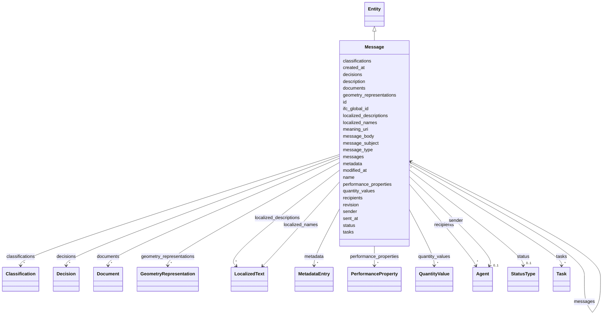

---
search:
  boost: 10.0
---

# Class: Message 


_Message or communication record linked to an entity for coordination and traceability._


<div data-search-exclude markdown="1">


URI: [pbs:Message](https://schema.pragmaticbim.ch/Message)





## Inheritance
* [Entity](Entity.md)
    * **Message**


## Class Properties

| Property | Value |
| --- | --- |
| Class URI | [pbs:Message](https://schema.pragmaticbim.ch/Message) |


## Slots

| Name | Cardinality and Range | Description | Inheritance |
| ---  | --- | --- | --- |
| [message_type](message_type.md) | 0..1 <br/> [Uriorcurie](Uriorcurie.md) | Message type expressed as a URI/CURIE from a controlled vocabulary. | direct |
| [sender](sender.md) | 0..1 <br/> [Agent](Agent.md) | Agent that sent the message. | direct |
| [recipients](recipients.md) | * <br/> [Agent](Agent.md) | Agents that received the message. | direct |
| [sent_at](sent_at.md) | 0..1 <br/> [Datetime](Datetime.md) | Timestamp when the message was sent. | direct |
| [message_subject](message_subject.md) | 0..1 <br/> [String](String.md) | Optional subject or headline for the message. | direct |
| [message_body](message_body.md) | 0..1 <br/> [String](String.md) | Human-readable message content. | direct |
| [id](id.md) | 1 <br/> [String](String.md) | Unique local identifier. | [Entity](Entity.md) |
| [name](name.md) | 1 <br/> [String](String.md) | Default display name. | [Entity](Entity.md) |
| [localized_names](localized_names.md) | * <br/> [LocalizedText](LocalizedText.md) | Localized variants of name. | [Entity](Entity.md) |
| [description](description.md) | 0..1 <br/> [String](String.md) | Default description text. | [Entity](Entity.md) |
| [meaning_uri](meaning_uri.md) | 0..1 <br/> [Uriorcurie](Uriorcurie.md) | Optional semantic URI for linking the entity instance to an external ontology concept. | [Entity](Entity.md) |
| [localized_descriptions](localized_descriptions.md) | * <br/> [LocalizedText](LocalizedText.md) | Localized variants of description. | [Entity](Entity.md) |
| [ifc_global_id](ifc_global_id.md) | 0..1 <br/> [String](String.md) | IFC GlobalId of the mapped entity. | [Entity](Entity.md) |
| [classifications](classifications.md) | * <br/> [Classification](Classification.md) | Classification entries from IFC and other schemes. | [Entity](Entity.md) |
| [geometry_representations](geometry_representations.md) | * <br/> [GeometryRepresentation](GeometryRepresentation.md) | Geometry references associated with the entity. A single element may link to multiple geometry representations to serve different intents (authoring, coordination, analysis, visualization) without duplicating the element itself. | [Entity](Entity.md) |
| [quantity_values](quantity_values.md) | * <br/> [QuantityValue](QuantityValue.md) | Quantities associated with the entity. | [Entity](Entity.md) |
| [documents](documents.md) | * <br/> [Document](Document.md) | Linked documents associated with this entity. | [Entity](Entity.md) |
| [metadata](metadata.md) | * <br/> [MetadataEntry](MetadataEntry.md) | Generic metadata container for IFC attributes/properties and project-specific extensions. | [Entity](Entity.md) |
| [performance_properties](performance_properties.md) | * <br/> [PerformanceProperty](PerformanceProperty.md) | Normalized, strongly typed domain properties (fire/acoustic/thermal/structural/ security/material) extracted from raw IFC PropertySet values. | [Entity](Entity.md) |
| [decisions](decisions.md) | * <br/> [Decision](Decision.md) | Decision records associated with this entity. | [Entity](Entity.md) |
| [tasks](tasks.md) | * <br/> [Task](Task.md) | Tasks associated with this entity. | [Entity](Entity.md) |
| [messages](messages.md) | * <br/> [Message](Message.md) | Messages associated with this entity. | [Entity](Entity.md) |
| [created_at](created_at.md) | 0..1 <br/> [Datetime](Datetime.md) | Creation timestamp for this entity record. | [Entity](Entity.md) |
| [modified_at](modified_at.md) | 0..1 <br/> [Datetime](Datetime.md) | Last modification timestamp for this entity record. | [Entity](Entity.md) |
| [revision](revision.md) | 0..1 <br/> [Integer](Integer.md) | Integer revision counter for change tracking. | [Entity](Entity.md) |
| [status](status.md) | 0..1 <br/> [StatusType](StatusType.md) | Lifecycle or QA status. | [Entity](Entity.md) |


## Usages

| used by | used in | type | used |
| ---  | --- | --- | --- |
| [Entity](Entity.md) | [messages](messages.md) | range | [Message](Message.md) |
| [Agent](Agent.md) | [messages](messages.md) | range | [Message](Message.md) |
| [Person](Person.md) | [messages](messages.md) | range | [Message](Message.md) |
| [Company](Company.md) | [messages](messages.md) | range | [Message](Message.md) |
| [Message](Message.md) | [messages](messages.md) | range | [Message](Message.md) |
| [PhysicalElement](PhysicalElement.md) | [messages](messages.md) | range | [Message](Message.md) |
| [Separator](Separator.md) | [messages](messages.md) | range | [Message](Message.md) |
| [SeparatorWall](SeparatorWall.md) | [messages](messages.md) | range | [Message](Message.md) |
| [SeparatorSlab](SeparatorSlab.md) | [messages](messages.md) | range | [Message](Message.md) |
| [ConnectionPhysical](ConnectionPhysical.md) | [messages](messages.md) | range | [Message](Message.md) |
| [Boundary](Boundary.md) | [messages](messages.md) | range | [Message](Message.md) |
| [Equipment](Equipment.md) | [messages](messages.md) | range | [Message](Message.md) |
| [VirtualEntity](VirtualEntity.md) | [messages](messages.md) | range | [Message](Message.md) |
| [SpatialContext](SpatialContext.md) | [messages](messages.md) | range | [Message](Message.md) |
| [ProjectContext](ProjectContext.md) | [messages](messages.md) | range | [Message](Message.md) |
| [PerimeterContext](PerimeterContext.md) | [messages](messages.md) | range | [Message](Message.md) |
| [LegalSiteContext](LegalSiteContext.md) | [messages](messages.md) | range | [Message](Message.md) |
| [BuiltAssetContext](BuiltAssetContext.md) | [messages](messages.md) | range | [Message](Message.md) |
| [BuildingContext](BuildingContext.md) | [messages](messages.md) | range | [Message](Message.md) |
| [CivilStructureContext](CivilStructureContext.md) | [messages](messages.md) | range | [Message](Message.md) |
| [LevelContext](LevelContext.md) | [messages](messages.md) | range | [Message](Message.md) |
| [ZoneContext](ZoneContext.md) | [messages](messages.md) | range | [Message](Message.md) |
| [Space](Space.md) | [messages](messages.md) | range | [Message](Message.md) |
| [System](System.md) | [messages](messages.md) | range | [Message](Message.md) |
| [ConnectionVirtual](ConnectionVirtual.md) | [messages](messages.md) | range | [Message](Message.md) |
| [AbstractTimeRecord](AbstractTimeRecord.md) | [messages](messages.md) | range | [Message](Message.md) |
| [TimeItem](TimeItem.md) | [messages](messages.md) | range | [Message](Message.md) |
| [Milestone](Milestone.md) | [messages](messages.md) | range | [Message](Message.md) |
| [TimePlan](TimePlan.md) | [messages](messages.md) | range | [Message](Message.md) |
| [TimeDependency](TimeDependency.md) | [messages](messages.md) | range | [Message](Message.md) |
| [AbstractCostRecord](AbstractCostRecord.md) | [messages](messages.md) | range | [Message](Message.md) |
| [CostItem](CostItem.md) | [messages](messages.md) | range | [Message](Message.md) |
| [CostAssembly](CostAssembly.md) | [messages](messages.md) | range | [Message](Message.md) |
| [Material](Material.md) | [messages](messages.md) | range | [Message](Message.md) |


## Identifier and Mapping Information


### Schema Source


* from schema: https://schema.pragmaticbim.ch


## Mappings

| Mapping Type | Mapped Value |
| ---  | ---  |
| self | pbs:Message |
| native | pbs:Message |
| exact | schema:Message, prov:Entity |


## LinkML Source

<!-- TODO: investigate https://stackoverflow.com/questions/37606292/how-to-create-tabbed-code-blocks-in-mkdocs-or-sphinx -->

### Direct

<details>
```yaml
name: Message
description: Message or communication record linked to an entity for coordination
  and traceability.
from_schema: https://schema.pragmaticbim.ch
exact_mappings:
- schema:Message
- prov:Entity
is_a: Entity
slots:
- message_type
- sender
- recipients
- sent_at
- message_subject
- message_body
class_uri: pbs:Message

```
</details>

### Induced

<details>
```yaml
name: Message
description: Message or communication record linked to an entity for coordination
  and traceability.
from_schema: https://schema.pragmaticbim.ch
exact_mappings:
- schema:Message
- prov:Entity
is_a: Entity
attributes:
  message_type:
    name: message_type
    description: Message type expressed as a URI/CURIE from a controlled vocabulary.
    from_schema: https://schema.pragmaticbim.ch
    rank: 1000
    slot_uri: dcterms:type
    owner: Message
    domain_of:
    - Message
    range: uriorcurie
  sender:
    name: sender
    description: Agent that sent the message.
    from_schema: https://schema.pragmaticbim.ch
    rank: 1000
    slot_uri: schema:sender
    owner: Message
    domain_of:
    - Message
    range: Agent
    inlined: false
  recipients:
    name: recipients
    description: Agents that received the message.
    from_schema: https://schema.pragmaticbim.ch
    rank: 1000
    slot_uri: schema:recipient
    owner: Message
    domain_of:
    - Message
    range: Agent
    multivalued: true
    inlined: false
  sent_at:
    name: sent_at
    description: Timestamp when the message was sent.
    from_schema: https://schema.pragmaticbim.ch
    rank: 1000
    slot_uri: schema:dateSent
    owner: Message
    domain_of:
    - Message
    range: datetime
  message_subject:
    name: message_subject
    description: Optional subject or headline for the message.
    from_schema: https://schema.pragmaticbim.ch
    rank: 1000
    slot_uri: schema:headline
    owner: Message
    domain_of:
    - Message
    range: string
  message_body:
    name: message_body
    description: Human-readable message content.
    from_schema: https://schema.pragmaticbim.ch
    rank: 1000
    slot_uri: schema:text
    owner: Message
    domain_of:
    - Message
    range: string
  id:
    name: id
    description: Unique local identifier.
    from_schema: https://schema.pragmaticbim.ch
    rank: 1000
    identifier: true
    owner: Message
    domain_of:
    - Entity
    - Task
    - Document
    - Requirement
    - Change
    - ChangeSet
    range: string
    required: true
  name:
    name: name
    description: Default display name.
    from_schema: https://schema.pragmaticbim.ch
    rank: 1000
    owner: Message
    domain_of:
    - Entity
    - Requirement
    range: string
    required: true
  localized_names:
    name: localized_names
    description: Localized variants of name.
    from_schema: https://schema.pragmaticbim.ch
    rank: 1000
    owner: Message
    domain_of:
    - Entity
    range: LocalizedText
    multivalued: true
    inlined: true
  description:
    name: description
    description: Default description text.
    from_schema: https://schema.pragmaticbim.ch
    rank: 1000
    owner: Message
    domain_of:
    - Entity
    - Requirement
    range: string
  meaning_uri:
    name: meaning_uri
    description: Optional semantic URI for linking the entity instance to an external
      ontology concept.
    from_schema: https://schema.pragmaticbim.ch
    rank: 1000
    owner: Message
    domain_of:
    - Entity
    range: uriorcurie
  localized_descriptions:
    name: localized_descriptions
    description: Localized variants of description.
    from_schema: https://schema.pragmaticbim.ch
    rank: 1000
    owner: Message
    domain_of:
    - Entity
    range: LocalizedText
    multivalued: true
    inlined: true
  ifc_global_id:
    name: ifc_global_id
    description: IFC GlobalId of the mapped entity.
    from_schema: https://schema.pragmaticbim.ch
    rank: 1000
    owner: Message
    domain_of:
    - Entity
    - Change
    range: string
    pattern: ^[0-3][0-9A-Za-z_$]{21}$
  classifications:
    name: classifications
    description: Classification entries from IFC and other schemes.
    from_schema: https://schema.pragmaticbim.ch
    rank: 1000
    owner: Message
    domain_of:
    - Entity
    - Document
    range: Classification
    multivalued: true
    inlined: true
  geometry_representations:
    name: geometry_representations
    description: 'Geometry references associated with the entity. A single element
      may link to multiple geometry representations to serve different intents (authoring,
      coordination, analysis, visualization) without duplicating the element itself.

      '
    from_schema: https://schema.pragmaticbim.ch
    rank: 1000
    owner: Message
    domain_of:
    - Entity
    range: GeometryRepresentation
    multivalued: true
    inlined: true
  quantity_values:
    name: quantity_values
    description: Quantities associated with the entity.
    from_schema: https://schema.pragmaticbim.ch
    rank: 1000
    owner: Message
    domain_of:
    - Entity
    range: QuantityValue
    multivalued: true
    inlined: true
  documents:
    name: documents
    description: Linked documents associated with this entity.
    from_schema: https://schema.pragmaticbim.ch
    rank: 1000
    owner: Message
    domain_of:
    - Entity
    range: Document
    multivalued: true
    inlined: true
  metadata:
    name: metadata
    description: Generic metadata container for IFC attributes/properties and project-specific
      extensions.
    from_schema: https://schema.pragmaticbim.ch
    rank: 1000
    owner: Message
    domain_of:
    - Entity
    range: MetadataEntry
    multivalued: true
    inlined: true
  performance_properties:
    name: performance_properties
    description: 'Normalized, strongly typed domain properties (fire/acoustic/thermal/structural/
      security/material) extracted from raw IFC PropertySet values.

      '
    from_schema: https://schema.pragmaticbim.ch
    rank: 1000
    owner: Message
    domain_of:
    - Entity
    range: PerformanceProperty
    multivalued: true
    inlined: true
  decisions:
    name: decisions
    description: Decision records associated with this entity.
    from_schema: https://schema.pragmaticbim.ch
    rank: 1000
    owner: Message
    domain_of:
    - Entity
    range: Decision
    multivalued: true
    inlined: true
  tasks:
    name: tasks
    description: Tasks associated with this entity.
    from_schema: https://schema.pragmaticbim.ch
    rank: 1000
    owner: Message
    domain_of:
    - Entity
    range: Task
    multivalued: true
    inlined: true
  messages:
    name: messages
    description: Messages associated with this entity.
    from_schema: https://schema.pragmaticbim.ch
    rank: 1000
    owner: Message
    domain_of:
    - Entity
    range: Message
    multivalued: true
    inlined: true
  created_at:
    name: created_at
    description: Creation timestamp for this entity record.
    from_schema: https://schema.pragmaticbim.ch
    rank: 1000
    owner: Message
    domain_of:
    - Entity
    range: datetime
  modified_at:
    name: modified_at
    description: Last modification timestamp for this entity record.
    from_schema: https://schema.pragmaticbim.ch
    rank: 1000
    owner: Message
    domain_of:
    - Entity
    range: datetime
  revision:
    name: revision
    description: Integer revision counter for change tracking.
    from_schema: https://schema.pragmaticbim.ch
    rank: 1000
    owner: Message
    domain_of:
    - Entity
    range: integer
    minimum_value: 0
  status:
    name: status
    description: Lifecycle or QA status.
    from_schema: https://schema.pragmaticbim.ch
    rank: 1000
    owner: Message
    domain_of:
    - Entity
    - Requirement
    range: StatusType
class_uri: pbs:Message

```
</details></div>