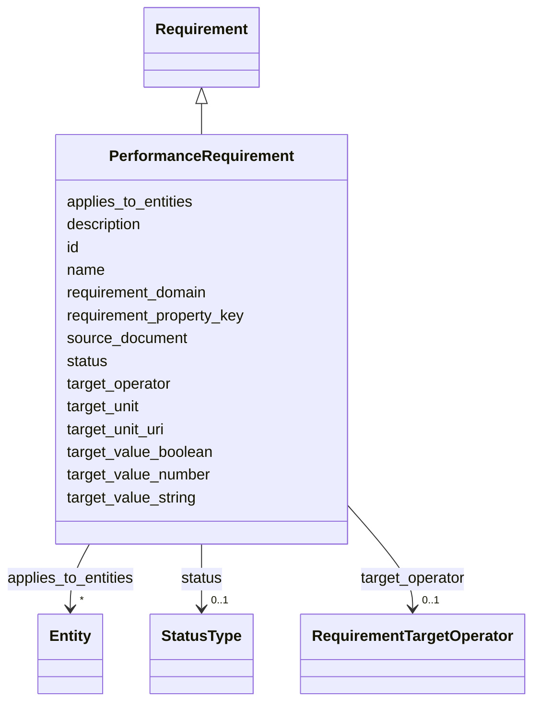

---
search:
  boost: 10.0
---

# Class: PerformanceRequirement 


_Performance target requirement (U-value, fire rating, airflow, acoustic, etc.)._


<div data-search-exclude markdown="1">


URI: [pbs:PerformanceRequirement](https://schema.pragmaticbim.ch/PerformanceRequirement)





## Inheritance
* [Requirement](Requirement.md)
    * **PerformanceRequirement**


## Class Properties

| Property | Value |
| --- | --- |
| Class URI | [pbs:PerformanceRequirement](https://schema.pragmaticbim.ch/PerformanceRequirement) |


## Slots

| Name | Cardinality and Range | Description | Inheritance |
| ---  | --- | --- | --- |
| [requirement_property_key](requirement_property_key.md) | 1 <br/> [String](String.md) | Canonical performance key for the target (for example u_value, resistance_rating). Aligns with performance property keys where applicable. | direct |
| [target_operator](target_operator.md) | 0..1 <br/> [RequirementTargetOperator](RequirementTargetOperator.md) | Comparison operator for the requirement target. | direct |
| [target_value_string](target_value_string.md) | 0..1 <br/> [String](String.md) | Textual target value when applicable. | direct |
| [target_value_number](target_value_number.md) | 0..1 <br/> [Double](Double.md) | Numeric target value when applicable. | direct |
| [target_value_boolean](target_value_boolean.md) | 0..1 <br/> [Boolean](Boolean.md) | Boolean target value when applicable. | direct |
| [target_unit](target_unit.md) | 0..1 <br/> [String](String.md) | Unit for numeric targets (for example W/m2K, min, dB). | direct |
| [target_unit_uri](target_unit_uri.md) | 0..1 <br/> [Uriorcurie](Uriorcurie.md) | Optional URI identifying the target unit (for example QUDT). | direct |
| [id](id.md) | 1 <br/> [String](String.md) | Unique local identifier. | [Requirement](Requirement.md) |
| [name](name.md) | 1 <br/> [String](String.md) | Default display name. | [Requirement](Requirement.md) |
| [description](description.md) | 0..1 <br/> [String](String.md) | Default description text. | [Requirement](Requirement.md) |
| [requirement_domain](requirement_domain.md) | 1 <br/> [String](String.md) | Domain of this requirement record (performance, spatial, regulatory, brief). | [Requirement](Requirement.md) |
| [applies_to_entities](applies_to_entities.md) | * <br/> [Entity](Entity.md) | Model entities this record applies to (requirements, cost items, schedule items, etc.). | [Requirement](Requirement.md) |
| [source_document](source_document.md) | 0..1 <br/> [Uriorcurie](Uriorcurie.md) | Optional URI to norm, brief, or source document backing this requirement. | [Requirement](Requirement.md) |
| [status](status.md) | 0..1 <br/> [StatusType](StatusType.md) | Lifecycle or QA status. | [Requirement](Requirement.md) |


## Identifier and Mapping Information


### Schema Source


* from schema: https://schema.pragmaticbim.ch


## Mappings

| Mapping Type | Mapped Value |
| ---  | ---  |
| self | pbs:PerformanceRequirement |
| native | pbs:PerformanceRequirement |


## LinkML Source

<!-- TODO: investigate https://stackoverflow.com/questions/37606292/how-to-create-tabbed-code-blocks-in-mkdocs-or-sphinx -->

### Direct

<details>
```yaml
name: PerformanceRequirement
description: Performance target requirement (U-value, fire rating, airflow, acoustic,
  etc.).
from_schema: https://schema.pragmaticbim.ch
is_a: Requirement
slots:
- requirement_property_key
- target_operator
- target_value_string
- target_value_number
- target_value_boolean
- target_unit
- target_unit_uri
slot_usage:
  requirement_domain:
    name: requirement_domain
    range: string
    equals_string: performance
class_uri: pbs:PerformanceRequirement

```
</details>

### Induced

<details>
```yaml
name: PerformanceRequirement
description: Performance target requirement (U-value, fire rating, airflow, acoustic,
  etc.).
from_schema: https://schema.pragmaticbim.ch
is_a: Requirement
slot_usage:
  requirement_domain:
    name: requirement_domain
    range: string
    equals_string: performance
attributes:
  requirement_property_key:
    name: requirement_property_key
    description: 'Canonical performance key for the target (for example u_value, resistance_rating).
      Aligns with performance property keys where applicable.

      '
    from_schema: https://schema.pragmaticbim.ch
    rank: 1000
    owner: PerformanceRequirement
    domain_of:
    - PerformanceRequirement
    range: string
    required: true
  target_operator:
    name: target_operator
    description: Comparison operator for the requirement target.
    from_schema: https://schema.pragmaticbim.ch
    rank: 1000
    owner: PerformanceRequirement
    domain_of:
    - PerformanceRequirement
    range: RequirementTargetOperator
  target_value_string:
    name: target_value_string
    description: Textual target value when applicable.
    from_schema: https://schema.pragmaticbim.ch
    rank: 1000
    owner: PerformanceRequirement
    domain_of:
    - PerformanceRequirement
    range: string
  target_value_number:
    name: target_value_number
    description: Numeric target value when applicable.
    from_schema: https://schema.pragmaticbim.ch
    rank: 1000
    owner: PerformanceRequirement
    domain_of:
    - PerformanceRequirement
    range: double
  target_value_boolean:
    name: target_value_boolean
    description: Boolean target value when applicable.
    from_schema: https://schema.pragmaticbim.ch
    rank: 1000
    owner: PerformanceRequirement
    domain_of:
    - PerformanceRequirement
    range: boolean
  target_unit:
    name: target_unit
    description: Unit for numeric targets (for example W/m2K, min, dB).
    from_schema: https://schema.pragmaticbim.ch
    rank: 1000
    owner: PerformanceRequirement
    domain_of:
    - PerformanceRequirement
    range: string
  target_unit_uri:
    name: target_unit_uri
    description: Optional URI identifying the target unit (for example QUDT).
    from_schema: https://schema.pragmaticbim.ch
    rank: 1000
    owner: PerformanceRequirement
    domain_of:
    - PerformanceRequirement
    range: uriorcurie
  id:
    name: id
    description: Unique local identifier.
    from_schema: https://schema.pragmaticbim.ch
    rank: 1000
    identifier: true
    owner: PerformanceRequirement
    domain_of:
    - Entity
    - Task
    - Document
    - Requirement
    - Change
    - ChangeSet
    range: string
    required: true
  name:
    name: name
    description: Default display name.
    from_schema: https://schema.pragmaticbim.ch
    rank: 1000
    owner: PerformanceRequirement
    domain_of:
    - Entity
    - Requirement
    range: string
    required: true
  description:
    name: description
    description: Default description text.
    from_schema: https://schema.pragmaticbim.ch
    rank: 1000
    owner: PerformanceRequirement
    domain_of:
    - Entity
    - Requirement
    range: string
  requirement_domain:
    name: requirement_domain
    description: Domain of this requirement record (performance, spatial, regulatory,
      brief).
    from_schema: https://schema.pragmaticbim.ch
    rank: 1000
    owner: PerformanceRequirement
    domain_of:
    - Requirement
    range: string
    required: true
    equals_string: performance
  applies_to_entities:
    name: applies_to_entities
    description: Model entities this record applies to (requirements, cost items,
      schedule items, etc.).
    from_schema: https://schema.pragmaticbim.ch
    rank: 1000
    owner: PerformanceRequirement
    domain_of:
    - Requirement
    - AbstractTimeRecord
    - AbstractCostRecord
    range: Entity
    multivalued: true
    inlined: false
  source_document:
    name: source_document
    description: Optional URI to norm, brief, or source document backing this requirement.
    from_schema: https://schema.pragmaticbim.ch
    rank: 1000
    owner: PerformanceRequirement
    domain_of:
    - Requirement
    range: uriorcurie
  status:
    name: status
    description: Lifecycle or QA status.
    from_schema: https://schema.pragmaticbim.ch
    rank: 1000
    owner: PerformanceRequirement
    domain_of:
    - Entity
    - Requirement
    range: StatusType
class_uri: pbs:PerformanceRequirement

```
</details></div>