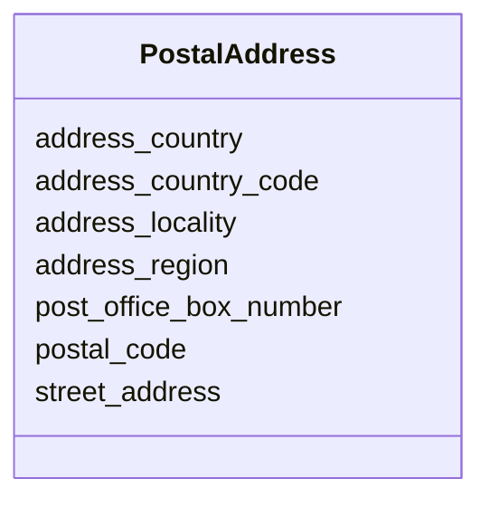

---
search:
  boost: 10.0
---

# Class: PostalAddress 


_Structured postal or physical address for an agent._


<div data-search-exclude markdown="1">


URI: [pbs:PostalAddress](https://schema.pragmaticbim.ch/PostalAddress)





<!-- no inheritance hierarchy -->

## Class Properties

| Property | Value |
| --- | --- |
| Class URI | [pbs:PostalAddress](https://schema.pragmaticbim.ch/PostalAddress) |


## Slots

| Name | Cardinality and Range | Description | Inheritance |
| ---  | --- | --- | --- |
| [street_address](street_address.md) | 0..1 <br/> [String](String.md) | Street name and house number or equivalent address line. | direct |
| [post_office_box_number](post_office_box_number.md) | 0..1 <br/> [String](String.md) | Post office box number where applicable. | direct |
| [postal_code](postal_code.md) | 0..1 <br/> [String](String.md) | Postal or ZIP code. | direct |
| [address_locality](address_locality.md) | 0..1 <br/> [String](String.md) | Locality, city, or town. | direct |
| [address_region](address_region.md) | 0..1 <br/> [String](String.md) | Region, state, canton, or province. | direct |
| [address_country](address_country.md) | 0..1 <br/> [String](String.md) | Country name. | direct |
| [address_country_code](address_country_code.md) | 0..1 <br/> [String](String.md) | Optional ISO 3166-1 alpha-2 or alpha-3 country code. | direct |


## Usages

| used by | used in | type | used |
| ---  | --- | --- | --- |
| [Agent](Agent.md) | [postal_addresses](postal_addresses.md) | range | [PostalAddress](PostalAddress.md) |
| [Person](Person.md) | [postal_addresses](postal_addresses.md) | range | [PostalAddress](PostalAddress.md) |
| [Company](Company.md) | [postal_addresses](postal_addresses.md) | range | [PostalAddress](PostalAddress.md) |


## Identifier and Mapping Information


### Schema Source


* from schema: https://schema.pragmaticbim.ch


## Mappings

| Mapping Type | Mapped Value |
| ---  | ---  |
| self | pbs:PostalAddress |
| native | pbs:PostalAddress |
| exact | schema:PostalAddress |


## LinkML Source

<!-- TODO: investigate https://stackoverflow.com/questions/37606292/how-to-create-tabbed-code-blocks-in-mkdocs-or-sphinx -->

### Direct

<details>
```yaml
name: PostalAddress
description: Structured postal or physical address for an agent.
from_schema: https://schema.pragmaticbim.ch
exact_mappings:
- schema:PostalAddress
slots:
- street_address
- post_office_box_number
- postal_code
- address_locality
- address_region
- address_country
- address_country_code
class_uri: pbs:PostalAddress

```
</details>

### Induced

<details>
```yaml
name: PostalAddress
description: Structured postal or physical address for an agent.
from_schema: https://schema.pragmaticbim.ch
exact_mappings:
- schema:PostalAddress
attributes:
  street_address:
    name: street_address
    description: Street name and house number or equivalent address line.
    from_schema: https://schema.pragmaticbim.ch
    rank: 1000
    slot_uri: schema:streetAddress
    owner: PostalAddress
    domain_of:
    - PostalAddress
    range: string
  post_office_box_number:
    name: post_office_box_number
    description: Post office box number where applicable.
    from_schema: https://schema.pragmaticbim.ch
    rank: 1000
    slot_uri: schema:postOfficeBoxNumber
    owner: PostalAddress
    domain_of:
    - PostalAddress
    range: string
  postal_code:
    name: postal_code
    description: Postal or ZIP code.
    from_schema: https://schema.pragmaticbim.ch
    rank: 1000
    slot_uri: schema:postalCode
    owner: PostalAddress
    domain_of:
    - PostalAddress
    range: string
  address_locality:
    name: address_locality
    description: Locality, city, or town.
    from_schema: https://schema.pragmaticbim.ch
    rank: 1000
    slot_uri: schema:addressLocality
    owner: PostalAddress
    domain_of:
    - PostalAddress
    range: string
  address_region:
    name: address_region
    description: Region, state, canton, or province.
    from_schema: https://schema.pragmaticbim.ch
    rank: 1000
    slot_uri: schema:addressRegion
    owner: PostalAddress
    domain_of:
    - PostalAddress
    range: string
  address_country:
    name: address_country
    description: Country name.
    from_schema: https://schema.pragmaticbim.ch
    rank: 1000
    slot_uri: schema:addressCountry
    owner: PostalAddress
    domain_of:
    - PostalAddress
    range: string
  address_country_code:
    name: address_country_code
    description: Optional ISO 3166-1 alpha-2 or alpha-3 country code.
    from_schema: https://schema.pragmaticbim.ch
    rank: 1000
    owner: PostalAddress
    domain_of:
    - PostalAddress
    range: string
class_uri: pbs:PostalAddress

```
</details></div>