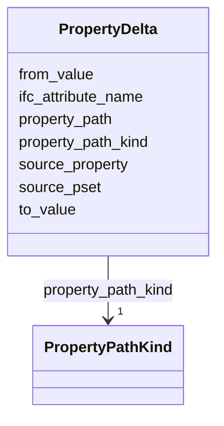

---
search:
  boost: 10.0
---

# Class: PropertyDelta 


_Field-level difference between two revision states. Supports IFC attributes, PropertySets, schema slots, document fields, and text spans._

__


<div data-search-exclude markdown="1">


URI: [pbs:PropertyDelta](https://schema.pragmaticbim.ch/PropertyDelta)





<!-- no inheritance hierarchy -->

## Class Properties

| Property | Value |
| --- | --- |
| Class URI | [pbs:PropertyDelta](https://schema.pragmaticbim.ch/PropertyDelta) |


## Slots

| Name | Cardinality and Range | Description | Inheritance |
| ---  | --- | --- | --- |
| [property_path](property_path.md) | 1 <br/> [String](String.md) | Canonical path to the changed field. Examples: Pset_WallCommon.FireRating, IfcWall.Name, description, section.4.2.requirement_3, body:char_offset:1204-1389. | direct |
| [property_path_kind](property_path_kind.md) | 1 <br/> [PropertyPathKind](PropertyPathKind.md) | Classification of the property path for downstream diff interpretation. | direct |
| [from_value](from_value.md) | 0..1 <br/> [String](String.md) | Prior value serialized as text. Absent or null for new subjects or fields. | direct |
| [to_value](to_value.md) | 0..1 <br/> [String](String.md) | New value serialized as text. Absent or null for deleted subjects or fields. | direct |
| [source_pset](source_pset.md) | 0..1 <br/> [String](String.md) | Original IFC PropertySet name (for example Pset_WallCommon). | direct |
| [source_property](source_property.md) | 0..1 <br/> [String](String.md) | Original property name inside the source PropertySet (for example FireRating). | direct |
| [ifc_attribute_name](ifc_attribute_name.md) | 0..1 <br/> [String](String.md) | IFC attribute name when property_path_kind is ifc_attribute (for example Name, GlobalId). | direct |


## Usages

| used by | used in | type | used |
| ---  | --- | --- | --- |
| [PropertyChange](PropertyChange.md) | [property_delta](property_delta.md) | range | [PropertyDelta](PropertyDelta.md) |
| [RequirementChange](RequirementChange.md) | [property_delta](property_delta.md) | range | [PropertyDelta](PropertyDelta.md) |


## Identifier and Mapping Information


### Schema Source


* from schema: https://schema.pragmaticbim.ch


## Mappings

| Mapping Type | Mapped Value |
| ---  | ---  |
| self | pbs:PropertyDelta |
| native | pbs:PropertyDelta |


## LinkML Source

<!-- TODO: investigate https://stackoverflow.com/questions/37606292/how-to-create-tabbed-code-blocks-in-mkdocs-or-sphinx -->

### Direct

<details>
```yaml
name: PropertyDelta
description: 'Field-level difference between two revision states. Supports IFC attributes,
  PropertySets, schema slots, document fields, and text spans.

  '
from_schema: https://schema.pragmaticbim.ch
slots:
- property_path
- property_path_kind
- from_value
- to_value
- source_pset
- source_property
- ifc_attribute_name
class_uri: pbs:PropertyDelta

```
</details>

### Induced

<details>
```yaml
name: PropertyDelta
description: 'Field-level difference between two revision states. Supports IFC attributes,
  PropertySets, schema slots, document fields, and text spans.

  '
from_schema: https://schema.pragmaticbim.ch
attributes:
  property_path:
    name: property_path
    description: 'Canonical path to the changed field. Examples: Pset_WallCommon.FireRating,
      IfcWall.Name, description, section.4.2.requirement_3, body:char_offset:1204-1389.

      '
    from_schema: https://schema.pragmaticbim.ch
    rank: 1000
    owner: PropertyDelta
    domain_of:
    - PropertyDelta
    range: string
    required: true
  property_path_kind:
    name: property_path_kind
    description: Classification of the property path for downstream diff interpretation.
    from_schema: https://schema.pragmaticbim.ch
    rank: 1000
    owner: PropertyDelta
    domain_of:
    - PropertyDelta
    range: PropertyPathKind
    required: true
  from_value:
    name: from_value
    description: Prior value serialized as text. Absent or null for new subjects or
      fields.
    from_schema: https://schema.pragmaticbim.ch
    rank: 1000
    owner: PropertyDelta
    domain_of:
    - PropertyDelta
    range: string
  to_value:
    name: to_value
    description: New value serialized as text. Absent or null for deleted subjects
      or fields.
    from_schema: https://schema.pragmaticbim.ch
    rank: 1000
    owner: PropertyDelta
    domain_of:
    - PropertyDelta
    range: string
  source_pset:
    name: source_pset
    description: Original IFC PropertySet name (for example Pset_WallCommon).
    from_schema: https://schema.pragmaticbim.ch
    rank: 1000
    owner: PropertyDelta
    domain_of:
    - PerformanceProperty
    - PropertyDelta
    range: string
  source_property:
    name: source_property
    description: Original property name inside the source PropertySet (for example
      FireRating).
    from_schema: https://schema.pragmaticbim.ch
    rank: 1000
    owner: PropertyDelta
    domain_of:
    - PerformanceProperty
    - PropertyDelta
    range: string
  ifc_attribute_name:
    name: ifc_attribute_name
    description: IFC attribute name when property_path_kind is ifc_attribute (for
      example Name, GlobalId).
    from_schema: https://schema.pragmaticbim.ch
    rank: 1000
    owner: PropertyDelta
    domain_of:
    - PropertyDelta
    range: string
class_uri: pbs:PropertyDelta

```
</details></div>