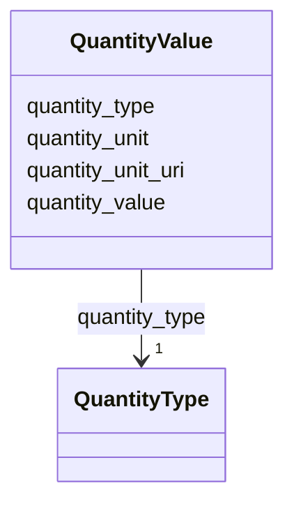

---
search:
  boost: 10.0
---

# Class: QuantityValue 


_Minimal quantity record for costing and analysis._


<div data-search-exclude markdown="1">


URI: [pbs:QuantityValue](https://schema.pragmaticbim.ch/QuantityValue)





<!-- no inheritance hierarchy -->

## Class Properties

| Property | Value |
| --- | --- |
| Class URI | [pbs:QuantityValue](https://schema.pragmaticbim.ch/QuantityValue) |


## Slots

| Name | Cardinality and Range | Description | Inheritance |
| ---  | --- | --- | --- |
| [quantity_type](quantity_type.md) | 1 <br/> [QuantityType](QuantityType.md) | Controlled quantity type. | direct |
| [quantity_value](quantity_value.md) | 1 <br/> [Double](Double.md) | Numeric quantity value. | direct |
| [quantity_unit](quantity_unit.md) | 1 <br/> [String](String.md) | Unit of the quantity value. | direct |
| [quantity_unit_uri](quantity_unit_uri.md) | 0..1 <br/> [Uriorcurie](Uriorcurie.md) | Optional URI that identifies the quantity unit in an external vocabulary such as QUDT. | direct |


## Usages

| used by | used in | type | used |
| ---  | --- | --- | --- |
| [Entity](Entity.md) | [quantity_values](quantity_values.md) | range | [QuantityValue](QuantityValue.md) |
| [Agent](Agent.md) | [quantity_values](quantity_values.md) | range | [QuantityValue](QuantityValue.md) |
| [Person](Person.md) | [quantity_values](quantity_values.md) | range | [QuantityValue](QuantityValue.md) |
| [Company](Company.md) | [quantity_values](quantity_values.md) | range | [QuantityValue](QuantityValue.md) |
| [Message](Message.md) | [quantity_values](quantity_values.md) | range | [QuantityValue](QuantityValue.md) |
| [PhysicalElement](PhysicalElement.md) | [quantity_values](quantity_values.md) | range | [QuantityValue](QuantityValue.md) |
| [Separator](Separator.md) | [quantity_values](quantity_values.md) | range | [QuantityValue](QuantityValue.md) |
| [SeparatorWall](SeparatorWall.md) | [quantity_values](quantity_values.md) | range | [QuantityValue](QuantityValue.md) |
| [SeparatorSlab](SeparatorSlab.md) | [quantity_values](quantity_values.md) | range | [QuantityValue](QuantityValue.md) |
| [ConnectionPhysical](ConnectionPhysical.md) | [quantity_values](quantity_values.md) | range | [QuantityValue](QuantityValue.md) |
| [Boundary](Boundary.md) | [quantity_values](quantity_values.md) | range | [QuantityValue](QuantityValue.md) |
| [Equipment](Equipment.md) | [quantity_values](quantity_values.md) | range | [QuantityValue](QuantityValue.md) |
| [VirtualEntity](VirtualEntity.md) | [quantity_values](quantity_values.md) | range | [QuantityValue](QuantityValue.md) |
| [SpatialContext](SpatialContext.md) | [quantity_values](quantity_values.md) | range | [QuantityValue](QuantityValue.md) |
| [ProjectContext](ProjectContext.md) | [quantity_values](quantity_values.md) | range | [QuantityValue](QuantityValue.md) |
| [PerimeterContext](PerimeterContext.md) | [quantity_values](quantity_values.md) | range | [QuantityValue](QuantityValue.md) |
| [LegalSiteContext](LegalSiteContext.md) | [quantity_values](quantity_values.md) | range | [QuantityValue](QuantityValue.md) |
| [BuiltAssetContext](BuiltAssetContext.md) | [quantity_values](quantity_values.md) | range | [QuantityValue](QuantityValue.md) |
| [BuildingContext](BuildingContext.md) | [quantity_values](quantity_values.md) | range | [QuantityValue](QuantityValue.md) |
| [CivilStructureContext](CivilStructureContext.md) | [quantity_values](quantity_values.md) | range | [QuantityValue](QuantityValue.md) |
| [LevelContext](LevelContext.md) | [quantity_values](quantity_values.md) | range | [QuantityValue](QuantityValue.md) |
| [ZoneContext](ZoneContext.md) | [quantity_values](quantity_values.md) | range | [QuantityValue](QuantityValue.md) |
| [Space](Space.md) | [quantity_values](quantity_values.md) | range | [QuantityValue](QuantityValue.md) |
| [System](System.md) | [quantity_values](quantity_values.md) | range | [QuantityValue](QuantityValue.md) |
| [ConnectionVirtual](ConnectionVirtual.md) | [quantity_values](quantity_values.md) | range | [QuantityValue](QuantityValue.md) |
| [TimeRecord](TimeRecord.md) | [quantity_values](quantity_values.md) | range | [QuantityValue](QuantityValue.md) |
| [CostRecord](CostRecord.md) | [quantity_values](quantity_values.md) | range | [QuantityValue](QuantityValue.md) |
| [Material](Material.md) | [quantity_values](quantity_values.md) | range | [QuantityValue](QuantityValue.md) |


## Identifier and Mapping Information


### Schema Source


* from schema: https://schema.pragmaticbim.ch


## Mappings

| Mapping Type | Mapped Value |
| ---  | ---  |
| self | pbs:QuantityValue |
| native | pbs:QuantityValue |


## LinkML Source

<!-- TODO: investigate https://stackoverflow.com/questions/37606292/how-to-create-tabbed-code-blocks-in-mkdocs-or-sphinx -->

### Direct

<details>
```yaml
name: QuantityValue
description: Minimal quantity record for costing and analysis.
from_schema: https://schema.pragmaticbim.ch
slots:
- quantity_type
- quantity_value
- quantity_unit
- quantity_unit_uri
class_uri: pbs:QuantityValue

```
</details>

### Induced

<details>
```yaml
name: QuantityValue
description: Minimal quantity record for costing and analysis.
from_schema: https://schema.pragmaticbim.ch
attributes:
  quantity_type:
    name: quantity_type
    description: Controlled quantity type.
    from_schema: https://schema.pragmaticbim.ch
    rank: 1000
    owner: QuantityValue
    domain_of:
    - QuantityValue
    range: QuantityType
    required: true
  quantity_value:
    name: quantity_value
    description: Numeric quantity value.
    from_schema: https://schema.pragmaticbim.ch
    rank: 1000
    owner: QuantityValue
    domain_of:
    - QuantityValue
    range: double
    required: true
    minimum_value: 0
  quantity_unit:
    name: quantity_unit
    description: Unit of the quantity value.
    from_schema: https://schema.pragmaticbim.ch
    rank: 1000
    owner: QuantityValue
    domain_of:
    - QuantityValue
    range: string
    required: true
  quantity_unit_uri:
    name: quantity_unit_uri
    description: Optional URI that identifies the quantity unit in an external vocabulary
      such as QUDT.
    from_schema: https://schema.pragmaticbim.ch
    rank: 1000
    owner: QuantityValue
    domain_of:
    - QuantityValue
    range: uriorcurie
class_uri: pbs:QuantityValue

```
</details></div>