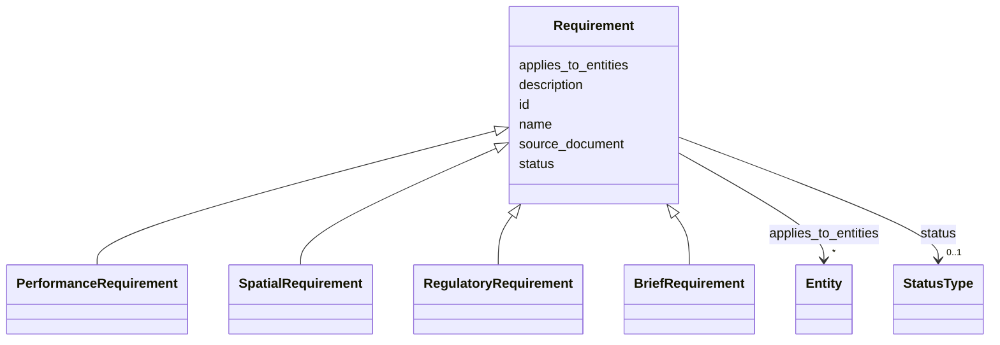

---
search:
  boost: 10.0
---

# Class: Requirement 


_Prescriptive requirement record (content_kind requirement). Not an Entity; may apply to one or more model entities. Domain is discriminated by concrete subclass (PerformanceRequirement, SpatialRequirement, etc.), not a separate slot._

__


<div data-search-exclude markdown="1">


* __NOTE__: this is an abstract class and should not be instantiated directly


URI: [pbs:Requirement](https://schema.pragmaticbim.ch/Requirement)





## Inheritance
* **Requirement**
    * [PerformanceRequirement](PerformanceRequirement.md)
    * [SpatialRequirement](SpatialRequirement.md)
    * [RegulatoryRequirement](RegulatoryRequirement.md)
    * [BriefRequirement](BriefRequirement.md)


## Class Properties

| Property | Value |
| --- | --- |
| Class URI | [pbs:Requirement](https://schema.pragmaticbim.ch/Requirement) |


## Slots

| Name | Cardinality and Range | Description | Inheritance |
| ---  | --- | --- | --- |
| [id](id.md) | 1 <br/> [String](String.md) | Unique local identifier. | direct |
| [name](name.md) | 1 <br/> [String](String.md) | Default display name. | direct |
| [description](description.md) | 0..1 <br/> [String](String.md) | Default description text. | direct |
| [applies_to_entities](applies_to_entities.md) | * <br/> [Entity](Entity.md) | Model entities this record applies to (requirements, cost items, schedule items, etc.). | direct |
| [source_document](source_document.md) | 0..1 <br/> [Uriorcurie](Uriorcurie.md) | Optional URI to norm, brief, or source document backing this requirement. | direct |
| [status](status.md) | 0..1 <br/> [StatusType](StatusType.md) | Lifecycle or QA status. | direct |


## Identifier and Mapping Information


### Schema Source


* from schema: https://schema.pragmaticbim.ch


## Mappings

| Mapping Type | Mapped Value |
| ---  | ---  |
| self | pbs:Requirement |
| native | pbs:Requirement |


## LinkML Source

<!-- TODO: investigate https://stackoverflow.com/questions/37606292/how-to-create-tabbed-code-blocks-in-mkdocs-or-sphinx -->

### Direct

<details>
```yaml
name: Requirement
description: 'Prescriptive requirement record (content_kind requirement). Not an Entity;
  may apply to one or more model entities. Domain is discriminated by concrete subclass
  (PerformanceRequirement, SpatialRequirement, etc.), not a separate slot.

  '
from_schema: https://schema.pragmaticbim.ch
abstract: true
slots:
- id
- name
- description
- applies_to_entities
- source_document
- status
slot_usage:
  id:
    name: id
    identifier: true
    required: true
class_uri: pbs:Requirement

```
</details>

### Induced

<details>
```yaml
name: Requirement
description: 'Prescriptive requirement record (content_kind requirement). Not an Entity;
  may apply to one or more model entities. Domain is discriminated by concrete subclass
  (PerformanceRequirement, SpatialRequirement, etc.), not a separate slot.

  '
from_schema: https://schema.pragmaticbim.ch
abstract: true
slot_usage:
  id:
    name: id
    identifier: true
    required: true
attributes:
  id:
    name: id
    description: Unique local identifier.
    from_schema: https://schema.pragmaticbim.ch
    rank: 1000
    identifier: true
    owner: Requirement
    domain_of:
    - Entity
    - Task
    - Document
    - Requirement
    - Change
    - ChangeSet
    range: string
    required: true
  name:
    name: name
    description: Default display name.
    from_schema: https://schema.pragmaticbim.ch
    rank: 1000
    owner: Requirement
    domain_of:
    - Entity
    - Requirement
    range: string
    required: true
  description:
    name: description
    description: Default description text.
    from_schema: https://schema.pragmaticbim.ch
    rank: 1000
    owner: Requirement
    domain_of:
    - Entity
    - Requirement
    range: string
  applies_to_entities:
    name: applies_to_entities
    description: Model entities this record applies to (requirements, cost items,
      schedule items, etc.).
    from_schema: https://schema.pragmaticbim.ch
    rank: 1000
    owner: Requirement
    domain_of:
    - Requirement
    - TimeRecord
    - CostRecord
    range: Entity
    multivalued: true
    inlined: false
  source_document:
    name: source_document
    description: Optional URI to norm, brief, or source document backing this requirement.
    from_schema: https://schema.pragmaticbim.ch
    rank: 1000
    owner: Requirement
    domain_of:
    - Requirement
    range: uriorcurie
  status:
    name: status
    description: Lifecycle or QA status.
    from_schema: https://schema.pragmaticbim.ch
    rank: 1000
    owner: Requirement
    domain_of:
    - Entity
    - Requirement
    range: StatusType
class_uri: pbs:Requirement

```
</details></div>