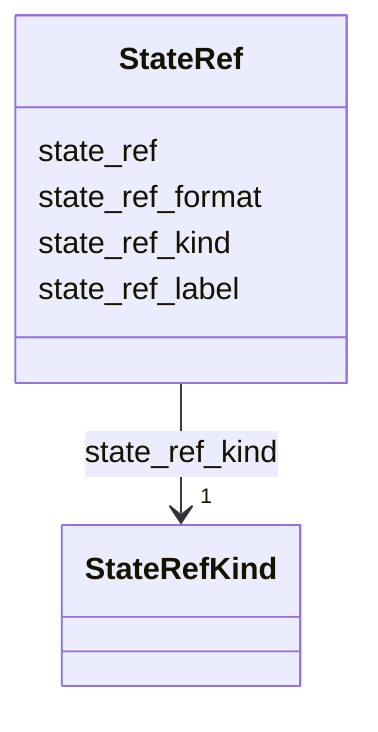

---
search:
  boost: 10.0
---

# Class: StateRef 


_Pointer to a content state at a specific revision. Covers IFC models, geometry payloads, documents, and extracted text._

__


<div data-search-exclude markdown="1">


URI: [pbs:StateRef](https://schema.pragmaticbim.ch/StateRef)





<!-- no inheritance hierarchy -->

## Class Properties

| Property | Value |
| --- | --- |
| Class URI | [pbs:StateRef](https://schema.pragmaticbim.ch/StateRef) |


## Slots

| Name | Cardinality and Range | Description | Inheritance |
| ---  | --- | --- | --- |
| [state_ref](state_ref.md) | 1 <br/> [Uriorcurie](Uriorcurie.md) | URI, path, or content hash identifying the stored content state. | direct |
| [state_ref_kind](state_ref_kind.md) | 1 <br/> [StateRefKind](StateRefKind.md) | Kind of content referenced (for example ifc_model, document, text_extract). | direct |
| [state_ref_format](state_ref_format.md) | 0..1 <br/> [String](String.md) | Optional serialization format (for example ifc, gltf, pdf, docx, markdown, plain_text, json). | direct |
| [state_ref_label](state_ref_label.md) | 0..1 <br/> [String](String.md) | Optional human-readable label (for example LOD300 export, Spec v3 draft). | direct |


## Usages

| used by | used in | type | used |
| ---  | --- | --- | --- |
| [Change](Change.md) | [from_state_ref](from_state_ref.md) | range | [StateRef](StateRef.md) |
| [Change](Change.md) | [to_state_ref](to_state_ref.md) | range | [StateRef](StateRef.md) |
| [PropertyChange](PropertyChange.md) | [from_state_ref](from_state_ref.md) | range | [StateRef](StateRef.md) |
| [PropertyChange](PropertyChange.md) | [to_state_ref](to_state_ref.md) | range | [StateRef](StateRef.md) |
| [GeometryChange](GeometryChange.md) | [from_state_ref](from_state_ref.md) | range | [StateRef](StateRef.md) |
| [GeometryChange](GeometryChange.md) | [to_state_ref](to_state_ref.md) | range | [StateRef](StateRef.md) |
| [RequirementChange](RequirementChange.md) | [from_state_ref](from_state_ref.md) | range | [StateRef](StateRef.md) |
| [RequirementChange](RequirementChange.md) | [to_state_ref](to_state_ref.md) | range | [StateRef](StateRef.md) |
| [MatchChange](MatchChange.md) | [from_state_ref](from_state_ref.md) | range | [StateRef](StateRef.md) |
| [MatchChange](MatchChange.md) | [to_state_ref](to_state_ref.md) | range | [StateRef](StateRef.md) |
| [AdditionChange](AdditionChange.md) | [from_state_ref](from_state_ref.md) | range | [StateRef](StateRef.md) |
| [AdditionChange](AdditionChange.md) | [to_state_ref](to_state_ref.md) | range | [StateRef](StateRef.md) |
| [DeletionChange](DeletionChange.md) | [from_state_ref](from_state_ref.md) | range | [StateRef](StateRef.md) |
| [DeletionChange](DeletionChange.md) | [to_state_ref](to_state_ref.md) | range | [StateRef](StateRef.md) |
| [ChangeSet](ChangeSet.md) | [ifc_state_ref](ifc_state_ref.md) | range | [StateRef](StateRef.md) |
| [ChangeSet](ChangeSet.md) | [document_state_refs](document_state_refs.md) | range | [StateRef](StateRef.md) |


## Identifier and Mapping Information


### Schema Source


* from schema: https://schema.pragmaticbim.ch


## Mappings

| Mapping Type | Mapped Value |
| ---  | ---  |
| self | pbs:StateRef |
| native | pbs:StateRef |


## LinkML Source

<!-- TODO: investigate https://stackoverflow.com/questions/37606292/how-to-create-tabbed-code-blocks-in-mkdocs-or-sphinx -->

### Direct

<details>
```yaml
name: StateRef
description: 'Pointer to a content state at a specific revision. Covers IFC models,
  geometry payloads, documents, and extracted text.

  '
from_schema: https://schema.pragmaticbim.ch
slots:
- state_ref
- state_ref_kind
- state_ref_format
- state_ref_label
class_uri: pbs:StateRef

```
</details>

### Induced

<details>
```yaml
name: StateRef
description: 'Pointer to a content state at a specific revision. Covers IFC models,
  geometry payloads, documents, and extracted text.

  '
from_schema: https://schema.pragmaticbim.ch
attributes:
  state_ref:
    name: state_ref
    description: URI, path, or content hash identifying the stored content state.
    from_schema: https://schema.pragmaticbim.ch
    rank: 1000
    owner: StateRef
    domain_of:
    - StateRef
    range: uriorcurie
    required: true
  state_ref_kind:
    name: state_ref_kind
    description: Kind of content referenced (for example ifc_model, document, text_extract).
    from_schema: https://schema.pragmaticbim.ch
    rank: 1000
    owner: StateRef
    domain_of:
    - StateRef
    range: StateRefKind
    required: true
  state_ref_format:
    name: state_ref_format
    description: 'Optional serialization format (for example ifc, gltf, pdf, docx,
      markdown, plain_text, json).

      '
    from_schema: https://schema.pragmaticbim.ch
    rank: 1000
    owner: StateRef
    domain_of:
    - StateRef
    range: string
  state_ref_label:
    name: state_ref_label
    description: Optional human-readable label (for example LOD300 export, Spec v3
      draft).
    from_schema: https://schema.pragmaticbim.ch
    rank: 1000
    owner: StateRef
    domain_of:
    - StateRef
    range: string
class_uri: pbs:StateRef

```
</details></div>