---
search:
  boost: 10.0
---

# Class: System 


_Building service system grouping that serves spaces or zones._


<div data-search-exclude markdown="1">


URI: [pbs:System](https://schema.pragmaticbim.ch/System)

```mermaid
 classDiagram
    class System
    click System href "./System.html"
      VirtualEntity <|-- System
        click VirtualEntity href "./VirtualEntity.html"
      System : classifications
        System --> "*" Classification : classifications
        click Classification href "./Classification.html"
      System : contained_entities
        System --> "*" Entity : contained_entities
        click Entity href "./Entity.html"
      System : cost_records
        System --> "*" CostRecord : cost_records
        click CostRecord href "./CostRecord.html"
      System : created_at
      System : decisions
        System --> "*" Decision : decisions
        click Decision href "./Decision.html"
      System : description
      System : documents
        System --> "*" Document : documents
        click Document href "./Document.html"
      System : geometry_representations
        System --> "*" GeometryRepresentation : geometry_representations
        click GeometryRepresentation href "./GeometryRepresentation.html"
      System : id
      System : ifc_global_id
      System : localized_descriptions
        System --> "*" LocalizedText : localized_descriptions
        click LocalizedText href "./LocalizedText.html"
      System : localized_names
        System --> "*" LocalizedText : localized_names
        click LocalizedText href "./LocalizedText.html"
      System : materials
        System --> "*" Material : materials
        click Material href "./Material.html"
      System : meaning_uri
      System : messages
        System --> "*" Message : messages
        click Message href "./Message.html"
      System : metadata
        System --> "*" MetadataEntry : metadata
        click MetadataEntry href "./MetadataEntry.html"
      System : modified_at
      System : name
      System : parent_building
        System --> "0..1" BuiltAssetContext : parent_building
        click BuiltAssetContext href "./BuiltAssetContext.html"
      System : parent_project
        System --> "0..1" ProjectContext : parent_project
        click ProjectContext href "./ProjectContext.html"
      System : performance_properties
        System --> "*" PerformanceProperty : performance_properties
        click PerformanceProperty href "./PerformanceProperty.html"
      System : quantity_values
        System --> "*" QuantityValue : quantity_values
        click QuantityValue href "./QuantityValue.html"
      System : revision
      System : serves_spaces
        System --> "*" Space : serves_spaces
        click Space href "./Space.html"
      System : serves_zones
        System --> "*" ZoneContext : serves_zones
        click ZoneContext href "./ZoneContext.html"
      System : status
        System --> "0..1" StatusType : status
        click StatusType href "./StatusType.html"
      System : system_discipline
        System --> "1" SystemDiscipline : system_discipline
        click SystemDiscipline href "./SystemDiscipline.html"
      System : system_type
        System --> "1" SystemType : system_type
        click SystemType href "./SystemType.html"
      System : tasks
        System --> "*" Task : tasks
        click Task href "./Task.html"
      System : time_records
        System --> "*" TimeRecord : time_records
        click TimeRecord href "./TimeRecord.html"
```





## Inheritance
* [Entity](Entity.md)
    * [VirtualEntity](VirtualEntity.md)
        * **System**


## Class Properties

| Property | Value |
| --- | --- |
| Class URI | [pbs:System](https://schema.pragmaticbim.ch/System) |


## Slots

| Name | Cardinality and Range | Description | Inheritance |
| ---  | --- | --- | --- |
| [system_type](system_type.md) | 1 <br/> [SystemType](SystemType.md) | Classification of system role (unit, network, terminal). | direct |
| [system_discipline](system_discipline.md) | 1 <br/> [SystemDiscipline](SystemDiscipline.md) | Classification of system discipline (electrical, sanitary, ventilation, heating). | direct |
| [parent_project](parent_project.md) | 0..1 <br/> [ProjectContext](ProjectContext.md) | Parent project context reference. | direct |
| [parent_building](parent_building.md) | 0..1 <br/> [BuiltAssetContext](BuiltAssetContext.md) | Parent building context reference. | direct |
| [serves_spaces](serves_spaces.md) | * <br/> [Space](Space.md) | Spaces served by this system. | direct |
| [serves_zones](serves_zones.md) | * <br/> [ZoneContext](ZoneContext.md) | Zone context nodes served by this system. | direct |
| [contained_entities](contained_entities.md) | * <br/> [Entity](Entity.md) | Generic containment for associated entities. | direct |
| [cost_records](cost_records.md) | * <br/> [CostRecord](CostRecord.md) | Cost records associated with this entity. | [VirtualEntity](VirtualEntity.md) |
| [time_records](time_records.md) | * <br/> [TimeRecord](TimeRecord.md) | Time records associated with this entity. | [VirtualEntity](VirtualEntity.md) |
| [materials](materials.md) | * <br/> [Material](Material.md) | Material definitions associated with this entity. | [VirtualEntity](VirtualEntity.md) |
| [id](id.md) | 1 <br/> [String](String.md) | Unique local identifier. | [Entity](Entity.md) |
| [name](name.md) | 1 <br/> [String](String.md) | Default display name. | [Entity](Entity.md) |
| [localized_names](localized_names.md) | * <br/> [LocalizedText](LocalizedText.md) | Localized variants of name. | [Entity](Entity.md) |
| [description](description.md) | 0..1 <br/> [String](String.md) | Default description text. | [Entity](Entity.md) |
| [meaning_uri](meaning_uri.md) | 0..1 <br/> [Uriorcurie](Uriorcurie.md) | Optional semantic URI for linking the entity instance to an external ontology concept. | [Entity](Entity.md) |
| [localized_descriptions](localized_descriptions.md) | * <br/> [LocalizedText](LocalizedText.md) | Localized variants of description. | [Entity](Entity.md) |
| [ifc_global_id](ifc_global_id.md) | 0..1 <br/> [String](String.md) | IFC GlobalId of the mapped entity. | [Entity](Entity.md) |
| [classifications](classifications.md) | * <br/> [Classification](Classification.md) | Classification entries from IFC and other schemes. | [Entity](Entity.md) |
| [geometry_representations](geometry_representations.md) | * <br/> [GeometryRepresentation](GeometryRepresentation.md) | Geometry references associated with the entity. A single element may link to multiple geometry representations to serve different intents (authoring, coordination, analysis, visualization) without duplicating the element itself. | [Entity](Entity.md) |
| [quantity_values](quantity_values.md) | * <br/> [QuantityValue](QuantityValue.md) | Quantities associated with the entity. | [Entity](Entity.md) |
| [documents](documents.md) | * <br/> [Document](Document.md) | Linked documents associated with this entity. | [Entity](Entity.md) |
| [metadata](metadata.md) | * <br/> [MetadataEntry](MetadataEntry.md) | Generic metadata container for IFC attributes/properties and project-specific extensions. | [Entity](Entity.md) |
| [performance_properties](performance_properties.md) | * <br/> [PerformanceProperty](PerformanceProperty.md) | Normalized, strongly typed domain properties (fire/acoustic/thermal/structural/ security/material) extracted from raw IFC PropertySet values. | [Entity](Entity.md) |
| [decisions](decisions.md) | * <br/> [Decision](Decision.md) | Decision records associated with this entity. | [Entity](Entity.md) |
| [tasks](tasks.md) | * <br/> [Task](Task.md) | Tasks associated with this entity. | [Entity](Entity.md) |
| [messages](messages.md) | * <br/> [Message](Message.md) | Messages associated with this entity. | [Entity](Entity.md) |
| [created_at](created_at.md) | 0..1 <br/> [Datetime](Datetime.md) | Creation timestamp for this entity record. | [Entity](Entity.md) |
| [modified_at](modified_at.md) | 0..1 <br/> [Datetime](Datetime.md) | Last modification timestamp for this entity record. | [Entity](Entity.md) |
| [revision](revision.md) | 0..1 <br/> [Integer](Integer.md) | Integer revision counter for change tracking. | [Entity](Entity.md) |
| [status](status.md) | 0..1 <br/> [StatusType](StatusType.md) | Lifecycle or QA status. | [Entity](Entity.md) |


## Usages

| used by | used in | type | used |
| ---  | --- | --- | --- |
| [Equipment](Equipment.md) | [parent_system](parent_system.md) | range | [System](System.md) |


## Identifier and Mapping Information


### Schema Source


* from schema: https://schema.pragmaticbim.ch


## Mappings

| Mapping Type | Mapped Value |
| ---  | ---  |
| self | pbs:System |
| native | pbs:System |
| exact | ifcowl:IfcSystem |


## LinkML Source

<!-- TODO: investigate https://stackoverflow.com/questions/37606292/how-to-create-tabbed-code-blocks-in-mkdocs-or-sphinx -->

### Direct

<details>
```yaml
name: System
description: Building service system grouping that serves spaces or zones.
from_schema: https://schema.pragmaticbim.ch
exact_mappings:
- ifcowl:IfcSystem
is_a: VirtualEntity
slots:
- system_type
- system_discipline
- parent_project
- parent_building
- serves_spaces
- serves_zones
- contained_entities
slot_usage:
  parent_project:
    name: parent_project
    range: ProjectContext
  parent_building:
    name: parent_building
    range: BuiltAssetContext
class_uri: pbs:System

```
</details>

### Induced

<details>
```yaml
name: System
description: Building service system grouping that serves spaces or zones.
from_schema: https://schema.pragmaticbim.ch
exact_mappings:
- ifcowl:IfcSystem
is_a: VirtualEntity
slot_usage:
  parent_project:
    name: parent_project
    range: ProjectContext
  parent_building:
    name: parent_building
    range: BuiltAssetContext
attributes:
  system_type:
    name: system_type
    description: Classification of system role (unit, network, terminal).
    from_schema: https://schema.pragmaticbim.ch
    rank: 1000
    owner: System
    domain_of:
    - System
    range: SystemType
    required: true
  system_discipline:
    name: system_discipline
    description: Classification of system discipline (electrical, sanitary, ventilation,
      heating).
    from_schema: https://schema.pragmaticbim.ch
    rank: 1000
    owner: System
    domain_of:
    - System
    range: SystemDiscipline
    required: true
  parent_project:
    name: parent_project
    description: Parent project context reference.
    from_schema: https://schema.pragmaticbim.ch
    rank: 1000
    owner: System
    domain_of:
    - SpatialContext
    - System
    range: ProjectContext
  parent_building:
    name: parent_building
    description: Parent building context reference.
    from_schema: https://schema.pragmaticbim.ch
    rank: 1000
    owner: System
    domain_of:
    - PhysicalElement
    - SpatialContext
    - Space
    - System
    range: BuiltAssetContext
  serves_spaces:
    name: serves_spaces
    description: Spaces served by this system.
    from_schema: https://schema.pragmaticbim.ch
    rank: 1000
    owner: System
    domain_of:
    - System
    range: Space
    multivalued: true
  serves_zones:
    name: serves_zones
    description: Zone context nodes served by this system.
    from_schema: https://schema.pragmaticbim.ch
    rank: 1000
    owner: System
    domain_of:
    - System
    range: ZoneContext
    multivalued: true
  contained_entities:
    name: contained_entities
    description: Generic containment for associated entities.
    from_schema: https://schema.pragmaticbim.ch
    rank: 1000
    owner: System
    domain_of:
    - Space
    - System
    range: Entity
    multivalued: true
  cost_records:
    name: cost_records
    description: Cost records associated with this entity.
    from_schema: https://schema.pragmaticbim.ch
    rank: 1000
    owner: System
    domain_of:
    - VirtualEntity
    range: CostRecord
    multivalued: true
    inlined: false
  time_records:
    name: time_records
    description: Time records associated with this entity.
    from_schema: https://schema.pragmaticbim.ch
    rank: 1000
    owner: System
    domain_of:
    - VirtualEntity
    range: TimeRecord
    multivalued: true
    inlined: false
  materials:
    name: materials
    description: Material definitions associated with this entity.
    from_schema: https://schema.pragmaticbim.ch
    rank: 1000
    owner: System
    domain_of:
    - VirtualEntity
    range: Material
    multivalued: true
    inlined: false
  id:
    name: id
    description: Unique local identifier.
    from_schema: https://schema.pragmaticbim.ch
    rank: 1000
    identifier: true
    owner: System
    domain_of:
    - Entity
    - Task
    - Document
    - Requirement
    - Change
    - ChangeSet
    range: string
    required: true
  name:
    name: name
    description: Default display name.
    from_schema: https://schema.pragmaticbim.ch
    rank: 1000
    owner: System
    domain_of:
    - Entity
    - Requirement
    range: string
    required: true
  localized_names:
    name: localized_names
    description: Localized variants of name.
    from_schema: https://schema.pragmaticbim.ch
    rank: 1000
    owner: System
    domain_of:
    - Entity
    range: LocalizedText
    multivalued: true
    inlined: true
  description:
    name: description
    description: Default description text.
    from_schema: https://schema.pragmaticbim.ch
    rank: 1000
    owner: System
    domain_of:
    - Entity
    - Requirement
    range: string
  meaning_uri:
    name: meaning_uri
    description: Optional semantic URI for linking the entity instance to an external
      ontology concept.
    from_schema: https://schema.pragmaticbim.ch
    rank: 1000
    owner: System
    domain_of:
    - Entity
    range: uriorcurie
  localized_descriptions:
    name: localized_descriptions
    description: Localized variants of description.
    from_schema: https://schema.pragmaticbim.ch
    rank: 1000
    owner: System
    domain_of:
    - Entity
    range: LocalizedText
    multivalued: true
    inlined: true
  ifc_global_id:
    name: ifc_global_id
    description: IFC GlobalId of the mapped entity.
    from_schema: https://schema.pragmaticbim.ch
    rank: 1000
    owner: System
    domain_of:
    - Entity
    - Change
    range: string
    pattern: ^[0-3][0-9A-Za-z_$]{21}$
  classifications:
    name: classifications
    description: Classification entries from IFC and other schemes.
    from_schema: https://schema.pragmaticbim.ch
    rank: 1000
    owner: System
    domain_of:
    - Entity
    - Document
    range: Classification
    multivalued: true
    inlined: true
  geometry_representations:
    name: geometry_representations
    description: 'Geometry references associated with the entity. A single element
      may link to multiple geometry representations to serve different intents (authoring,
      coordination, analysis, visualization) without duplicating the element itself.

      '
    from_schema: https://schema.pragmaticbim.ch
    rank: 1000
    owner: System
    domain_of:
    - Entity
    range: GeometryRepresentation
    multivalued: true
    inlined: true
  quantity_values:
    name: quantity_values
    description: Quantities associated with the entity.
    from_schema: https://schema.pragmaticbim.ch
    rank: 1000
    owner: System
    domain_of:
    - Entity
    range: QuantityValue
    multivalued: true
    inlined: true
  documents:
    name: documents
    description: Linked documents associated with this entity.
    from_schema: https://schema.pragmaticbim.ch
    rank: 1000
    owner: System
    domain_of:
    - Entity
    range: Document
    multivalued: true
    inlined: true
  metadata:
    name: metadata
    description: Generic metadata container for IFC attributes/properties and project-specific
      extensions.
    from_schema: https://schema.pragmaticbim.ch
    rank: 1000
    owner: System
    domain_of:
    - Entity
    range: MetadataEntry
    multivalued: true
    inlined: true
  performance_properties:
    name: performance_properties
    description: 'Normalized, strongly typed domain properties (fire/acoustic/thermal/structural/
      security/material) extracted from raw IFC PropertySet values.

      '
    from_schema: https://schema.pragmaticbim.ch
    rank: 1000
    owner: System
    domain_of:
    - Entity
    range: PerformanceProperty
    multivalued: true
    inlined: true
  decisions:
    name: decisions
    description: Decision records associated with this entity.
    from_schema: https://schema.pragmaticbim.ch
    rank: 1000
    owner: System
    domain_of:
    - Entity
    range: Decision
    multivalued: true
    inlined: true
  tasks:
    name: tasks
    description: Tasks associated with this entity.
    from_schema: https://schema.pragmaticbim.ch
    rank: 1000
    owner: System
    domain_of:
    - Entity
    range: Task
    multivalued: true
    inlined: true
  messages:
    name: messages
    description: Messages associated with this entity.
    from_schema: https://schema.pragmaticbim.ch
    rank: 1000
    owner: System
    domain_of:
    - Entity
    range: Message
    multivalued: true
    inlined: true
  created_at:
    name: created_at
    description: Creation timestamp for this entity record.
    from_schema: https://schema.pragmaticbim.ch
    rank: 1000
    owner: System
    domain_of:
    - Entity
    range: datetime
  modified_at:
    name: modified_at
    description: Last modification timestamp for this entity record.
    from_schema: https://schema.pragmaticbim.ch
    rank: 1000
    owner: System
    domain_of:
    - Entity
    range: datetime
  revision:
    name: revision
    description: Integer revision counter for change tracking.
    from_schema: https://schema.pragmaticbim.ch
    rank: 1000
    owner: System
    domain_of:
    - Entity
    range: integer
    minimum_value: 0
  status:
    name: status
    description: Lifecycle or QA status.
    from_schema: https://schema.pragmaticbim.ch
    rank: 1000
    owner: System
    domain_of:
    - Entity
    - Requirement
    range: StatusType
class_uri: pbs:System

```
</details></div>