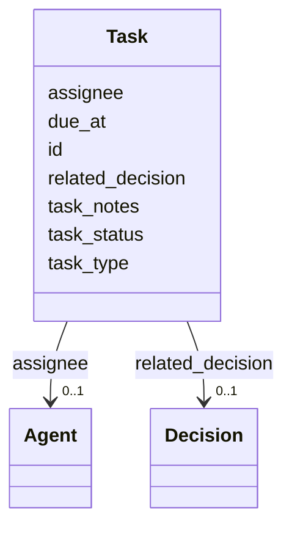

---
search:
  boost: 10.0
---

# Class: Task 


_Action/task record linked to an entity for implementation and follow-up workflows._


<div data-search-exclude markdown="1">


URI: [pbs:Task](https://schema.pragmaticbim.ch/Task)





<!-- no inheritance hierarchy -->

## Class Properties

| Property | Value |
| --- | --- |
| Class URI | [pbs:Task](https://schema.pragmaticbim.ch/Task) |


## Slots

| Name | Cardinality and Range | Description | Inheritance |
| ---  | --- | --- | --- |
| [id](id.md) | 0..1 <br/> [String](String.md) | Optional stable identifier when referenced externally (for example from Change.triggered_task). | direct |
| [task_type](task_type.md) | 0..1 <br/> [Uriorcurie](Uriorcurie.md) | Task type expressed as a URI/CURIE from a controlled vocabulary. | direct |
| [task_status](task_status.md) | 0..1 <br/> [Uriorcurie](Uriorcurie.md) | Task status URI/CURIE aligned with action status vocabularies. | direct |
| [assignee](assignee.md) | 0..1 <br/> [Agent](Agent.md) | Responsible agent. | direct |
| [due_at](due_at.md) | 0..1 <br/> [Datetime](Datetime.md) | Due timestamp for task completion. | direct |
| [related_decision](related_decision.md) | 0..1 <br/> [Decision](Decision.md) | Optional reference to a decision that informs or drives this task. | direct |
| [task_notes](task_notes.md) | 0..1 <br/> [String](String.md) | Additional notes or implementation details for the task. | direct |


## Usages

| used by | used in | type | used |
| ---  | --- | --- | --- |
| [Entity](Entity.md) | [tasks](tasks.md) | range | [Task](Task.md) |
| [Agent](Agent.md) | [tasks](tasks.md) | range | [Task](Task.md) |
| [Person](Person.md) | [tasks](tasks.md) | range | [Task](Task.md) |
| [Company](Company.md) | [tasks](tasks.md) | range | [Task](Task.md) |
| [Message](Message.md) | [tasks](tasks.md) | range | [Task](Task.md) |
| [PhysicalElement](PhysicalElement.md) | [tasks](tasks.md) | range | [Task](Task.md) |
| [Separator](Separator.md) | [tasks](tasks.md) | range | [Task](Task.md) |
| [SeparatorWall](SeparatorWall.md) | [tasks](tasks.md) | range | [Task](Task.md) |
| [SeparatorSlab](SeparatorSlab.md) | [tasks](tasks.md) | range | [Task](Task.md) |
| [ConnectionPhysical](ConnectionPhysical.md) | [tasks](tasks.md) | range | [Task](Task.md) |
| [Boundary](Boundary.md) | [tasks](tasks.md) | range | [Task](Task.md) |
| [Equipment](Equipment.md) | [tasks](tasks.md) | range | [Task](Task.md) |
| [VirtualEntity](VirtualEntity.md) | [tasks](tasks.md) | range | [Task](Task.md) |
| [SpatialContext](SpatialContext.md) | [tasks](tasks.md) | range | [Task](Task.md) |
| [ProjectContext](ProjectContext.md) | [tasks](tasks.md) | range | [Task](Task.md) |
| [PerimeterContext](PerimeterContext.md) | [tasks](tasks.md) | range | [Task](Task.md) |
| [LegalSiteContext](LegalSiteContext.md) | [tasks](tasks.md) | range | [Task](Task.md) |
| [BuiltAssetContext](BuiltAssetContext.md) | [tasks](tasks.md) | range | [Task](Task.md) |
| [BuildingContext](BuildingContext.md) | [tasks](tasks.md) | range | [Task](Task.md) |
| [CivilStructureContext](CivilStructureContext.md) | [tasks](tasks.md) | range | [Task](Task.md) |
| [LevelContext](LevelContext.md) | [tasks](tasks.md) | range | [Task](Task.md) |
| [ZoneContext](ZoneContext.md) | [tasks](tasks.md) | range | [Task](Task.md) |
| [Space](Space.md) | [tasks](tasks.md) | range | [Task](Task.md) |
| [System](System.md) | [tasks](tasks.md) | range | [Task](Task.md) |
| [ConnectionVirtual](ConnectionVirtual.md) | [tasks](tasks.md) | range | [Task](Task.md) |
| [TimeRecord](TimeRecord.md) | [tasks](tasks.md) | range | [Task](Task.md) |
| [CostRecord](CostRecord.md) | [tasks](tasks.md) | range | [Task](Task.md) |
| [Material](Material.md) | [tasks](tasks.md) | range | [Task](Task.md) |


## Identifier and Mapping Information


### Schema Source


* from schema: https://schema.pragmaticbim.ch


## Mappings

| Mapping Type | Mapped Value |
| ---  | ---  |
| self | pbs:Task |
| native | pbs:Task |
| exact | schema:Action, prov:Activity |


## LinkML Source

<!-- TODO: investigate https://stackoverflow.com/questions/37606292/how-to-create-tabbed-code-blocks-in-mkdocs-or-sphinx -->

### Direct

<details>
```yaml
name: Task
description: Action/task record linked to an entity for implementation and follow-up
  workflows.
from_schema: https://schema.pragmaticbim.ch
exact_mappings:
- schema:Action
- prov:Activity
slots:
- id
- task_type
- task_status
- assignee
- due_at
- related_decision
- task_notes
slot_usage:
  id:
    name: id
    description: Optional stable identifier when referenced externally (for example
      from Change.triggered_task).
    identifier: false
    required: false
class_uri: pbs:Task

```
</details>

### Induced

<details>
```yaml
name: Task
description: Action/task record linked to an entity for implementation and follow-up
  workflows.
from_schema: https://schema.pragmaticbim.ch
exact_mappings:
- schema:Action
- prov:Activity
slot_usage:
  id:
    name: id
    description: Optional stable identifier when referenced externally (for example
      from Change.triggered_task).
    identifier: false
    required: false
attributes:
  id:
    name: id
    description: Optional stable identifier when referenced externally (for example
      from Change.triggered_task).
    from_schema: https://schema.pragmaticbim.ch
    rank: 1000
    identifier: false
    owner: Task
    domain_of:
    - Entity
    - Task
    - Document
    - Requirement
    - Change
    - ChangeSet
    range: string
    required: false
  task_type:
    name: task_type
    description: Task type expressed as a URI/CURIE from a controlled vocabulary.
    from_schema: https://schema.pragmaticbim.ch
    rank: 1000
    slot_uri: dcterms:type
    owner: Task
    domain_of:
    - Task
    range: uriorcurie
  task_status:
    name: task_status
    description: Task status URI/CURIE aligned with action status vocabularies.
    from_schema: https://schema.pragmaticbim.ch
    rank: 1000
    slot_uri: schema:actionStatus
    owner: Task
    domain_of:
    - Task
    range: uriorcurie
  assignee:
    name: assignee
    description: Responsible agent.
    from_schema: https://schema.pragmaticbim.ch
    rank: 1000
    slot_uri: schema:agent
    owner: Task
    domain_of:
    - Task
    range: Agent
    inlined: false
  due_at:
    name: due_at
    description: Due timestamp for task completion.
    from_schema: https://schema.pragmaticbim.ch
    rank: 1000
    slot_uri: schema:deadline
    owner: Task
    domain_of:
    - Task
    range: datetime
  related_decision:
    name: related_decision
    description: Optional reference to a decision that informs or drives this task.
    from_schema: https://schema.pragmaticbim.ch
    rank: 1000
    slot_uri: prov:used
    owner: Task
    domain_of:
    - Task
    range: Decision
  task_notes:
    name: task_notes
    description: Additional notes or implementation details for the task.
    from_schema: https://schema.pragmaticbim.ch
    rank: 1000
    slot_uri: rdfs:comment
    owner: Task
    domain_of:
    - Task
    range: string
class_uri: pbs:Task

```
</details></div>