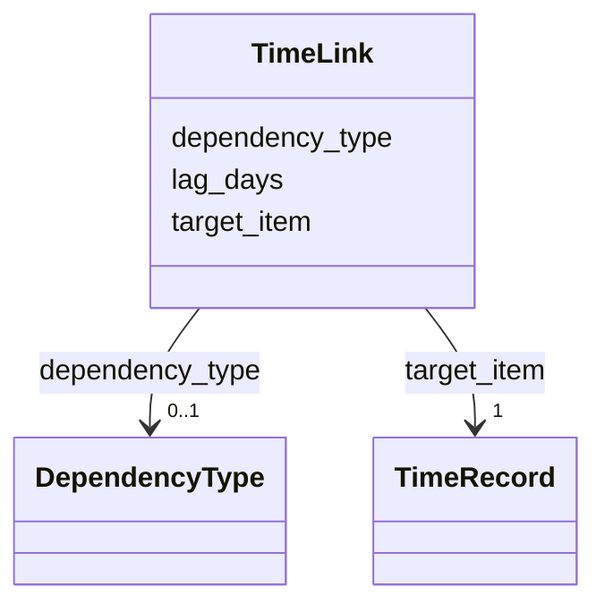

---
search:
  boost: 10.0
---

# Class: TimeLink 


_Inline typed precedence link from a TimeRecord to one successor. Not a VirtualEntity — no id, no mixin. Owned by the predecessor record._


<div data-search-exclude markdown="1">


URI: [pbs:TimeLink](https://schema.pragmaticbim.ch/TimeLink)





<!-- no inheritance hierarchy -->

## Class Properties

| Property | Value |
| --- | --- |
| Class URI | [pbs:TimeLink](https://schema.pragmaticbim.ch/TimeLink) |


## Slots

| Name | Cardinality and Range | Description | Inheritance |
| ---  | --- | --- | --- |
| [target_item](target_item.md) | 1 <br/> [TimeRecord](TimeRecord.md) | The successor TimeRecord. | direct |
| [dependency_type](dependency_type.md) | 0..1 <br/> [DependencyType](DependencyType.md) | FS | SS | FF | SF | direct |
| [lag_days](lag_days.md) | 0..1 <br/> [Integer](Integer.md) |  | direct |


## Usages

| used by | used in | type | used |
| ---  | --- | --- | --- |
| [TimeRecord](TimeRecord.md) | [successors](successors.md) | range | [TimeLink](TimeLink.md) |


## Identifier and Mapping Information


### Schema Source


* from schema: https://schema.pragmaticbim.ch


## Mappings

| Mapping Type | Mapped Value |
| ---  | ---  |
| self | pbs:TimeLink |
| native | pbs:TimeLink |


## LinkML Source

<!-- TODO: investigate https://stackoverflow.com/questions/37606292/how-to-create-tabbed-code-blocks-in-mkdocs-or-sphinx -->

### Direct

<details>
```yaml
name: TimeLink
description: Inline typed precedence link from a TimeRecord to one successor. Not
  a VirtualEntity — no id, no mixin. Owned by the predecessor record.
from_schema: https://schema.pragmaticbim.ch
attributes:
  target_item:
    name: target_item
    description: The successor TimeRecord.
    from_schema: https://schema.pragmaticbim.ch/entity/virtual
    rank: 1000
    domain_of:
    - TimeLink
    range: TimeRecord
    required: true
  dependency_type:
    name: dependency_type
    description: FS | SS | FF | SF
    from_schema: https://schema.pragmaticbim.ch/entity/virtual
    rank: 1000
    ifabsent: FS
    domain_of:
    - TimeLink
    range: DependencyType
  lag_days:
    name: lag_days
    from_schema: https://schema.pragmaticbim.ch/entity/virtual
    rank: 1000
    ifabsent: '0'
    domain_of:
    - TimeLink
    range: integer
class_uri: pbs:TimeLink

```
</details>

### Induced

<details>
```yaml
name: TimeLink
description: Inline typed precedence link from a TimeRecord to one successor. Not
  a VirtualEntity — no id, no mixin. Owned by the predecessor record.
from_schema: https://schema.pragmaticbim.ch
attributes:
  target_item:
    name: target_item
    description: The successor TimeRecord.
    from_schema: https://schema.pragmaticbim.ch/entity/virtual
    rank: 1000
    owner: TimeLink
    domain_of:
    - TimeLink
    range: TimeRecord
    required: true
  dependency_type:
    name: dependency_type
    description: FS | SS | FF | SF
    from_schema: https://schema.pragmaticbim.ch/entity/virtual
    rank: 1000
    ifabsent: FS
    owner: TimeLink
    domain_of:
    - TimeLink
    range: DependencyType
  lag_days:
    name: lag_days
    from_schema: https://schema.pragmaticbim.ch/entity/virtual
    rank: 1000
    ifabsent: '0'
    owner: TimeLink
    domain_of:
    - TimeLink
    range: integer
class_uri: pbs:TimeLink

```
</details></div>