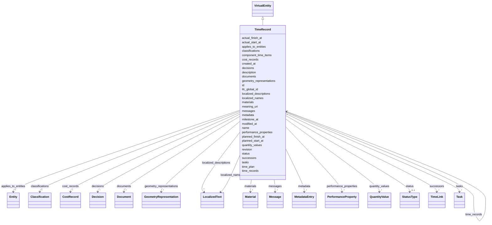

---
search:
  boost: 10.0
---

# Class: TimeRecord 


_Planned work record with baseline and actual dates, optionally linked to model entities and a time plan. — Set milestone_at to mark as a zero-duration checkpoint. — Populate component_time_items to act as a plan container._


<div data-search-exclude markdown="1">


URI: [pbs:TimeRecord](https://schema.pragmaticbim.ch/TimeRecord)





## Inheritance
* [Entity](Entity.md)
    * [VirtualEntity](VirtualEntity.md)
        * **TimeRecord**


## Class Properties

| Property | Value |
| --- | --- |
| Class URI | [pbs:TimeRecord](https://schema.pragmaticbim.ch/TimeRecord) |


## Slots

| Name | Cardinality and Range | Description | Inheritance |
| ---  | --- | --- | --- |
| [time_plan](time_plan.md) | 0..1 <br/> [TimeRecord](TimeRecord.md) | Parent time plan this record belongs to. | direct |
| [planned_start_at](planned_start_at.md) | 0..1 <br/> [Datetime](Datetime.md) | Planned start timestamp for the time record. | direct |
| [planned_finish_at](planned_finish_at.md) | 0..1 <br/> [Datetime](Datetime.md) | Planned finish timestamp for the time record. | direct |
| [actual_start_at](actual_start_at.md) | 0..1 <br/> [Datetime](Datetime.md) | Actual start timestamp for the time record where known. | direct |
| [actual_finish_at](actual_finish_at.md) | 0..1 <br/> [Datetime](Datetime.md) | Actual finish timestamp for the time record where known. | direct |
| [milestone_at](milestone_at.md) | 0..1 <br/> [Datetime](Datetime.md) | Target timestamp for a zero-duration milestone checkpoint. | direct |
| [applies_to_entities](applies_to_entities.md) | * <br/> [Entity](Entity.md) | Model entities this record applies to (requirements, cost items, schedule items, etc.). | direct |
| [component_time_items](component_time_items.md) | * <br/> [TimeRecord](TimeRecord.md) | Time records contained in this plan; set milestone_at on a record to mark it as a checkpoint. | direct |
| [successors](successors.md) | * <br/> [TimeLink](TimeLink.md) | Forward precedence links to successor records. Reverse lookup (find all predecessors of X) requires scanning all TimeRecord.successors — acceptable for document exchange, not for live graph queries. | direct |
| [cost_records](cost_records.md) | * <br/> [CostRecord](CostRecord.md) | Cost records associated with this entity. | [VirtualEntity](VirtualEntity.md) |
| [time_records](time_records.md) | * <br/> [TimeRecord](TimeRecord.md) | Time records associated with this entity. | [VirtualEntity](VirtualEntity.md) |
| [materials](materials.md) | * <br/> [Material](Material.md) | Material definitions associated with this entity. | [VirtualEntity](VirtualEntity.md) |
| [id](id.md) | 1 <br/> [String](String.md) | Unique local identifier. | [Entity](Entity.md) |
| [name](name.md) | 1 <br/> [String](String.md) | Default display name. | [Entity](Entity.md) |
| [localized_names](localized_names.md) | * <br/> [LocalizedText](LocalizedText.md) | Localized variants of name. | [Entity](Entity.md) |
| [description](description.md) | 0..1 <br/> [String](String.md) | Default description text. | [Entity](Entity.md) |
| [meaning_uri](meaning_uri.md) | 0..1 <br/> [Uriorcurie](Uriorcurie.md) | Optional semantic URI for linking the entity instance to an external ontology concept. | [Entity](Entity.md) |
| [localized_descriptions](localized_descriptions.md) | * <br/> [LocalizedText](LocalizedText.md) | Localized variants of description. | [Entity](Entity.md) |
| [ifc_global_id](ifc_global_id.md) | 0..1 <br/> [String](String.md) | IFC GlobalId of the mapped entity. | [Entity](Entity.md) |
| [classifications](classifications.md) | * <br/> [Classification](Classification.md) | Classification entries from IFC and other schemes. | [Entity](Entity.md) |
| [geometry_representations](geometry_representations.md) | * <br/> [GeometryRepresentation](GeometryRepresentation.md) | Geometry references associated with the entity. A single element may link to multiple geometry representations to serve different intents (authoring, coordination, analysis, visualization) without duplicating the element itself. | [Entity](Entity.md) |
| [quantity_values](quantity_values.md) | * <br/> [QuantityValue](QuantityValue.md) | Quantities associated with the entity. | [Entity](Entity.md) |
| [documents](documents.md) | * <br/> [Document](Document.md) | Linked documents associated with this entity. | [Entity](Entity.md) |
| [metadata](metadata.md) | * <br/> [MetadataEntry](MetadataEntry.md) | Generic metadata container for IFC attributes/properties and project-specific extensions. | [Entity](Entity.md) |
| [performance_properties](performance_properties.md) | * <br/> [PerformanceProperty](PerformanceProperty.md) | Normalized, strongly typed domain properties (fire/acoustic/thermal/structural/ security/material) extracted from raw IFC PropertySet values. | [Entity](Entity.md) |
| [decisions](decisions.md) | * <br/> [Decision](Decision.md) | Decision records associated with this entity. | [Entity](Entity.md) |
| [tasks](tasks.md) | * <br/> [Task](Task.md) | Tasks associated with this entity. | [Entity](Entity.md) |
| [messages](messages.md) | * <br/> [Message](Message.md) | Messages associated with this entity. | [Entity](Entity.md) |
| [created_at](created_at.md) | 0..1 <br/> [Datetime](Datetime.md) | Creation timestamp for this entity record. | [Entity](Entity.md) |
| [modified_at](modified_at.md) | 0..1 <br/> [Datetime](Datetime.md) | Last modification timestamp for this entity record. | [Entity](Entity.md) |
| [revision](revision.md) | 0..1 <br/> [Integer](Integer.md) | Integer revision counter for change tracking. | [Entity](Entity.md) |
| [status](status.md) | 0..1 <br/> [StatusType](StatusType.md) | Lifecycle or QA status. | [Entity](Entity.md) |


## Usages

| used by | used in | type | used |
| ---  | --- | --- | --- |
| [VirtualEntity](VirtualEntity.md) | [time_records](time_records.md) | range | [TimeRecord](TimeRecord.md) |
| [SpatialContext](SpatialContext.md) | [time_records](time_records.md) | range | [TimeRecord](TimeRecord.md) |
| [ProjectContext](ProjectContext.md) | [time_records](time_records.md) | range | [TimeRecord](TimeRecord.md) |
| [PerimeterContext](PerimeterContext.md) | [time_records](time_records.md) | range | [TimeRecord](TimeRecord.md) |
| [LegalSiteContext](LegalSiteContext.md) | [time_records](time_records.md) | range | [TimeRecord](TimeRecord.md) |
| [BuiltAssetContext](BuiltAssetContext.md) | [time_records](time_records.md) | range | [TimeRecord](TimeRecord.md) |
| [BuildingContext](BuildingContext.md) | [time_records](time_records.md) | range | [TimeRecord](TimeRecord.md) |
| [CivilStructureContext](CivilStructureContext.md) | [time_records](time_records.md) | range | [TimeRecord](TimeRecord.md) |
| [LevelContext](LevelContext.md) | [time_records](time_records.md) | range | [TimeRecord](TimeRecord.md) |
| [ZoneContext](ZoneContext.md) | [time_records](time_records.md) | range | [TimeRecord](TimeRecord.md) |
| [Space](Space.md) | [time_records](time_records.md) | range | [TimeRecord](TimeRecord.md) |
| [System](System.md) | [time_records](time_records.md) | range | [TimeRecord](TimeRecord.md) |
| [ConnectionVirtual](ConnectionVirtual.md) | [time_records](time_records.md) | range | [TimeRecord](TimeRecord.md) |
| [TimeLink](TimeLink.md) | [target_item](target_item.md) | range | [TimeRecord](TimeRecord.md) |
| [TimeRecord](TimeRecord.md) | [time_plan](time_plan.md) | range | [TimeRecord](TimeRecord.md) |
| [TimeRecord](TimeRecord.md) | [component_time_items](component_time_items.md) | range | [TimeRecord](TimeRecord.md) |
| [TimeRecord](TimeRecord.md) | [time_records](time_records.md) | range | [TimeRecord](TimeRecord.md) |
| [CostRecord](CostRecord.md) | [time_records](time_records.md) | range | [TimeRecord](TimeRecord.md) |
| [Material](Material.md) | [time_records](time_records.md) | range | [TimeRecord](TimeRecord.md) |


## Identifier and Mapping Information


### Schema Source


* from schema: https://schema.pragmaticbim.ch


## Mappings

| Mapping Type | Mapped Value |
| ---  | ---  |
| self | pbs:TimeRecord |
| native | pbs:TimeRecord |


## LinkML Source

<!-- TODO: investigate https://stackoverflow.com/questions/37606292/how-to-create-tabbed-code-blocks-in-mkdocs-or-sphinx -->

### Direct

<details>
```yaml
name: TimeRecord
description: Planned work record with baseline and actual dates, optionally linked
  to model entities and a time plan. — Set milestone_at to mark as a zero-duration
  checkpoint. — Populate component_time_items to act as a plan container.
from_schema: https://schema.pragmaticbim.ch
is_a: VirtualEntity
slots:
- time_plan
- planned_start_at
- planned_finish_at
- actual_start_at
- actual_finish_at
- milestone_at
- applies_to_entities
- component_time_items
attributes:
  successors:
    name: successors
    description: Forward precedence links to successor records. Reverse lookup (find
      all predecessors of X) requires scanning all TimeRecord.successors — acceptable
      for document exchange, not for live graph queries.
    from_schema: https://schema.pragmaticbim.ch/entity/virtual
    rank: 1000
    domain_of:
    - TimeRecord
    range: TimeLink
    multivalued: true
    inlined: true
class_uri: pbs:TimeRecord

```
</details>

### Induced

<details>
```yaml
name: TimeRecord
description: Planned work record with baseline and actual dates, optionally linked
  to model entities and a time plan. — Set milestone_at to mark as a zero-duration
  checkpoint. — Populate component_time_items to act as a plan container.
from_schema: https://schema.pragmaticbim.ch
is_a: VirtualEntity
attributes:
  successors:
    name: successors
    description: Forward precedence links to successor records. Reverse lookup (find
      all predecessors of X) requires scanning all TimeRecord.successors — acceptable
      for document exchange, not for live graph queries.
    from_schema: https://schema.pragmaticbim.ch/entity/virtual
    rank: 1000
    owner: TimeRecord
    domain_of:
    - TimeRecord
    range: TimeLink
    multivalued: true
    inlined: true
  time_plan:
    name: time_plan
    description: Parent time plan this record belongs to.
    from_schema: https://schema.pragmaticbim.ch
    rank: 1000
    owner: TimeRecord
    domain_of:
    - TimeRecord
    range: TimeRecord
    inlined: false
  planned_start_at:
    name: planned_start_at
    description: Planned start timestamp for the time record.
    from_schema: https://schema.pragmaticbim.ch
    rank: 1000
    owner: TimeRecord
    domain_of:
    - TimeRecord
    range: datetime
  planned_finish_at:
    name: planned_finish_at
    description: Planned finish timestamp for the time record.
    from_schema: https://schema.pragmaticbim.ch
    rank: 1000
    owner: TimeRecord
    domain_of:
    - TimeRecord
    range: datetime
  actual_start_at:
    name: actual_start_at
    description: Actual start timestamp for the time record where known.
    from_schema: https://schema.pragmaticbim.ch
    rank: 1000
    owner: TimeRecord
    domain_of:
    - TimeRecord
    range: datetime
  actual_finish_at:
    name: actual_finish_at
    description: Actual finish timestamp for the time record where known.
    from_schema: https://schema.pragmaticbim.ch
    rank: 1000
    owner: TimeRecord
    domain_of:
    - TimeRecord
    range: datetime
  milestone_at:
    name: milestone_at
    description: Target timestamp for a zero-duration milestone checkpoint.
    from_schema: https://schema.pragmaticbim.ch
    rank: 1000
    owner: TimeRecord
    domain_of:
    - TimeRecord
    range: datetime
  applies_to_entities:
    name: applies_to_entities
    description: Model entities this record applies to (requirements, cost items,
      schedule items, etc.).
    from_schema: https://schema.pragmaticbim.ch
    rank: 1000
    owner: TimeRecord
    domain_of:
    - Requirement
    - TimeRecord
    - CostRecord
    range: Entity
    multivalued: true
    inlined: false
  component_time_items:
    name: component_time_items
    description: Time records contained in this plan; set milestone_at on a record
      to mark it as a checkpoint.
    from_schema: https://schema.pragmaticbim.ch
    rank: 1000
    owner: TimeRecord
    domain_of:
    - TimeRecord
    range: TimeRecord
    multivalued: true
    inlined: false
  cost_records:
    name: cost_records
    description: Cost records associated with this entity.
    from_schema: https://schema.pragmaticbim.ch
    rank: 1000
    owner: TimeRecord
    domain_of:
    - VirtualEntity
    range: CostRecord
    multivalued: true
    inlined: false
  time_records:
    name: time_records
    description: Time records associated with this entity.
    from_schema: https://schema.pragmaticbim.ch
    rank: 1000
    owner: TimeRecord
    domain_of:
    - VirtualEntity
    range: TimeRecord
    multivalued: true
    inlined: false
  materials:
    name: materials
    description: Material definitions associated with this entity.
    from_schema: https://schema.pragmaticbim.ch
    rank: 1000
    owner: TimeRecord
    domain_of:
    - VirtualEntity
    range: Material
    multivalued: true
    inlined: false
  id:
    name: id
    description: Unique local identifier.
    from_schema: https://schema.pragmaticbim.ch
    rank: 1000
    identifier: true
    owner: TimeRecord
    domain_of:
    - Entity
    - Task
    - Document
    - Requirement
    - Change
    - ChangeSet
    range: string
    required: true
  name:
    name: name
    description: Default display name.
    from_schema: https://schema.pragmaticbim.ch
    rank: 1000
    owner: TimeRecord
    domain_of:
    - Entity
    - Requirement
    range: string
    required: true
  localized_names:
    name: localized_names
    description: Localized variants of name.
    from_schema: https://schema.pragmaticbim.ch
    rank: 1000
    owner: TimeRecord
    domain_of:
    - Entity
    range: LocalizedText
    multivalued: true
    inlined: true
  description:
    name: description
    description: Default description text.
    from_schema: https://schema.pragmaticbim.ch
    rank: 1000
    owner: TimeRecord
    domain_of:
    - Entity
    - Requirement
    range: string
  meaning_uri:
    name: meaning_uri
    description: Optional semantic URI for linking the entity instance to an external
      ontology concept.
    from_schema: https://schema.pragmaticbim.ch
    rank: 1000
    owner: TimeRecord
    domain_of:
    - Entity
    range: uriorcurie
  localized_descriptions:
    name: localized_descriptions
    description: Localized variants of description.
    from_schema: https://schema.pragmaticbim.ch
    rank: 1000
    owner: TimeRecord
    domain_of:
    - Entity
    range: LocalizedText
    multivalued: true
    inlined: true
  ifc_global_id:
    name: ifc_global_id
    description: IFC GlobalId of the mapped entity.
    from_schema: https://schema.pragmaticbim.ch
    rank: 1000
    owner: TimeRecord
    domain_of:
    - Entity
    - Change
    range: string
    pattern: ^[0-3][0-9A-Za-z_$]{21}$
  classifications:
    name: classifications
    description: Classification entries from IFC and other schemes.
    from_schema: https://schema.pragmaticbim.ch
    rank: 1000
    owner: TimeRecord
    domain_of:
    - Entity
    - Document
    range: Classification
    multivalued: true
    inlined: true
  geometry_representations:
    name: geometry_representations
    description: 'Geometry references associated with the entity. A single element
      may link to multiple geometry representations to serve different intents (authoring,
      coordination, analysis, visualization) without duplicating the element itself.

      '
    from_schema: https://schema.pragmaticbim.ch
    rank: 1000
    owner: TimeRecord
    domain_of:
    - Entity
    range: GeometryRepresentation
    multivalued: true
    inlined: true
  quantity_values:
    name: quantity_values
    description: Quantities associated with the entity.
    from_schema: https://schema.pragmaticbim.ch
    rank: 1000
    owner: TimeRecord
    domain_of:
    - Entity
    range: QuantityValue
    multivalued: true
    inlined: true
  documents:
    name: documents
    description: Linked documents associated with this entity.
    from_schema: https://schema.pragmaticbim.ch
    rank: 1000
    owner: TimeRecord
    domain_of:
    - Entity
    range: Document
    multivalued: true
    inlined: true
  metadata:
    name: metadata
    description: Generic metadata container for IFC attributes/properties and project-specific
      extensions.
    from_schema: https://schema.pragmaticbim.ch
    rank: 1000
    owner: TimeRecord
    domain_of:
    - Entity
    range: MetadataEntry
    multivalued: true
    inlined: true
  performance_properties:
    name: performance_properties
    description: 'Normalized, strongly typed domain properties (fire/acoustic/thermal/structural/
      security/material) extracted from raw IFC PropertySet values.

      '
    from_schema: https://schema.pragmaticbim.ch
    rank: 1000
    owner: TimeRecord
    domain_of:
    - Entity
    range: PerformanceProperty
    multivalued: true
    inlined: true
  decisions:
    name: decisions
    description: Decision records associated with this entity.
    from_schema: https://schema.pragmaticbim.ch
    rank: 1000
    owner: TimeRecord
    domain_of:
    - Entity
    range: Decision
    multivalued: true
    inlined: true
  tasks:
    name: tasks
    description: Tasks associated with this entity.
    from_schema: https://schema.pragmaticbim.ch
    rank: 1000
    owner: TimeRecord
    domain_of:
    - Entity
    range: Task
    multivalued: true
    inlined: true
  messages:
    name: messages
    description: Messages associated with this entity.
    from_schema: https://schema.pragmaticbim.ch
    rank: 1000
    owner: TimeRecord
    domain_of:
    - Entity
    range: Message
    multivalued: true
    inlined: true
  created_at:
    name: created_at
    description: Creation timestamp for this entity record.
    from_schema: https://schema.pragmaticbim.ch
    rank: 1000
    owner: TimeRecord
    domain_of:
    - Entity
    range: datetime
  modified_at:
    name: modified_at
    description: Last modification timestamp for this entity record.
    from_schema: https://schema.pragmaticbim.ch
    rank: 1000
    owner: TimeRecord
    domain_of:
    - Entity
    range: datetime
  revision:
    name: revision
    description: Integer revision counter for change tracking.
    from_schema: https://schema.pragmaticbim.ch
    rank: 1000
    owner: TimeRecord
    domain_of:
    - Entity
    range: integer
    minimum_value: 0
  status:
    name: status
    description: Lifecycle or QA status.
    from_schema: https://schema.pragmaticbim.ch
    rank: 1000
    owner: TimeRecord
    domain_of:
    - Entity
    - Requirement
    range: StatusType
class_uri: pbs:TimeRecord

```
</details></div>